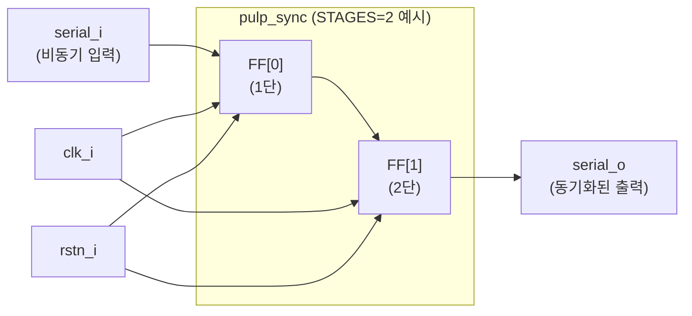

# pulp_sync.sv (Deprecated)

## 개요

`pulp_sync`는 비동기 신호를 특정 클럭 도메인으로 동기화하는 다단 플립플롭 체인(synchronizer) 모듈입니다. 메타스태빌리티(metastability) 위험을 완화하기 위해 `STAGES`단의 D 플립플롭을 직렬로 연결합니다. 단일 비트 신호의 CDC(Clock Domain Crossing) 처리에 사용됩니다.

**Deprecated 이유:** PULP 플랫폼 전용 네이밍 규칙을 따르며, common_cells의 표준 동기화 모듈로 대체되었습니다.

**대안 모듈:** `sync` (common_cells 표준 동기화 모듈)

---

## 블록 다이어그램



---

## 포트/파라미터

### 파라미터

| 파라미터명 | 타입 | 기본값 | 설명 |
|---|---|---|---|
| `STAGES` | `int` | `2` | 동기화 플립플롭 단수 (일반적으로 2~3) |

### 포트

| 포트명 | 방향 | 너비 | 설명 |
|---|---|---|---|
| `clk_i` | input | 1 | 목적지 클럭 도메인 클럭 |
| `rstn_i` | input | 1 | 비동기 액티브 로우 리셋 |
| `serial_i` | input | 1 | 동기화할 비동기 입력 신호 |
| `serial_o` | output | 1 | 동기화된 출력 신호 |

---

## 동작 설명

### 동기화 체인

`STAGES`개의 D 플립플롭이 직렬로 연결되어 있습니다.

```sv
logic [STAGES-1:0] r_reg;

always_ff @(posedge clk_i, negedge rstn_i) begin
    if (!rstn_i)
        r_reg <= '0;
    else
        r_reg <= {r_reg[STAGES-2:0], serial_i};  // 시프트
end

assign serial_o = r_reg[STAGES-1];  // 마지막 단 출력
```

- 리셋 시 모든 플립플롭이 0으로 초기화됩니다.
- 매 클럭 사이클마다 입력이 한 단씩 전파됩니다.
- `STAGES=2`이면 2사이클, `STAGES=3`이면 3사이클의 전파 지연이 발생합니다.

### 메타스태빌리티 완화

- 첫 번째 플립플롭에서 메타스태빌리티가 발생할 수 있지만, 두 번째 이후 플립플롭에서 안정화됩니다.
- 더 높은 신뢰도가 필요한 경우 `STAGES=3` 이상을 사용합니다.

### 주의 사항

- 이 모듈은 **단일 비트** 신호 동기화에만 적합합니다.
- 다비트 버스의 경우 그레이 코드 변환 또는 비동기 FIFO를 사용해야 합니다.
- 펄스 신호는 목적지 클럭 주기보다 길어야 손실 없이 감지됩니다.

---

## 의존성 및 관계

- **의존 모듈:** 없음
- **상위 모듈:** `pulp_sync_wedge` (엣지 검출과 함께 사용)
- **대안 모듈:** `sync` — common_cells 표준 동기화 모듈로 동일한 기능을 제공합니다.
