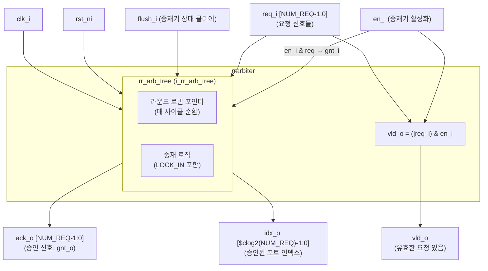

# rrarbiter.sv (Deprecated)

## 개요

`rrarbiter`는 공정한 라운드 로빈 방식의 중재기(round-robin arbiter) 모듈입니다. 매 사이클마다 우선순위를 순환시켜 모든 요청 포트에 공평한 서비스를 제공합니다. 선택적 `LOCK_IN` 기능을 통해 중재기가 비활성화(`en_i=0`)되었을 때 직전 중재 결과를 유지할 수 있습니다.

**Deprecated 이유:** 내부적으로 `rr_arb_tree`를 래핑하는 얇은 래퍼이며, 직접 `rr_arb_tree`를 사용하는 것이 더 유연합니다. 파일 헤더에도 `rr_arb_tree`에 의존한다고 명시되어 있습니다.

**대안 모듈:** `rr_arb_tree` (직접 사용 권장)

---

## 블록 다이어그램



---

## 포트/파라미터

### 파라미터

| 파라미터명 | 타입 | 기본값 | 설명 |
|---|---|---|---|
| `NUM_REQ` | `int unsigned` | `64` | 요청 포트 수 |
| `LOCK_IN` | `bit` | `1'b0` | 1이면 `en_i=0`일 때 이전 중재 결과를 래치 |

### 포트

| 포트명 | 방향 | 너비 | 설명 |
|---|---|---|---|
| `clk_i` | input | 1 | 클럭 |
| `rst_ni` | input | 1 | 비동기 액티브 로우 리셋 |
| `flush_i` | input | 1 | 중재기 상태 초기화 |
| `en_i` | input | 1 | 중재기 활성화 (`0`이면 승인 없음) |
| `req_i` | input | `NUM_REQ` | 요청 신호 배열 |
| `ack_o` | output | `NUM_REQ` | 승인 신호 배열 |
| `vld_o` | output | 1 | 유효한 요청이 있고 중재기가 활성화됨 |
| `idx_o` | output | `$clog2(NUM_REQ)` | 승인된 포트 인덱스 |

---

## 동작 설명

### 라운드 로빈 중재

`rr_arb_tree`에 위임하여 공정한 라운드 로빈 중재를 수행합니다.

```sv
rr_arb_tree #(
  .NumIn     ( NUM_REQ ),
  .DataWidth ( 1       ),
  .LockIn    ( LOCK_IN )
) i_rr_arb_tree (
  .clk_i,
  .rst_ni,
  .flush_i,
  .rr_i    ( '0      ),   // 라운드 로빈 포인터 자동 관리
  .req_i,
  .gnt_o   ( ack_o   ),
  .data_i  ( '0      ),
  .gnt_i   ( en_i & req ),  // 활성화 시에만 승인
  .req_o   ( req     ),
  .data_o  (         ),
  .idx_o
);
```

### 유효 신호

```sv
assign vld_o = (|req_i) & en_i;
```

### LOCK_IN 기능

`LOCK_IN=1`일 때 `en_i=0`이면 `rr_arb_tree` 내부 라운드 로빈 포인터가 갱신되지 않아 이전 승인 결정이 유지됩니다.

### prioarbiter와 비교

| 항목 | `rrarbiter` | `prioarbiter` |
|---|---|---|
| 중재 방식 | 라운드 로빈 (공정) | 고정 우선순위 (포트 0 최우선) |
| 기아(starvation) 방지 | O | X |
| 내부 구현 | `rr_arb_tree` 래퍼 | `onehot_to_bin` + 조합 논리 |

---

## 의존성 및 관계

| 하위 모듈 | 역할 |
|---|---|
| `rr_arb_tree` | 실제 라운드 로빈 중재 로직 수행 |

- **유사 모듈:** `prioarbiter` — 고정 우선순위 중재기
- **대안 모듈:** `rr_arb_tree` — 직접 인스턴스화하면 데이터 패스 지원 등 더 많은 기능 활용 가능
