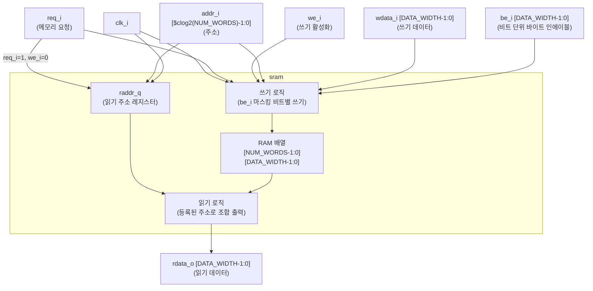

# sram.sv (Deprecated)

## 개요

`sram`은 SRAM의 동작을 모델링하는 합성 불가능한 행동적 모델(behavioral model)입니다. 비트 단위 바이트 인에이블(`be_i`)을 지원하며, 읽기는 1사이클 지연(registered read address), 쓰기는 즉시 반영되는 동기식 동작을 합니다. 주로 시뮬레이션 및 기능 검증(functional verification)에 사용됩니다.

**Deprecated 이유:** 이 모듈은 행동적 SRAM 모델로, 실제 물리적 메모리 매크로(SRAM macro)를 대체하지 않습니다. 현재는 보다 정교한 SRAM 래퍼 또는 기술 특정 메모리 모델 사용을 권장합니다.

**대안 모듈:** 기술 특정 SRAM 매크로 래퍼 (예: `tc_sram`)

---

## 블록 다이어그램



---

## 포트/파라미터

### 파라미터

| 파라미터명 | 타입 | 기본값 | 설명 |
|---|---|---|---|
| `DATA_WIDTH` | `int unsigned` | `64` | 데이터 비트 폭 |
| `NUM_WORDS` | `int unsigned` | `1024` | 메모리 워드 수 |

자동 계산 로컬 파라미터:
- `ADDR_WIDTH = $clog2(NUM_WORDS)` (주소 비트 폭)

### 포트

| 포트명 | 방향 | 너비 | 설명 |
|---|---|---|---|
| `clk_i` | input | 1 | 클럭 |
| `req_i` | input | 1 | 메모리 접근 요청 (읽기/쓰기 공통) |
| `we_i` | input | 1 | 쓰기 인에이블 (`1`=쓰기, `0`=읽기) |
| `addr_i` | input | `$clog2(NUM_WORDS)` | 접근 주소 |
| `wdata_i` | input | `DATA_WIDTH` | 쓰기 데이터 |
| `be_i` | input | `DATA_WIDTH` | 비트 단위 쓰기 인에이블 마스크 |
| `rdata_o` | output | `DATA_WIDTH` | 읽기 데이터 출력 |

---

## 동작 설명

### 쓰기 동작

`req_i=1`, `we_i=1`인 클럭 상승 엣지에서 비트 단위로 쓰기를 수행합니다.

```sv
for (int i = 0; i < DATA_WIDTH; i++)
    if (be_i[i]) ram[addr_i][i] <= wdata_i[i];
```

`be_i`의 각 비트가 해당 데이터 비트의 쓰기 마스크로 동작합니다.

### 읽기 동작

`req_i=1`, `we_i=0`인 클럭 상승 엣지에서 읽기 주소를 `raddr_q`에 등록합니다.

```sv
if (req_i && !we_i)
    raddr_q <= addr_i;
```

출력 `rdata_o`는 `raddr_q`를 사용한 조합 출력입니다.

```sv
assign rdata_o = ram[raddr_q];
```

따라서 읽기 데이터는 주소 등록 후 **다음 사이클**에 유효합니다 (1사이클 지연).

### 읽기/쓰기 타이밍

```
      클럭:    ___↑___↑___↑___
 req_i/we_i:  R   W   R   -
    addr_i:   A0  A1  A2
  raddr_q:    -   A0  -   A2
  rdata_o:    X   X   ram[A0]  ram[A2]
```

### 초기화

RAM 배열은 초기화되지 않습니다 (X 상태). 실제 SRAM 동작과 동일합니다.

---

## 의존성 및 관계

- **의존 모듈:** 없음 (독립 모듈, 합성 불가능한 행동 모델)
- **적용 범위:** 시뮬레이션 전용 (`// Description: SRAM Behavioral Model`)
- **대안 모듈:** `tc_sram` (technology-cell SRAM 래퍼) — 합성 가능하고 기술 독립적인 인터페이스를 제공하는 표준 SRAM 래퍼
