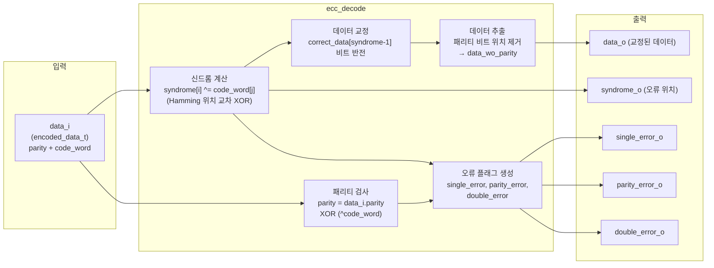

# ecc_decode.sv

## 개요

`ecc_decode`는 SECDED(Single Error Correction, Double Error Detection) Hamming 코드를 구현한 ECC 디코더 모듈입니다. 확장 패리티 비트를 포함한 인코딩된 데이터 워드를 입력으로 받아 오류를 감지 및 교정하고, 원래의 데이터 워드를 복원하여 출력합니다.

- **단일 오류(Single Error)**: 감지 및 자동 교정 가능
- **패리티 비트 오류(Parity Error)**: 최상위 패리티 비트(MSB)의 오류 감지
- **이중 오류(Double Error)**: 감지 가능하나 교정 불가

`ecc_pkg`의 헬퍼 함수를 통해 데이터 폭에 따라 패리티 비트 수와 코드워드 폭이 자동 결정됩니다.

## 블록 다이어그램



### 오류 판별 진리표

| syndrome | overall parity | 오류 유형 | 설명 |
|----------|---------------|-----------|------|
| 0        | 0             | 오류 없음 | 정상 |
| != 0     | 1             | 단일 오류 | 교정 가능. syndrome이 오류 비트 위치 |
| 0        | 1             | 패리티 오류 | MSB(전체 패리티 비트) 오류 |
| != 0     | 0             | 이중 오류 | 교정 불가 |

## 포트/파라미터

### 파라미터

| 파라미터 | 기본값 | 설명 |
|---------|--------|------|
| `DataWidth` | 64 | 인코딩 전 데이터의 비트 폭 |
| `data_t` | `logic [DataWidth-1:0]` | 데이터 타입 (변경 금지) |
| `parity_t` | `logic [get_parity_width(DataWidth)-1:0]` | 패리티 타입 (변경 금지) |
| `code_word_t` | `logic [get_cw_width(DataWidth)-1:0]` | 코드워드 타입 (변경 금지) |
| `encoded_data_t` | `struct packed { logic parity; code_word_t code_word; }` | 인코딩된 데이터 구조체 타입 (변경 금지) |

### 포트

| 포트 | 방향 | 타입 | 설명 |
|------|------|------|------|
| `data_i` | input | `encoded_data_t` | 인코딩된 데이터 입력 (패리티 + 코드워드) |
| `data_o` | output | `data_t` | 교정된 데이터 출력 |
| `syndrome_o` | output | `parity_t` | 오류 신드롬 (오류 비트 위치 표시) |
| `single_error_o` | output | `logic` | 단일 오류 발생 표시 |
| `parity_error_o` | output | `logic` | 패리티 비트(MSB) 오류 발생 표시 |
| `double_error_o` | output | `logic` | 이중 오류 발생 표시 |

## 동작 설명

### 1. 전체 패리티 검사

```
parity = data_i.parity XOR (^data_i.code_word)
```

`data_i.parity`(확장 패리티 비트)와 코드워드 전체의 XOR 값을 비교하여 전체 패리티의 일치 여부를 판단합니다. 결과가 1이면 패리티 불일치를 의미합니다.

### 2. 신드롬 계산 (Hamming 패리티 규칙)

각 패리티 비트는 특정 위치의 비트들을 커버합니다.

```
///  | 0  1  2  3  4  5  6  7  8  9 10 11 12  13  14
///  |p1 p2 d1 p4 d2 d3 d4 p8 d5 d6 d7 d8 d9 d10 d11
/// p1: 위치에서 LSB=1인 비트 커버 (1, 3, 5, 7, 9, ...)
/// p2: 위치에서 2번째 비트=1인 비트 커버 (2, 3, 6, 7, 10, 11, ...)
/// p4: 위치에서 3번째 비트=1인 비트 커버 (4~7, 12~15, ...)
/// p8: 위치에서 4번째 비트=1인 비트 커버 (8~15, 24~31, ...)
```

syndrome[i]는 2^i 비트 마스크와 비트 위치의 AND가 비영인 모든 코드워드 비트를 XOR한 값입니다. 신드롬이 0이 아니면 syndrome 값이 오류 비트의 1-기반 위치를 가리킵니다.

### 3. 데이터 교정

신드롬이 0이 아닌 경우, `correct_data[syndrome - 1]` 비트를 반전하여 단일 비트 오류를 교정합니다.

### 4. 데이터 추출

코드워드에서 패리티 비트 위치(2의 거듭제곱 위치: 1, 2, 4, 8, ...)를 제외한 나머지 위치의 비트만 순서대로 추출하여 원본 데이터 워드를 복원합니다.

### 5. 오류 플래그 생성

```systemverilog
assign single_error_o = parity & syndrome_not_zero;
assign parity_error_o = parity & ~syndrome_not_zero;
assign double_error_o = ~parity & syndrome_not_zero;
```

## 의존성 및 관계

| 항목 | 설명 |
|------|------|
| `ecc_pkg` | `get_parity_width()`, `get_cw_width()` 함수 제공. 패리티 비트 수 및 코드워드 폭 계산에 사용 |
| `ecc_encode` | 대응하는 인코더 모듈. `ecc_decode`의 입력 형식(`encoded_data_t`)을 생성 |

`ecc_encode`가 생성한 `encoded_data_t` 구조체(`parity` + `code_word`)를 `ecc_decode`가 그대로 입력으로 받아 처리하는 쌍(pair) 관계입니다. 두 모듈 모두 `ecc_pkg`를 import하여 동일한 타입 정의와 계산 함수를 공유합니다.
