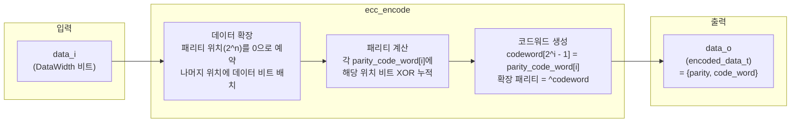

# ecc_encode.sv

## 개요

`ecc_encode`는 SECDED(Single Error Correction, Double Error Detection) Hamming 코드를 구현한 ECC 인코더 모듈입니다. 원본 데이터 워드를 입력으로 받아 Hamming 패리티 비트를 계산하고, 이중 오류 감지를 위한 확장 패리티 비트(overall parity)를 추가하여 인코딩된 코드워드를 출력합니다.

인코딩된 출력은 대응하는 디코더 모듈인 `ecc_decode`에서 오류 검출 및 교정에 사용됩니다. `ecc_pkg`의 헬퍼 함수를 통해 데이터 폭에 따라 필요한 패리티 비트 수와 코드워드 폭이 자동으로 결정됩니다.

## 블록 다이어그램



### 코드워드 구조 (DataWidth=11 예시)

```
비트 위치:  1   2   3   4   5   6   7   8   9  10  11  12  13  14  15
           p1  p2  d1  p4  d2  d3  d4  p8  d5  d6  d7  d8  d9 d10 d11
           ↑   ↑       ↑               ↑
        패리티 비트 위치 (2의 거듭제곱)
```

최종 출력: `{ overall_parity[1비트], code_word[cw_width 비트] }`

## 포트/파라미터

### 파라미터

| 파라미터 | 기본값 | 설명 |
|---------|--------|------|
| `DataWidth` | 64 | 인코딩 전 원본 데이터의 비트 폭 |
| `data_t` | `logic [DataWidth-1:0]` | 데이터 타입 (변경 금지) |
| `parity_t` | `logic [get_parity_width(DataWidth)-1:0]` | 패리티 타입 (변경 금지) |
| `code_word_t` | `logic [get_cw_width(DataWidth)-1:0]` | 코드워드 타입 (변경 금지) |
| `encoded_data_t` | `struct packed { logic parity; code_word_t code_word; }` | 인코딩된 출력 구조체 타입 (변경 금지) |

### 포트

| 포트 | 방향 | 타입 | 설명 |
|------|------|------|------|
| `data_i` | input | `data_t` | 인코딩할 원본 데이터 입력 |
| `data_o` | output | `encoded_data_t` | 인코딩된 데이터 출력 (패리티 + 코드워드) |

## 동작 설명

### 1. 데이터 확장 (expand_data)

코드워드 내에서 2의 거듭제곱 위치(1, 2, 4, 8, ...)는 Hamming 패리티 비트 자리로 예약합니다. 나머지 위치(3, 5, 6, 7, 9, 10, 11, ...)에 원본 데이터 비트를 순서대로 배치합니다.

```systemverilog
for (int unsigned i = 1; i < $bits(code_word_t) + 1; i++) begin
  if (2**$clog2(i) != i) begin  // 2의 거듭제곱이 아닌 위치
    data[i - 1] = data_i[idx];
    idx++;
  end
end
```

### 2. 패리티 계산 (calculate_syndrome)

각 패리티 비트 `parity_code_word[i]`는 비트 위치 번호와 2^i의 AND가 0이 아닌 모든 코드워드 위치의 비트를 XOR하여 계산합니다.

```systemverilog
for (int unsigned i = 0; i < $bits(parity_t); i++) begin
  for (int unsigned j = 1; j < $bits(code_word_t) + 1; j++) begin
    if (|(2**i & j)) parity_code_word[i] ^= data[j - 1];
  end
end
```

### 3. 코드워드 생성 (generate_codeword)

데이터가 배치된 코드워드에서 패리티 비트 위치(`2^i - 1`, 0-기반 인덱스)에 계산된 패리티 값을 삽입합니다.

```systemverilog
codeword = data;
for (int unsigned i = 0; i < $bits(parity_t); i++) begin
  codeword[2**i - 1] = parity_code_word[i];
end
```

### 4. 확장 패리티(Overall Parity) 생성

전체 코드워드의 모든 비트를 XOR하여 확장 패리티 비트를 생성합니다. 이 비트는 SECDED에서 이중 오류 감지를 위한 MSB 역할을 합니다.

```systemverilog
assign data_o.code_word = codeword;
assign data_o.parity    = ^codeword;
```

## 의존성 및 관계

| 항목 | 설명 |
|------|------|
| `ecc_pkg` | `get_parity_width()`, `get_cw_width()` 함수 제공. 패리티 비트 수 및 코드워드 폭 계산에 사용 |
| `ecc_decode` | 대응하는 디코더 모듈. `ecc_encode`의 출력 형식(`encoded_data_t`)을 입력으로 받아 오류 검출/교정 수행 |

`ecc_encode`와 `ecc_decode`는 `ecc_pkg`를 공유하여 동일한 데이터 타입과 폭 계산 함수를 사용하는 대칭적인 인코더-디코더 쌍입니다.
