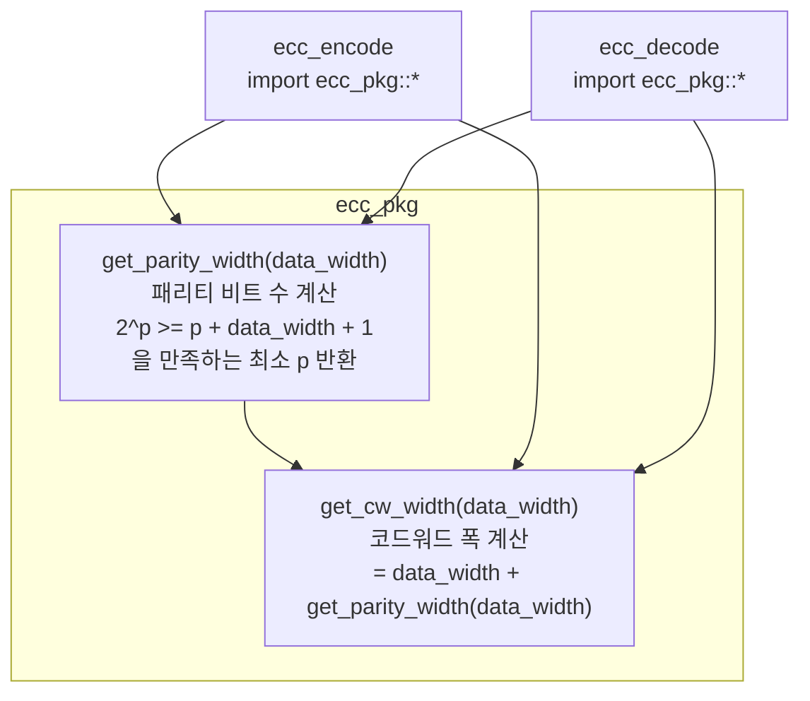

# ecc_pkg.sv

## 개요

`ecc_pkg`는 ECC(Error Correcting Code) 관련 공통 정의와 헬퍼 함수를 제공하는 SystemVerilog 패키지입니다. `ecc_encode`와 `ecc_decode` 모듈에서 공통으로 사용되며, 주어진 데이터 폭에 대해 필요한 Hamming 패리티 비트 수와 코드워드 전체 폭을 계산하는 두 가지 자동화 함수를 포함합니다.

## 블록 다이어그램



### DataWidth별 패리티 비트 수 계산 예시

| DataWidth | 패리티 비트 수 (p) | 코드워드 폭 (cw) | 조건 (2^p >= p + D + 1) |
|-----------|------------------|-----------------|------------------------|
| 4         | 3                | 7               | 8 >= 8 (참)            |
| 8         | 4                | 12              | 16 >= 13 (참)           |
| 16        | 5                | 21              | 32 >= 22 (참)           |
| 32        | 6                | 38              | 64 >= 39 (참)           |
| 64        | 7                | 71              | 128 >= 72 (참)          |

## 포트/파라미터

`ecc_pkg`는 모듈이 아닌 패키지이므로 포트가 없습니다. 아래는 제공하는 함수 목록입니다.

### 함수

| 함수 | 반환 타입 | 인자 | 설명 |
|------|----------|------|------|
| `get_parity_width(data_width)` | `int unsigned` | `data_width: int unsigned` | 주어진 데이터 폭에 필요한 Hamming 패리티 비트 수 반환 |
| `get_cw_width(data_width)` | `int unsigned` | `data_width: int unsigned` | 최종 코드워드 전체 비트 폭 반환 (데이터 + 패리티) |

## 동작 설명

### get_parity_width 함수

SECDED Hamming 코드에서 데이터 비트 수(D)와 패리티 비트 수(p)는 다음 조건을 만족해야 합니다:

```
2^p >= p + D + 1
```

이 조건을 만족하는 최소 p 값을 초기값 2부터 시작하여 while 루프로 탐색합니다.

```systemverilog
function automatic int unsigned get_parity_width(int unsigned data_width);
  int unsigned parity_width = 2;
  while (unsigned'(2**parity_width) < parity_width + data_width + 1) parity_width++;
  return parity_width;
endfunction
```

- `+1`은 SECDED의 확장 패리티 비트(overall parity, double error detection용)를 위한 여분
- 반환값은 순수 Hamming 패리티 비트 수이며, 확장 패리티 비트는 별도로 1비트 추가됨 (`ecc_encode`에서 `^codeword`로 생성)

### get_cw_width 함수

코드워드 폭은 데이터 비트와 Hamming 패리티 비트의 합입니다. 확장 패리티 비트(1비트)는 `encoded_data_t` 구조체의 `parity` 필드로 별도 관리되므로 이 함수의 반환값에는 포함되지 않습니다.

```systemverilog
function automatic int unsigned get_cw_width(int unsigned data_width);
  return data_width + get_parity_width(data_width);
endfunction
```

## 의존성 및 관계

| 항목 | 설명 |
|------|------|
| `ecc_encode` | `import ecc_pkg::*`로 패키지를 가져와 `get_parity_width()`, `get_cw_width()` 함수 및 타입 파라미터 기본값에 활용 |
| `ecc_decode` | `import ecc_pkg::*`로 패키지를 가져와 동일한 함수 및 타입 파라미터 기본값에 활용 |

`ecc_pkg`는 ECC 서브시스템의 핵심 공유 라이브러리로, 인코더와 디코더가 항상 동일한 코드워드 구조를 사용하도록 보장합니다.
