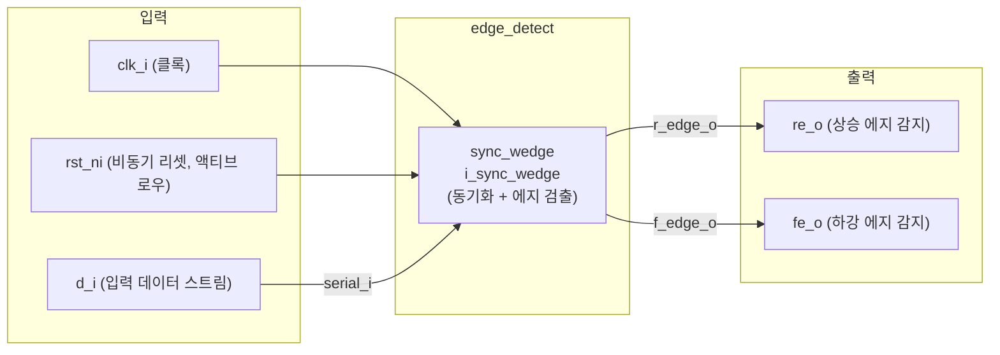

# edge_detect.sv

## 개요

`edge_detect`는 디지털 신호의 상승 에지(rising edge)와 하강 에지(falling edge)를 감지하는 모듈입니다. 내부적으로 `sync_wedge` 모듈을 인스턴스화하여 동기화 및 에지 검출 기능을 제공합니다.

입력 신호 `d_i`는 클록 `clk_i`에 대해 비동기일 수 있으므로, 클록이 입력 신호를 충분히 오버샘플링(oversampling)해야 올바른 에지 감지가 가능합니다. 출력 `re_o`와 `fe_o`는 각각 상승 에지와 하강 에지가 감지된 클록 사이클에서 1클록 폭의 펄스를 발생시킵니다.

## 블록 다이어그램



### 타이밍 예시

```
clk_i:   __|‾|_|‾|_|‾|_|‾|_|‾|_|‾|_|‾|_
d_i:     ______|‾‾‾‾‾‾‾‾‾‾‾‾|____________
re_o:    __________|‾|__________________
fe_o:    __________________________|‾|__
```

## 포트/파라미터

### 파라미터

이 모듈은 별도의 파라미터가 없습니다.

### 포트

| 포트 | 방향 | 타입 | 설명 |
|------|------|------|------|
| `clk_i` | input | `logic` | 시스템 클록. 입력 신호를 오버샘플링해야 함 |
| `rst_ni` | input | `logic` | 비동기 리셋 (액티브 로우) |
| `d_i` | input | `logic` | 에지를 감지할 입력 데이터 스트림 |
| `re_o` | output | `logic` | 상승 에지 감지 시 1클록 폭 펄스 출력 |
| `fe_o` | output | `logic` | 하강 에지 감지 시 1클록 폭 펄스 출력 |

## 동작 설명

`edge_detect`는 `sync_wedge` 모듈의 래퍼(wrapper)로, `en_i`를 항상 1로 고정하고 사용하지 않는 `serial_o` 출력은 NC(No Connect)로 처리합니다.

```systemverilog
sync_wedge i_sync_wedge (
    .clk_i    ( clk_i  ),
    .rst_ni   ( rst_ni ),
    .en_i     ( 1'b1   ),   // 항상 활성화
    .serial_i ( d_i    ),
    .r_edge_o ( re_o   ),   // 상승 에지
    .f_edge_o ( fe_o   ),   // 하강 에지
    .serial_o (        )    // 미사용
);
```

- `sync_wedge`는 내부적으로 2단 플립플롭 동기화기(synchronizer)와 에지 검출 로직을 포함합니다.
- 상승 에지: 이전 클록 사이클의 동기화된 값이 0이고 현재 값이 1일 때 `re_o` 펄스 발생
- 하강 에지: 이전 클록 사이클의 동기화된 값이 1이고 현재 값이 0일 때 `fe_o` 펄스 발생
- 올바른 동작을 위해 클록 주파수가 입력 신호 최대 주파수의 2배 이상이어야 합니다(나이퀴스트 조건).

## 의존성 및 관계

| 항목 | 설명 |
|------|------|
| `sync_wedge` | 핵심 동기화 및 에지 검출 기능을 제공하는 내부 인스턴스. `edge_detect`는 이 모듈의 단순 래퍼 |

`edge_propagator_rx` 모듈도 유사한 목적으로 `pulp_sync_wedge`를 사용하며, `edge_detect`는 단일 클록 도메인 내에서의 에지 감지에 특화되어 있습니다.
