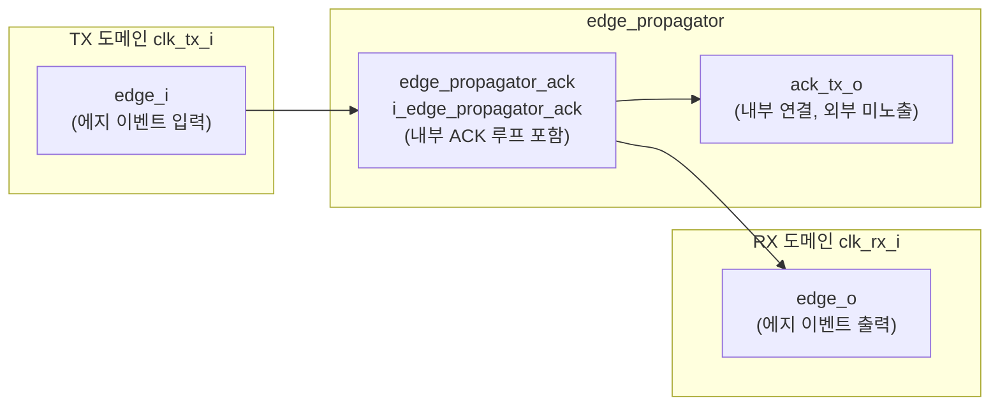
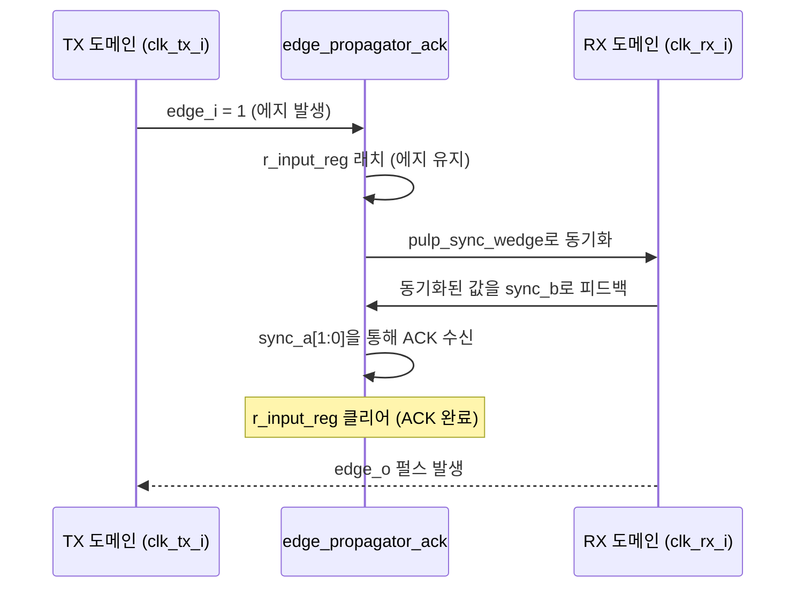

# edge_propagator.sv

## 개요

`edge_propagator`는 서로 다른 클록 도메인(TX 도메인 → RX 도메인) 간에 에지 이벤트를 안전하게 전파하는 비동기 브리지 모듈입니다. 내부적으로 `edge_propagator_ack`를 인스턴스화하지만, ACK 신호(`ack_tx_o`)를 외부로 노출하지 않는 단순화된 인터페이스를 제공합니다.

TX 도메인에서 에지 이벤트(`edge_i`)가 발생하면, RX 도메인 클록에 동기화된 에지 펄스(`edge_o`)로 변환되어 출력됩니다. ACK 피드백 메커니즘이 내부적으로 동작하여 이벤트 손실을 방지합니다.

## 블록 다이어그램



### 에지 전파 흐름



## 포트/파라미터

### 파라미터

이 모듈은 별도의 파라미터가 없습니다.

### 포트

| 포트 | 방향 | 타입 | 설명 |
|------|------|------|------|
| `clk_tx_i` | input | `logic` | TX 도메인 클록 |
| `rstn_tx_i` | input | `logic` | TX 도메인 비동기 리셋 (액티브 로우) |
| `edge_i` | input | `logic` | TX 도메인의 에지 이벤트 입력 |
| `clk_rx_i` | input | `logic` | RX 도메인 클록 |
| `rstn_rx_i` | input | `logic` | RX 도메인 비동기 리셋 (액티브 로우) |
| `edge_o` | output | `logic` | RX 도메인에서 동기화된 에지 이벤트 출력 |

## 동작 설명

`edge_propagator`는 `edge_propagator_ack`의 래퍼(wrapper) 모듈입니다. ACK 신호(`ack_tx_o`)를 불필요한 경우 외부에 노출하지 않고 단순한 인터페이스로 에지 전파 기능을 제공합니다.

```systemverilog
edge_propagator_ack i_edge_propagator_ack (
    .clk_tx_i,
    .rstn_tx_i,
    .edge_i,
    .ack_tx_o (/* unused */),   // ACK 신호 외부 미노출
    .clk_rx_i,
    .rstn_rx_i,
    .edge_o
);
```

내부 `edge_propagator_ack`의 ACK 메커니즘은 그대로 동작하지만, 상위 모듈에서 ACK를 별도로 처리할 필요가 없는 단순 에지 전파 용도로 사용됩니다.

## 의존성 및 관계

| 항목 | 설명 |
|------|------|
| `edge_propagator_ack` | 실제 에지 전파 및 ACK 로직을 구현. `edge_propagator`는 이 모듈의 래퍼 |
| `edge_propagator_tx` | TX 측 단독 사용 시 활용. `edge_propagator_ack`의 TX 부분에 해당 |
| `edge_propagator_rx` | RX 측 단독 사용 시 활용. `edge_propagator_ack`의 RX 부분에 해당 |

ACK를 상위 레벨에서 직접 제어해야 하는 경우에는 `edge_propagator_ack`를 직접 사용하고, 단순히 다른 클록 도메인으로 에지를 전달하기만 하면 되는 경우에는 `edge_propagator`를 사용합니다.
