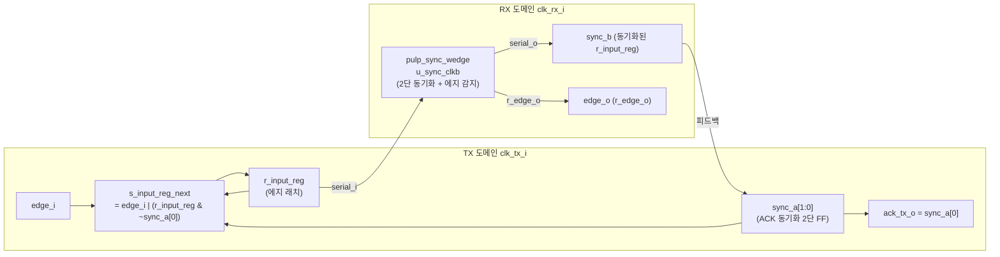

# edge_propagator_ack.sv

## 개요

`edge_propagator_ack`는 TX 클록 도메인에서 발생한 에지 이벤트를 RX 클록 도메인으로 안전하게 전파하는 비동기 브리지 모듈로, ACK(확인 응답) 메커니즘을 포함합니다. TX에서 에지가 발생하면 내부 레지스터에 래치(latch)되고, RX 도메인에서 동기화 후 에지가 감지될 때까지 상태를 유지합니다. RX 도메인의 동기화된 피드백 신호가 ACK 역할을 하여 TX의 레지스터를 클리어합니다.

`edge_propagator`와 달리 ACK 신호(`ack_tx_o`)를 외부로 노출하여 상위 모듈에서 전송 완료 여부를 확인할 수 있습니다.

## 블록 다이어그램



### 상태 전이 및 타이밍

```
clk_tx:      __|‾|_|‾|_|‾|_|‾|_|‾|_|‾|_|‾|_
edge_i:      _____|‾|________________________
r_input_reg: ________|‾‾‾‾‾‾‾‾‾‾‾‾‾‾‾|______
sync_b(RX):  ________________|‾‾‾‾‾‾‾‾|____
edge_o:      ____________________|‾|_________
sync_a[0]:   ______________________|‾‾‾‾‾‾|_  (ACK)
r_input_reg: ________________________________ (클리어)
```

## 포트/파라미터

### 파라미터

이 모듈은 별도의 파라미터가 없습니다.

### 포트

| 포트 | 방향 | 타입 | 설명 |
|------|------|------|------|
| `clk_tx_i` | input | `logic` | TX 도메인 클록 |
| `rstn_tx_i` | input | `logic` | TX 도메인 비동기 리셋 (액티브 로우) |
| `edge_i` | input | `logic` | TX 도메인의 에지 이벤트 입력 |
| `ack_tx_o` | output | `logic` | TX 도메인으로의 ACK 신호 (전파 완료 확인) |
| `clk_rx_i` | input | `logic` | RX 도메인 클록 |
| `rstn_rx_i` | input | `logic` | RX 도메인 비동기 리셋 (액티브 로우) |
| `edge_o` | output | `logic` | RX 도메인에서 동기화된 에지 이벤트 출력 |

## 동작 설명

### 1. TX 도메인: 에지 래치 및 유지

`edge_i`가 1이 되면 `r_input_reg`가 세트됩니다. 이후 ACK(`sync_a[0]`)가 수신될 때까지 에지 상태를 유지합니다.

```systemverilog
assign s_input_reg_next = edge_i | (r_input_reg & ~sync_a[0]);
```

- `edge_i = 1`: 즉시 세트
- `r_input_reg & ~sync_a[0]`: ACK가 오지 않은 동안 유지 (self-sustaining)
- ACK(`sync_a[0] = 1`) 수신 시 자동 클리어

### 2. RX 도메인: 동기화 및 에지 감지

`r_input_reg`의 상승 에지를 `pulp_sync_wedge`를 통해 RX 클록에 동기화합니다.

```systemverilog
pulp_sync_wedge u_sync_clkb (
    .clk_i    ( clk_rx_i    ),
    .rstn_i   ( rstn_rx_i   ),
    .en_i     ( 1'b1        ),
    .serial_i ( r_input_reg ),
    .r_edge_o ( edge_o      ),   // RX 도메인 에지 출력
    .f_edge_o (             ),   // 하강 에지 미사용
    .serial_o ( sync_b      )    // 동기화된 값 → TX 피드백
);
```

### 3. TX 도메인: ACK 수신 (2단 동기화)

`sync_b`(RX 도메인에서 동기화된 `r_input_reg` 값)가 TX 클록 도메인으로 2단 플립플롭 체인을 통해 재동기화됩니다.

```systemverilog
sync_a <= {sync_b, sync_a[1]};
assign ack_tx_o = sync_a[0];
```

`sync_a[0]`이 1이 되면 ACK 완료로 간주하고 `r_input_reg`가 클리어됩니다.

### 에지 손실 방지

`r_input_reg`가 클리어되기 전에 새로운 `edge_i`가 발생해도, `s_input_reg_next = edge_i | (r_input_reg & ~sync_a[0])` 로직에 의해 이전 이벤트가 유지되므로 이벤트 손실이 발생하지 않습니다. 단, 연속적인 에지 이벤트의 경우 ACK 완료 후 다음 이벤트가 처리되므로 처리량(throughput)이 클록 도메인 간 동기화 지연에 의해 제한됩니다.

## 의존성 및 관계

| 항목 | 설명 |
|------|------|
| `pulp_sync_wedge` | RX 도메인에서 TX의 `r_input_reg` 신호를 동기화하고 에지를 감지하는 서브모듈 |
| `edge_propagator` | `edge_propagator_ack`의 래퍼. `ack_tx_o`를 외부에 노출하지 않고 단순 에지 전파만 제공 |
| `edge_propagator_tx` | TX 측 로직(`r_input_reg` 래치, ACK 처리)을 독립 모듈로 분리한 버전 |
| `edge_propagator_rx` | RX 측 로직(`pulp_sync_wedge` 기반 동기화)을 독립 모듈로 분리한 버전 |
