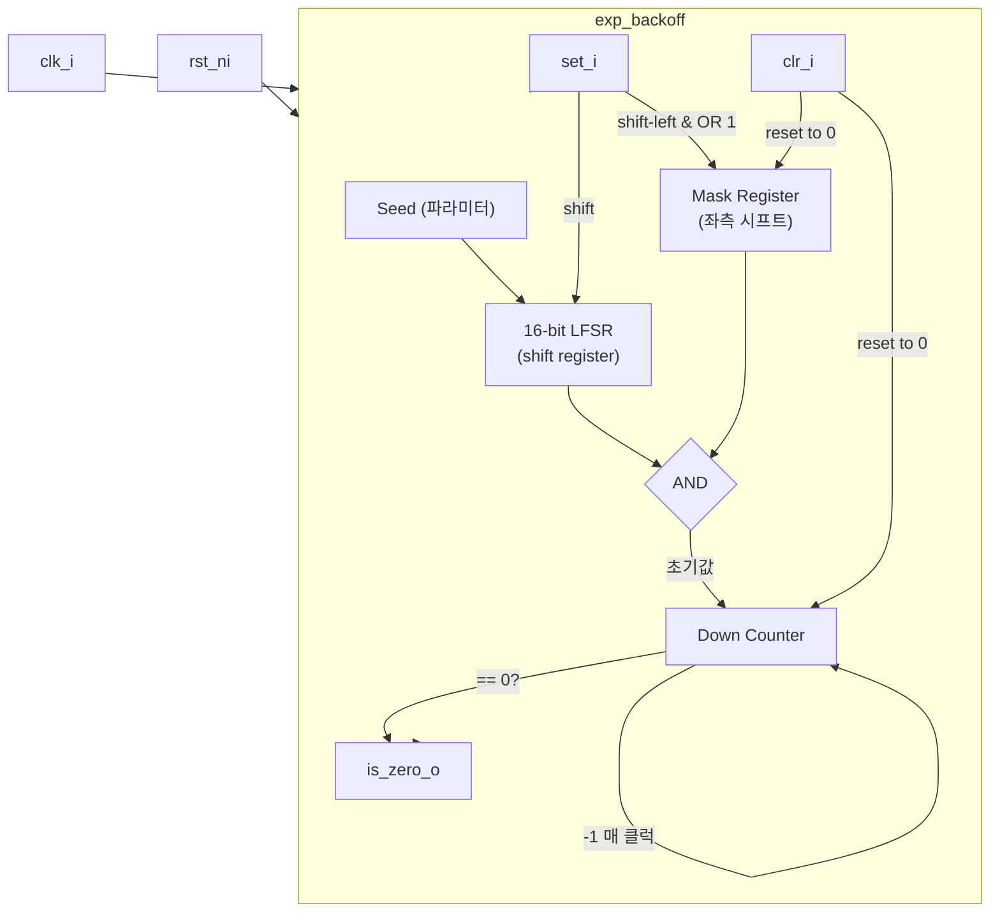

# exp_backoff.sv

## 개요

지수 백오프(Exponential Backoff) 카운터 모듈로, 무작위화(randomization)를 적용한 대기 시간 생성기입니다. 재시도 기반 프로토콜(버스 중재, 캐시 미스 처리 등)에서 충돌을 피하기 위해 사용됩니다.

- 시도 실패 시(`set_i` 펄스): 16비트 LFSR과 지수적으로 커지는 마스크를 AND 연산하여 무작위 대기 카운터를 생성합니다.
- 시도 성공 시(`clr_i` 펄스): 마스크와 카운터를 모두 0으로 초기화합니다.
- 카운터가 0이 되면 `is_zero_o`가 어서트되어 다음 시도가 가능함을 알립니다.

## 블록 다이어그램



## 포트/파라미터

### 파라미터

| 파라미터 | 타입 | 기본값 | 설명 |
|---------|------|--------|------|
| `Seed` | `int unsigned` | `'hffff` | 16비트 LFSR 초기값 (0 불가) |
| `MaxExp` | `int unsigned` | `16` | 최대 지수. 최대 대기 범위는 `2**MaxExp - 1`. 범위: 1~16 |

### 포트

| 포트 | 방향 | 타입 | 설명 |
|------|------|------|------|
| `clk_i` | 입력 | `logic` | 클럭 |
| `rst_ni` | 입력 | `logic` | 비동기 액티브 로우 리셋 |
| `set_i` | 입력 | `logic` | 시도 실패 펄스: 백오프 카운터를 설정 |
| `clr_i` | 입력 | `logic` | 시도 성공 펄스: 백오프 카운터를 클리어 |
| `is_zero_o` | 출력 | `logic` | 카운터가 0일 때 어서트: 새 시도 가능 |

## 동작 설명

### LFSR 동작

내부적으로 16비트 LFSR을 사용하며, 탭은 `[15], [13], [12], [10]` 비트의 XOR로 피드백됩니다. `set_i`가 어서트될 때마다 오른쪽 방향으로 한 비트 시프트합니다(플립드 LFSR). 마스크와의 상관 효과를 줄이기 위해 일반적인 왼쪽 시프트 대신 오른쪽 시프트를 사용합니다.

### 마스크 생성

`mask_q`는 `set_i` 펄스마다 왼쪽으로 1비트 시프트되고 LSB에 1이 채워집니다. 즉, 재시도 횟수가 늘어날수록 마스크의 어서트된 비트 수가 증가하여 더 넓은 대기 시간 범위를 제공합니다.

| 시도 횟수 | mask_q (MaxExp=4 예시) | 최대 대기 범위 |
|----------|----------------------|--------------|
| 1회 실패 | `0001` | 0~1 |
| 2회 실패 | `0011` | 0~3 |
| 3회 실패 | `0111` | 0~7 |
| 4회 실패 | `1111` | 0~15 |

### 카운터 동작

```
cnt_d = (clr_i)      ? 0               (리셋)
      : (set_i)      ? mask_q & lfsr_q (새 무작위 대기값 로드)
      : (!is_zero_o) ? cnt_q - 1       (카운트다운)
      : 0
```

카운터가 0이면 `is_zero_o = 1`이 되어 상위 모듈이 새 시도를 수행할 수 있습니다.

### 파라미터 제약

- `MaxExp > 0` 이어야 합니다.
- `MaxExp <= 16` 이어야 합니다.
- `Seed > 0` 이어야 합니다 (LFSR의 올-제로 상태 방지).

## 의존성 및 관계

| 항목 | 설명 |
|------|------|
| `common_cells/assertions.svh` | `ASSERT_INIT` 매크로를 통한 파라미터 검증 |
| `lfsr_16bit.sv` | LFSR 로직을 인라인으로 직접 구현 (별도 인스턴스 없음) |

이 모듈은 버스 중재기, 캐시 리필 선택, 재시도 프로토콜 등에서 충돌 회피를 위한 무작위 대기 시간 생성기로 사용됩니다.
