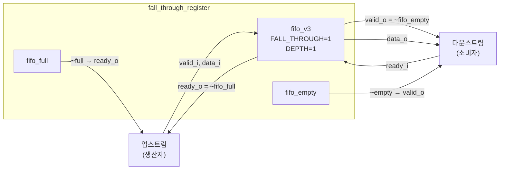

# fall_through_register (`fall_through_register.sv`)

## 개요

`fall_through_register`는 ready/valid 스트림 핸드셰이크 인터페이스를 갖는 1-엔트리 폴스루 레지스터입니다. valid와 data 신호의 조합 경로를 끊지 않고, **ready 신호의 조합 경로만** 차단합니다. 출력 측이 같은 사이클 안에 수락 가능하면 데이터를 바로 포워딩하므로 지연이 없습니다. 입력 측에서 '기본적으로 ready' 동작이 필요할 때 사용합니다.

내부적으로 `fifo_v3`를 `FALL_THROUGH=1`, `DEPTH=1`로 인스턴스화하여 구현됩니다.

## 블록 다이어그램



## 포트 목록

| 포트명 | 방향 | 비트폭 | 설명 |
|--------|------|--------|------|
| `clk_i` | input | 1 | 클록 |
| `rst_ni` | input | 1 | 비동기 리셋 (액티브 로우) |
| `clr_i` | input | 1 | 동기식 클리어 |
| `testmode_i` | input | 1 | 테스트 모드 (클록 게이팅 바이패스) |
| `valid_i` | input | 1 | 입력 데이터 유효 신호 |
| `ready_o` | output | 1 | 입력 수락 가능 신호 (= FIFO not full) |
| `data_i` | input | T | 입력 데이터 |
| `valid_o` | output | 1 | 출력 데이터 유효 신호 (= FIFO not empty) |
| `ready_i` | input | 1 | 출력 수락 신호 |
| `data_o` | output | T | 출력 데이터 |

## 파라미터

| 파라미터명 | 기본값 | 설명 |
|-----------|--------|------|
| `T` | `logic` | 데이터 페이로드 타입 (커스텀 struct 사용 가능) |

## 동작 설명

### ready/valid 핸드셰이크

핸드셰이크는 AXI4 스타일을 따릅니다: `valid`와 `ready`가 동시에 High일 때 전송이 성립합니다.

```
ready_o = ~fifo_full
valid_o = ~fifo_empty
```

### 폴스루 동작

FIFO가 비어 있을 때 `valid_i`가 들어오면, 동일 사이클에 `data_o`로 바로 포워딩됩니다. `ready_i`가 함께 High라면 전송이 완료되며 FIFO에 아무것도 기록되지 않습니다.

```
valid_i=1, ready_i=1, fifo_empty=1:
  → data_o = data_i (같은 사이클 즉시)
  → 전송 완료, fifo 상태 변화 없음
```

### 버퍼링 동작

`ready_i`가 Low일 때 `valid_i`가 들어오면 데이터를 내부 1-엔트리 FIFO에 저장합니다. 이후 `ready_i`가 High가 되면 저장된 데이터를 출력합니다.

### 타이밍 다이어그램

```
clk_i   : _/‾\_/‾\_/‾\_/‾\_/‾\
valid_i : ‾‾‾‾‾‾‾‾‾‾‾____________
data_i  : ====A===B===============
ready_i : _________‾‾‾‾‾‾‾‾‾‾‾‾‾
ready_o : ‾‾‾‾‾‾‾‾‾‾‾‾‾‾‾‾‾______  (FIFO가 가득 찰 때만 Low)
valid_o : ‾‾‾‾‾‾‾‾‾‾‾‾‾‾‾‾‾‾‾‾‾‾‾
data_o  : ====A===A===B===========
```

## 내부 구조

내부에서 `fifo_v3` 모듈을 다음과 같이 연결합니다:

```
push_i = valid_i & ~fifo_full   // 가득 차지 않을 때만 푸시
pop_i  = ready_i & ~fifo_empty  // 비어 있지 않을 때만 팝
```

`spill_register`와의 차이점:
- `fall_through_register`: valid/data 조합 경로 유지, ready만 차단 → 지연 없는 포워딩
- `spill_register`: valid/data/ready 모든 조합 경로 차단 → 타이밍 경로 완전 분리

## 의존성

- `fifo_v3` — 내부 1-엔트리 폴스루 FIFO

## 사용 예시

```systemverilog
// 32비트 데이터 폴스루 레지스터
fall_through_register #(
    .T (logic [31:0])
) u_ftr (
    .clk_i      (clk),
    .rst_ni     (rst_n),
    .clr_i      (clear),
    .testmode_i (1'b0),
    .valid_i    (prod_valid),
    .ready_o    (prod_ready),
    .data_i     (prod_data),
    .valid_o    (cons_valid),
    .ready_i    (cons_ready),
    .data_o     (cons_data)
);

// 커스텀 struct 사용
typedef struct packed { logic [7:0] tag; logic [31:0] data; } pkt_t;
fall_through_register #(.T(pkt_t)) u_pkt_reg ( ... );
```
