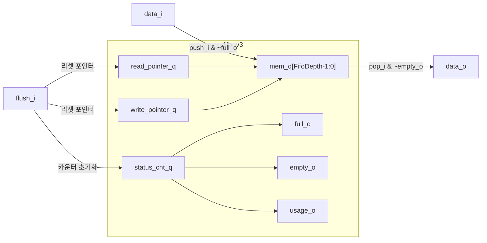

# fifo_v3 (`fifo_v3.sv`)

## 개요

`fifo_v3`는 범용 동기식 FIFO(First-In First-Out) 큐 모듈입니다. 임의의 깊이(DEPTH)와 데이터 타입을 지원하며, 폴스루(fall-through) 모드와 플러시(flush) 기능을 제공합니다. 클록 게이팅을 내장하여 쓰기가 없을 때 메모리 레지스터의 전력을 절약합니다. 스트림 인터페이스 FIFO(`stream_fifo`)의 기반 모듈로 널리 사용됩니다.

## 블록 다이어그램



## 포트 목록

| 포트명 | 방향 | 비트폭 | 설명 |
|--------|------|--------|------|
| `clk_i` | input | 1 | 클록 |
| `rst_ni` | input | 1 | 비동기 리셋 (액티브 로우) |
| `flush_i` | input | 1 | 동기식 플러시 (큐 비우기) |
| `testmode_i` | input | 1 | 테스트 모드 (클록 게이팅 바이패스) |
| `full_o` | output | 1 | FIFO 가득 참 표시 |
| `empty_o` | output | 1 | FIFO 비어 있음 표시 |
| `usage_o` | output | ADDR_DEPTH | 현재 채움 수 (fill count) |
| `data_i` | input | dtype | 푸시할 데이터 |
| `push_i` | input | 1 | 데이터 푸시 요청 |
| `data_o` | output | dtype | 팝된 데이터 |
| `pop_i` | input | 1 | 데이터 팝 요청 |

## 파라미터

| 파라미터명 | 기본값 | 설명 |
|-----------|--------|------|
| `FALL_THROUGH` | `1'b0` | 폴스루 모드 활성화 — 빈 FIFO에 푸시하면 동일 사이클에 바로 출력 |
| `DATA_WIDTH` | `32` | `dtype`이 logic일 때 기본 데이터 비트폭 |
| `DEPTH` | `8` | FIFO 깊이 (0 ~ 2³²) |
| `dtype` | `logic [DATA_WIDTH-1:0]` | 데이터 타입 (커스텀 struct 사용 가능) |
| `ADDR_DEPTH` | `$clog2(DEPTH)` | 포인터 비트폭 (자동 계산, 덮어쓰지 말 것) |

## 동작 설명

### 기본 푸시/팝

- **푸시**: `push_i && ~full_o` 조건에서 `data_i`를 `write_pointer_q` 위치에 저장하고 포인터와 카운터를 증가시킵니다.
- **팝**: `pop_i && ~empty_o` 조건에서 `read_pointer_q` 위치의 데이터를 `data_o`로 출력하고 포인터를 증가시킵니다.
- **동시 푸시/팝**: 가득 차지 않고 비어 있지 않을 때 동시에 수행되면 `status_cnt_q`가 변하지 않습니다.

### 폴스루 모드 (`FALL_THROUGH = 1`)

FIFO가 비어 있는 상태에서 `push_i`가 들어오면, 메모리에 쓰지 않고 `data_i`를 바로 `data_o`에 연결합니다. 동일 사이클에 `pop_i`가 함께 오면 포인터도 변경되지 않습니다. 이 모드는 `empty_o`에 `push_i`가 영향을 줍니다:

```
empty_o = (status_cnt_q == 0) & ~(FALL_THROUGH & push_i)
```

### DEPTH == 0 (패스스루 모드)

DEPTH가 0이면 메모리 없이 완전한 조합 경로로 동작합니다:
```
empty_o = ~push_i
full_o  = ~pop_i
```

### 플러시

`flush_i`가 어서트되면 다음 클록 엣지에서 `read_pointer_q`, `write_pointer_q`, `status_cnt_q`가 모두 0으로 초기화됩니다.

### 클록 게이팅

쓰기 동작이 없을 때(`gate_clock = 1`) 메모리 레지스터(`mem_q`)의 클록을 차단하여 동적 전력 소모를 줄입니다.

### 타이밍 다이어그램

```
clk_i   : _/‾\_/‾\_/‾\_/‾\_/‾\
push_i  : ‾‾‾‾‾‾‾‾‾____________
data_i  : =====A===B=============
full_o  : _______________________
pop_i   : ____________‾‾‾‾‾‾‾‾‾‾
data_o  : ___________=A===B======
```

## 내부 구조

| 신호 | 설명 |
|------|------|
| `read_pointer_q` | 다음 팝 위치를 가리키는 읽기 포인터 |
| `write_pointer_q` | 다음 푸시 위치를 가리키는 쓰기 포인터 |
| `status_cnt_q` | 현재 FIFO에 있는 항목 수 (ADDR_DEPTH+1 비트) |
| `mem_q` | 실제 데이터 저장 배열 (`dtype [FifoDepth-1:0]`) |
| `gate_clock` | 메모리 클록 게이팅 제어 신호 |

포인터는 DEPTH 최댓값에서 0으로 래핑되는 순환 포인터입니다. DEPTH가 2의 거듭제곱이면 자연적으로 오버플로우로 처리되어 래핑 로직이 합성 최적화로 제거됩니다.

## 의존성

- `common_cells/assertions.svh` — 어서션 매크로

## 사용 예시

```systemverilog
// 깊이 16, 32비트 폴스루 FIFO
fifo_v3 #(
    .FALL_THROUGH (1'b1),
    .DATA_WIDTH   (32),
    .DEPTH        (16)
) u_fifo (
    .clk_i      (clk),
    .rst_ni     (rst_n),
    .flush_i    (flush),
    .testmode_i (1'b0),
    .full_o     (full),
    .empty_o    (empty),
    .usage_o    (usage),
    .data_i     (wdata),
    .push_i     (wen),
    .data_o     (rdata),
    .pop_i      (ren)
);

// 커스텀 struct 타입 사용
typedef struct packed {
    logic [31:0] addr;
    logic [63:0] data;
} my_pkt_t;

fifo_v3 #(
    .DEPTH (8),
    .dtype (my_pkt_t)
) u_pkt_fifo ( ... );
```
