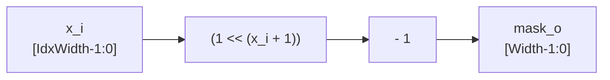

# heaviside.sv

## 개요

헤비사이드 계단 함수(Heaviside step function)에서 영감을 받은 비트 마스크 생성 모듈입니다. 입력 인덱스 `x_i`를 받아 비트 위치 `[0, x_i]` 구간의 모든 비트가 1로 어서트된 마스크를 출력합니다.

수학적으로는 `mask_o = (1 << (x_i + 1)) - 1`로 표현되며, 순수 조합 논리(combinational logic)로 구현됩니다.

예시:
- `x_i = 0` → `mask_o = 32'b0000...0001`
- `x_i = 3` → `mask_o = 32'b0000...1111`
- `x_i = 7` → `mask_o = 32'b0000...1111_1111`

## 블록 다이어그램



## 포트/파라미터

### 파라미터

| 파라미터 | 타입 | 기본값 | 설명 |
|---------|------|--------|------|
| `Width` | `int unsigned` | `32` | 출력 마스크의 비트 폭 |
| `IdxWidth` | `int unsigned` | (자동 계산) | 인덱스 비트 폭: `cf_math_pkg::idx_width(Width)`. **오버라이드 금지** |
| `idx_t` | `type` | `logic [IdxWidth-1:0]` | 인덱스 타입. **오버라이드 금지** |
| `mask_t` | `type` | `logic [Width-1:0]` | 마스크 타입. **오버라이드 금지** |

### 포트

| 포트 | 방향 | 타입 | 설명 |
|------|------|------|------|
| `x_i` | 입력 | `idx_t` | 마스크를 어서트할 최상위 비트 인덱스 (포함) |
| `mask_o` | 출력 | `mask_t` | 비트 [0, x_i] 구간이 모두 1인 마스크 |

## 동작 설명

단일 조합 논리 식으로 구현됩니다:

```systemverilog
assign mask_o = (1 << (x_i + 1)) - 1;
```

| `x_i` 값 | 연산 (`Width=8`) | `mask_o` |
|----------|-----------------|---------|
| 0 | `(1 << 1) - 1 = 1` | `8'b0000_0001` |
| 2 | `(1 << 3) - 1 = 7` | `8'b0000_0111` |
| 5 | `(1 << 6) - 1 = 63` | `8'b0011_1111` |
| 7 | `(1 << 8) - 1 = 255` | `8'b1111_1111` |

`x_i`의 최대값은 `Width - 1`이며, 이 경우 출력 마스크의 모든 비트가 1입니다.

## 의존성 및 관계

| 항목 | 설명 |
|------|------|
| `cf_math_pkg` | `idx_width()` 함수를 사용하여 `IdxWidth` 파라미터를 자동 계산 |

이 모듈은 연속된 하위 비트 마스킹이 필요한 경우에 범용으로 활용됩니다. 예를 들어, 주소 디코더, 우선순위 인코더, 비트필드 마스킹 등에서 사용할 수 있습니다.
