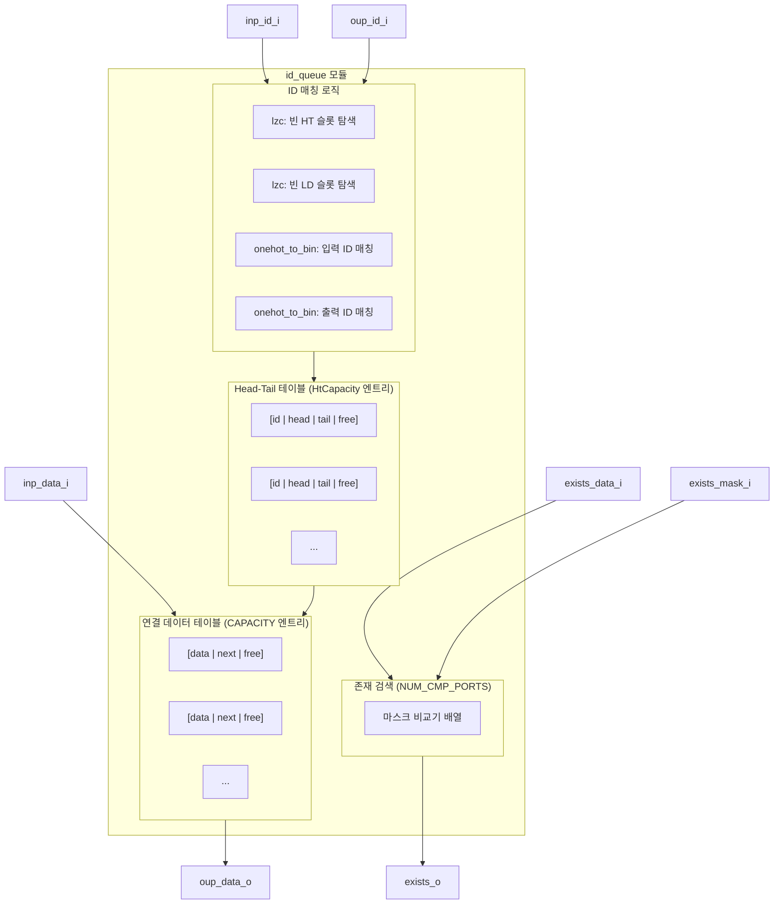

# id_queue (`id_queue.sv`)

## 상태: 활성

## 개요

ID 기반 순서 보존 큐(ID Queue)로, 각 요소는 숫자형 ID를 가지며 동일한 ID를 가진 요소들 사이에서 FIFO 순서를 보장합니다. 여러 ID 서브큐를 단일 물리적 메모리 풀에 저장하며, 입력(`inp_*`)과 출력(`oup_*`)을 동시에 또는 순차적으로 처리할 수 있습니다. 추가로 마스크 기반 내용 검색(`exists_*`)도 지원합니다.

주요 특징:
- 동일 ID 요소 간 FIFO 순서 보존
- 최대 `CAPACITY`개 요소 저장 (ID 수와 무관)
- FULL_BW 모드: 동일 클록 사이클에 Push와 Pop 동시 수행 가능
- 마스크 기반 다중 포트 존재 검색 지원
- 내부 연결 리스트 구조로 ID별 서브큐 관리

## 블록 다이어그램



## 포트 목록

| 포트명 | 방향 | 비트폭 | 설명 |
|--------|------|--------|------|
| `clk_i` | 입력 | 1 | 클록 |
| `rst_ni` | 입력 | 1 | 비동기 리셋 (Active Low) |
| `inp_id_i` | 입력 | ID_WIDTH | 삽입할 요소의 ID |
| `inp_data_i` | 입력 | data_t | 삽입할 데이터 |
| `inp_req_i` | 입력 | 1 | 삽입 요청 |
| `inp_gnt_o` | 출력 | 1 | 삽입 허용 (큐가 가득 차지 않은 경우) |
| `exists_data_i` | 입력 | data_t × NUM_CMP_PORTS | 검색할 데이터 |
| `exists_mask_i` | 입력 | data_t × NUM_CMP_PORTS | 검색 비교 마스크 |
| `exists_req_i` | 입력 | NUM_CMP_PORTS | 검색 요청 |
| `exists_o` | 출력 | NUM_CMP_PORTS | 검색 결과 (존재 여부) |
| `exists_gnt_o` | 출력 | NUM_CMP_PORTS | 검색 요청 허용 |
| `oup_id_i` | 입력 | ID_WIDTH | 출력할 요소의 ID |
| `oup_pop_i` | 입력 | 1 | 1이면 파괴적 읽기(Pop), 0이면 비파괴적 읽기 |
| `oup_req_i` | 입력 | 1 | 출력 요청 |
| `oup_data_o` | 출력 | data_t | 출력 데이터 |
| `oup_data_valid_o` | 출력 | 1 | 출력 데이터 유효 여부 |
| `oup_gnt_o` | 출력 | 1 | 출력 요청 허용 |
| `full_o` | 출력 | 1 | 큐 가득 참 |
| `empty_o` | 출력 | 1 | 큐 비어 있음 |

## 파라미터

| 파라미터명 | 기본값 | 설명 |
|-----------|--------|------|
| `ID_WIDTH` | 0 | ID 비트 폭. 최소 1 이상 필요. 최대 ID 수 = 2^ID_WIDTH |
| `CAPACITY` | 0 | 큐의 최대 저장 요소 수. 최소 1 이상 필요 |
| `FULL_BW` | 0 | 1이면 동일 클록에서 Push/Pop 동시 허용 (풀 대역폭 모드) |
| `CUT_OUP_POP_INP_GNT` | 0 | Pop 중에 inp_gnt_o와의 타이밍 경로를 끊음 |
| `NUM_CMP_PORTS` | 1 | 동시 존재 검색 포트 수 |
| `data_t` | logic[31:0] | 저장할 데이터 타입 |

## 동작 설명

### 내부 자료구조

두 개의 테이블로 구성됩니다:

1. **Head-Tail 테이블 (HT Table)**: ID별 서브큐의 헤드/테일 인덱스를 저장합니다.
   - `HtCapacity = min(2^ID_WIDTH, CAPACITY)` 크기
   - 각 엔트리: `{id, head, tail, free}`
   
2. **연결 데이터 테이블 (Linked Data Table)**: 실제 데이터를 연결 리스트 형태로 저장합니다.
   - `CAPACITY` 크기
   - 각 엔트리: `{data, next, free}`

### 삽입 (Push)

- `inp_req_i`가 1이고 큐가 가득 차지 않으면 삽입 허용
- 해당 ID가 HT 테이블에 없으면 새 HT 엔트리 할당
- 같은 ID가 이미 있으면 기존 서브큐의 테일에 연결

### 출력 (Pop / Peek)

- `oup_req_i`가 1이면 출력 요청
- 해당 ID의 헤드 데이터를 반환
- `oup_pop_i`가 1이면 헤드를 해제하고 다음 노드로 이동 (파괴적 읽기)
- `oup_pop_i`가 0이면 데이터만 반환 (비파괴적 읽기)
- ID가 없으면 `oup_data_valid_o = 0`

### FULL_BW 모드

FULL_BW=0 (기본): Push와 Pop 중 하나만 처리 (최대 50% 대역폭)

FULL_BW=1: Push와 Pop을 동일 클록에서 처리, Pop된 슬롯을 즉시 재활용 가능 (면적 약 5-10% 증가)

### 존재 검색 (Exists)

`exists_req_i[k]`가 1이면 전체 연결 데이터 테이블을 마스크 기반으로 병렬 검색합니다.

```
match = ~free & ((data & mask) == (query & mask))
```

마스킹이 불필요하면 `exists_mask_i = '1`로 설정하면 합성기가 단순화합니다.
존재 검색 기능이 불필요하면 `exists_req_i = 1'b0`으로 타이하면 비교기가 제거됩니다.

### 메모리 소요량

- 데이터 저장: O(C × (B + log₂C)) 비트 (C=CAPACITY, B=data_t 비트폭)
- HT 테이블: O(H × log₂C) 비트 (H = min(C, 2^ID_WIDTH))

## 의존성

| 모듈 | 용도 |
|------|------|
| `onehot_to_bin` | One-hot 인덱스를 바이너리로 변환 (ID 매칭 결과 디코딩) |
| `lzc` | Leading Zero Counter: 빈 HT/LD 슬롯의 첫 번째 인덱스 탐색 |
| `cf_math_pkg::idx_width` | 인덱스 비트폭 계산 함수 |
| `common_cells/assertions.svh` | 파라미터 검증 어서션 |

## 사용 예시

```systemverilog
// 4비트 ID, 최대 16개 요소, 32비트 데이터, 풀 대역폭 모드
id_queue #(
    .ID_WIDTH  (4),
    .CAPACITY  (16),
    .FULL_BW   (1),
    .data_t    (logic [31:0])
) u_id_queue (
    .clk_i          (clk),
    .rst_ni         (rst_n),
    // 삽입 포트
    .inp_id_i       (push_id),
    .inp_data_i     (push_data),
    .inp_req_i      (push_valid),
    .inp_gnt_o      (push_ready),
    // 존재 검색 (미사용 시 tie-off)
    .exists_data_i  ('0),
    .exists_mask_i  ('0),
    .exists_req_i   ('0),
    .exists_o       (),
    .exists_gnt_o   (),
    // 출력 포트
    .oup_id_i       (pop_id),
    .oup_pop_i      (do_pop),       // 1: 파괴적, 0: Peek
    .oup_req_i      (pop_valid),
    .oup_data_o     (pop_data),
    .oup_data_valid_o(pop_data_valid),
    .oup_gnt_o      (pop_ready),
    // 상태
    .full_o         (queue_full),
    .empty_o        (queue_empty)
);
```
