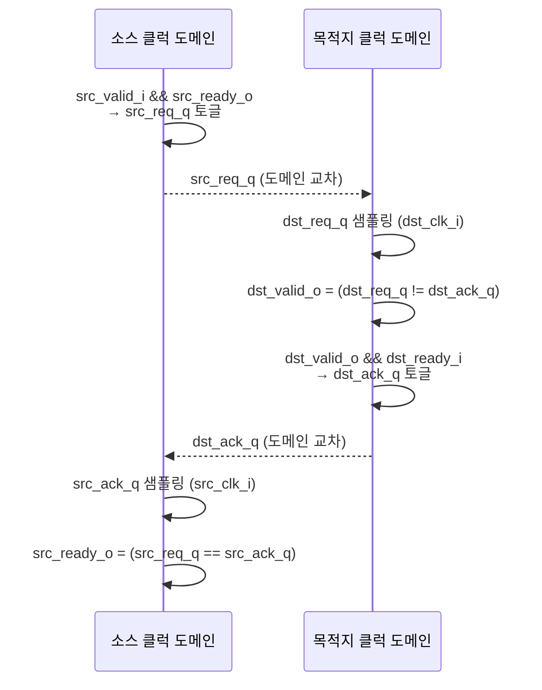
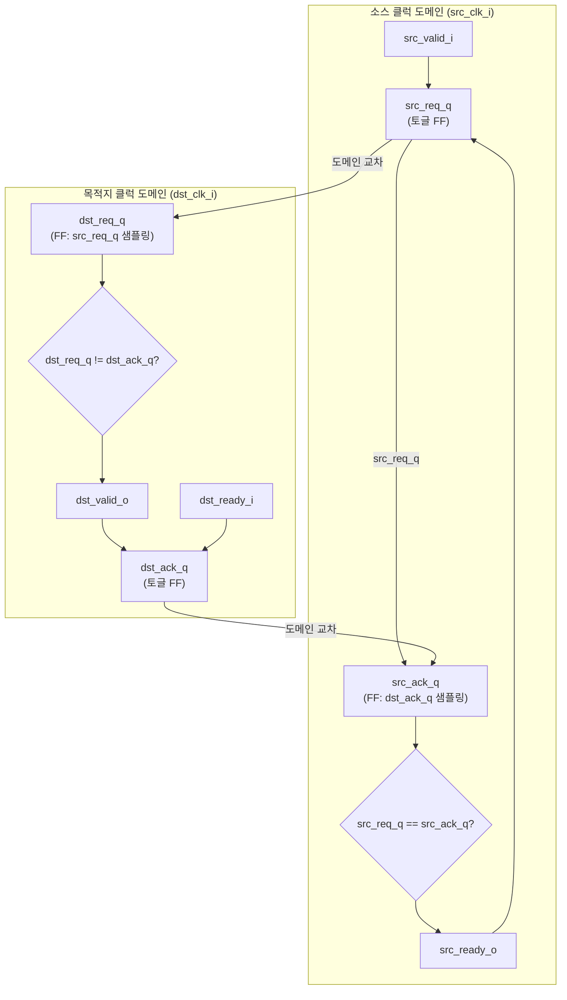

# isochronous_4phase_handshake.sv

## 개요

등시성(isochronous) 클럭 도메인 간 4-단계 핸드셰이크(4-phase handshake) 모듈입니다. 소스(src)와 목적지(dst) 클럭 도메인이 서로 정수배 관계에 있을 때 사용하며, 일반적인 CDC(Clock Domain Crossing)와 달리 동기화 레지스터가 필요 없습니다(STA로 타이밍 경로 커버).

- 데이터를 직접 버퍼링하지 않으며, 핸드셰이크 신호만 전달합니다.
- 데이터 전송이 필요한 경우 모듈 외부에서 별도로 처리해야 합니다.
- 소스는 목적지가 핸드셰이크를 완료한 이후에만 다음 핸드셰이크를 시작합니다.

> `isochronous_spill_register`와의 차이점: 이 모듈은 데이터를 버퍼링하지 않으며, 목적지의 핸드셰이크가 완료된 후에만 소스 핸드셰이크가 이루어집니다.

## 블록 다이어그램





## 포트/파라미터

이 모듈은 파라미터가 없습니다.

### 포트

| 포트 | 방향 | 타입 | 설명 |
|------|------|------|------|
| `src_clk_i` | 입력 | `logic` | 소스 클럭 도메인 클럭 |
| `src_rst_ni` | 입력 | `logic` | 소스 도메인 비동기 액티브 로우 리셋 |
| `src_valid_i` | 입력 | `logic` | 소스 측 유효 데이터 신호 |
| `src_ready_o` | 출력 | `logic` | 소스 측 준비 신호 (이전 핸드셰이크 완료 시 어서트) |
| `dst_clk_i` | 입력 | `logic` | 목적지 클럭 도메인 클럭 |
| `dst_rst_ni` | 입력 | `logic` | 목적지 도메인 비동기 액티브 로우 리셋 |
| `dst_valid_o` | 출력 | `logic` | 목적지 측 유효 데이터 신호 |
| `dst_ready_i` | 입력 | `logic` | 목적지 측 준비 신호 |

## 동작 설명

### 4-단계 핸드셰이크 프로토콜

1. **소스 요청**: `src_valid_i && src_ready_o` 조건이 성립하면 `src_req_q`를 토글합니다.
2. **요청 전달**: `src_req_q`가 목적지 클럭 도메인으로 캡처되어 `dst_req_q`가 됩니다.
3. **목적지 응답**: `dst_req_q != dst_ack_q` 이면 `dst_valid_o`가 어서트됩니다. `dst_valid_o && dst_ready_i` 조건이 성립하면 `dst_ack_q`를 토글합니다.
4. **응답 전달**: `dst_ack_q`가 소스 클럭 도메인으로 캡처되어 `src_ack_q`가 됩니다.
5. **소스 준비**: `src_req_q == src_ack_q` 이면 `src_ready_o`가 어서트되어 다음 핸드셰이크 가능 상태가 됩니다.

### 핵심 동작 조건

| 조건 | 의미 |
|------|------|
| `src_req_q == src_ack_q` | 소스 준비(이전 핸드셰이크 완료) |
| `src_req_q != src_ack_q` | 소스 대기 중(목적지 응답 기다림) |
| `dst_req_q != dst_ack_q` | 목적지에 유효한 데이터 있음 |
| `dst_req_q == dst_ack_q` | 목적지 비어있음 |

### 제약 사항

- 소스와 목적지 클럭은 반드시 정수배 관계여야 합니다.
- 모든 타이밍 경로는 STA(Static Timing Analysis)로 검증되어야 합니다.
- 권장 SDC: `create_generated_clock dst_clk_i -name dst_clk -source src_clk_i -divide_by 2`
- 어떤 클럭 도메인이 더 빠르든 동작합니다(임의의 정수비 지원).

### 외부 데이터 처리 예시

```systemverilog
`FFLNR(dst_data_o, src_data_i, (src_valid_i && src_ready_o), src_clk_i)
```

## 의존성 및 관계

| 항목 | 설명 |
|------|------|
| `common_cells/registers.svh` | `FFLARN`, `FFARN` 플립플롭 매크로 |
| `common_cells/assertions.svh` | `ASSERT` 매크로를 통한 신호 안정성 검증 |
| `isochronous_spill_register.sv` | 유사 모듈 (데이터 버퍼링 포함 버전) |
