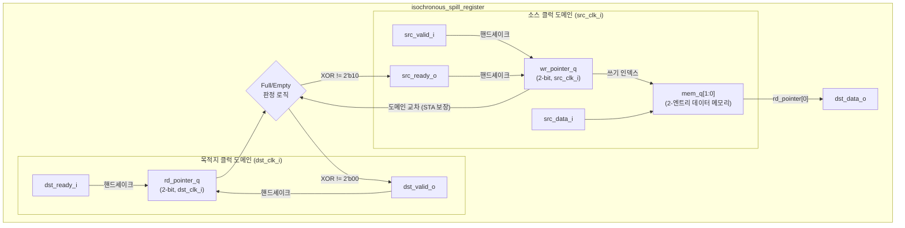
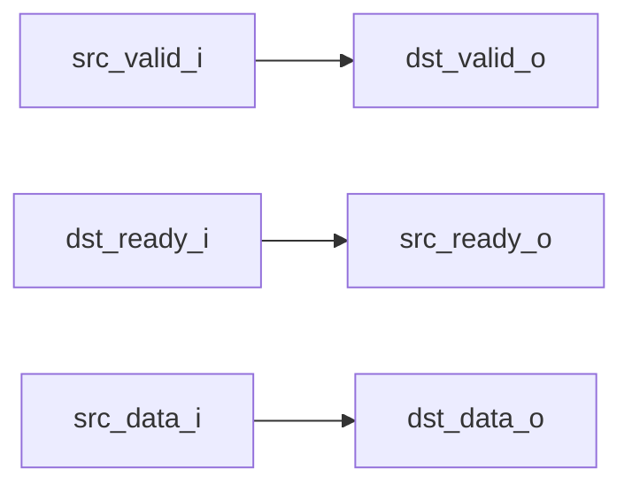

# isochronous_spill_register.sv

## 개요

등시성(isochronous) 클럭 도메인 간의 입력-출력 조합 경로를 완전히 차단하는 핸드셰이크 레지스터 모듈입니다. 소스와 목적지 클럭 도메인이 동일 클럭에서 파생되어 정수배 관계에 있을 때 사용합니다.

- 내부적으로 2-엔트리 이중 포인터 FIFO로 구현되어 데이터를 버퍼링합니다.
- 동기화 레지스터 없이 STA(정적 타이밍 분석)만으로 타이밍을 보장합니다.
- `Bypass` 파라미터로 버퍼링 없이 직접 연결(pass-through) 모드를 지원합니다.

> **등시성 정의**: 임의의 두 유효 순간 사이의 시간 간격이 단위 간격(unit interval)이거나 그 정수배인 신호.

## 블록 다이어그램

### Bypass 모드

## 포트/파라미터

### 파라미터

| 파라미터 | 타입 | 기본값 | 설명 |
|---------|------|--------|------|
| `T` | `type` | `logic` | 저장할 데이터 타입 |
| `Bypass` | `bit` | `1'b0` | `1'b1`이면 버퍼 없이 입출력을 직접 연결 |

### 포트

| 포트 | 방향 | 타입 | 설명 |
|------|------|------|------|
| `src_clk_i` | 입력 | `logic` | 소스 클럭 도메인 클럭 |
| `src_rst_ni` | 입력 | `logic` | 소스 도메인 비동기 액티브 로우 리셋 |
| `src_valid_i` | 입력 | `logic` | 소스 측 유효 데이터 신호 |
| `src_ready_o` | 출력 | `logic` | 소스 측 준비 신호 (FIFO가 가득 차지 않으면 어서트) |
| `src_data_i` | 입력 | `T` | 소스 측 입력 데이터 |
| `dst_clk_i` | 입력 | `logic` | 목적지 클럭 도메인 클럭 |
| `dst_rst_ni` | 입력 | `logic` | 목적지 도메인 비동기 액티브 로우 리셋 |
| `dst_valid_o` | 출력 | `logic` | 목적지 측 유효 데이터 신호 |
| `dst_ready_i` | 입력 | `logic` | 목적지 측 준비 신호 |
| `dst_data_o` | 출력 | `T` | 목적지 측 출력 데이터 |

## 동작 설명

### 내부 FIFO 구조

2-엔트리 이중 클럭 FIFO로 구현됩니다. 읽기/쓰기 포인터는 각각 목적지/소스 클럭 도메인에서 관리되며, 비트 폭은 2비트입니다. 상위 비트(MSB)는 오버플로우(래핑) 추적에 사용됩니다.

### FIFO 상태 판정

| 조건 | 상태 |
|------|------|
| `wr_pointer_q XOR rd_pointer_q == 2'b00` | FIFO 비어있음 (empty) |
| `wr_pointer_q XOR rd_pointer_q == 2'b10` | FIFO 가득 참 (full) |
| 그 외 | 데이터 1개 있음 |

- `src_ready_o`: XOR 결과가 `2'b10`이 아니면 어서트 (가득 차지 않음)
- `dst_valid_o`: XOR 결과가 `2'b00`이 아니면 어서트 (비어있지 않음)

### 쓰기 동작 (소스 클럭 도메인)

`src_valid_i && src_ready_o` 조건에서 `wr_pointer_q`를 증가시키고, `mem_q[wr_pointer_q[0]]`에 `src_data_i`를 저장합니다.

### 읽기 동작 (목적지 클럭 도메인)

`dst_valid_o && dst_ready_i` 조건에서 `rd_pointer_q`를 증가시킵니다. `dst_data_o`는 항상 `mem_q[rd_pointer_q[0]]`에서 읽습니다.

### 제약 사항

- 소스와 목적지 클럭은 동일 클럭 소스에서 파생되어 정수배 관계여야 합니다.
- 모든 타이밍 경로는 STA로 검증되어야 합니다.
- 권장 SDC: `create_generated_clock dst_clk_i -name dst_clk -source src_clk_i -divide_by 2`
- 어떤 클럭 도메인이 더 빠르든 동작합니다(임의의 정수비 지원).

## 의존성 및 관계

| 항목 | 설명 |
|------|------|
| `common_cells/registers.svh` | `FFLARN`, `FFL` 플립플롭 매크로 |
| `common_cells/assertions.svh` | `ASSERT` 매크로를 통한 신호 안정성 검증 |
| `isochronous_4phase_handshake.sv` | 유사 모듈 (데이터 버퍼링 없는 핸드셰이크 전용 버전) |
