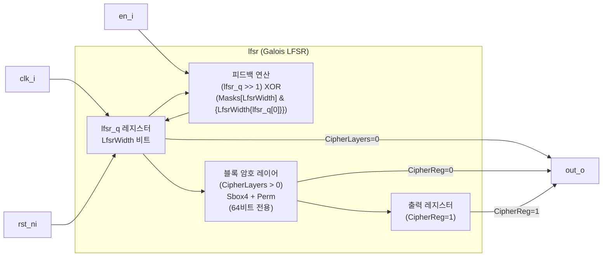

# lfsr (`lfsr.sv`)

## 개요

4비트에서 64비트까지 파라미터로 설정 가능한 갈루아(Galois) 방식의 선형 피드백 시프트 레지스터(LFSR)입니다. 사전 계산된 최대 길이 시퀀스(MLS) 피드백 마스크를 내장하고 있으며, 선택적으로 PRESENT 경량 블록 암호의 S-box와 순열(permutation) 레이어를 추가하여 선형 패턴을 비선형화할 수 있습니다. 의사 난수 생성, 스크램블링, 테스트 패턴 생성에 활용됩니다.

## 블록 다이어그램



## 포트 목록

| 포트명 | 방향 | 비트폭 | 설명 |
|--------|------|--------|------|
| `clk_i` | input | 1 | 클록 신호 |
| `rst_ni` | input | 1 | 비동기 액티브-로우 리셋 |
| `en_i` | input | 1 | LFSR 인에이블 (0이면 현재 상태 유지) |
| `out_o` | output | OutWidth | LFSR 출력 (하위 OutWidth 비트) |

## 파라미터

| 파라미터명 | 기본값 | 설명 |
|-----------|--------|------|
| `LfsrWidth` | 64 | LFSR 비트 폭 (4~64 범위) |
| `OutWidth` | 8 | 출력 비트 폭 (1~LfsrWidth) |
| `RstVal` | '1 | 리셋 초기값 (0이 되면 안 됨) |
| `CipherLayers` | 0 | 블록 암호 레이어 수 (0=비활성, 64비트 전용) |
| `CipherReg` | 1'b1 | 암호 레이어 후 출력 레지스터 추가 여부 |

## 동작 설명

### Galois LFSR 피드백 방식

갈루아 LFSR은 피드백이 시프트 레지스터 전체에 분산 적용되는 방식입니다.

```
lfsr_d = (lfsr_q >> 1) XOR (Masks[LfsrWidth] AND {LfsrWidth{lfsr_q[0]}})
```

- `lfsr_q[0]`이 1일 때: 우측 시프트 후 피드백 마스크를 XOR
- `lfsr_q[0]`이 0일 때: 단순 우측 시프트

### 피드백 마스크 (미리 계산된 최대 길이 시퀀스)

| LFSR 폭 | 마스크 (16진수) | 최대 시퀀스 길이 |
|---------|---------------|----------------|
| 4비트 | 0xC | 2^4-1 = 15 |
| 8비트 | 0x64B | 2^8-1 = 255 |
| 16비트 | 0x1030E | 2^16-1 = 65535 |
| 32비트 | 0x80000EA6 | 2^32-1 |
| 64비트 | 0x80000000019E2 | 2^64-1 |

마스크는 [Koopman의 LFSR 마스크 목록](https://users.ece.cmu.edu/~koopman/lfsr/)에서 가져왔으며, MSB가 반드시 1이어야 합니다.

### 블록 암호 레이어 (선택적, 64비트 전용)

PRESENT 경량 블록 암호의 변형을 사용하여 LFSR의 선형 패턴을 비선형화합니다.

1. **S-box 레이어 (`sbox4_layer`)**: 64비트를 4비트씩 16개 청크로 나눠 S-box 치환 적용
2. **순열 레이어 (`perm_layer`)**: PRESENT 암호의 비트 순열 행렬로 비트 위치 섞기
3. 두 레이어를 `CipherLayers`회 반복 적용

**S-box (4비트 입출력):**
```
입력:  0  1  2  3  4  5  6  7  8  9  A  B  C  D  E  F
출력: C  5  6  B  9  0  A  D  3  E  F  8  4  7  1  2
```

## 내부 구조

- `g_cipher_layers`: `CipherLayers > 0`일 때 생성되는 블록 암호 경로
- `g_no_cipher_layers`: 암호 없이 LFSR 출력을 직접 사용
- `g_cipher_reg` / `g_no_out_reg`: 암호 출력 레지스터 유무 선택
- 어서션: `all_zero` - LFSR이 전부 0이 되지 않도록 검사 (모든 0 상태는 LFSR 데드락)

## 의존성

- `common_cells/assertions.svh` (ASSERT, ASSERT_INIT 매크로)

## 사용 예시

```systemverilog
// 32비트 LFSR, 8비트 출력, 암호 레이어 없음
lfsr #(
    .LfsrWidth    (32),
    .OutWidth     (8),
    .RstVal       (32'hDEAD_BEEF),
    .CipherLayers (0)
) u_lfsr (
    .clk_i  (clk),
    .rst_ni (rst_n),
    .en_i   (enable),
    .out_o  (rand_byte)
);

// 64비트 LFSR, 3개 암호 레이어로 비선형화
lfsr #(
    .LfsrWidth    (64),
    .OutWidth     (16),
    .RstVal       (64'hFFFF_FFFF_FFFF_FFFF),
    .CipherLayers (3),
    .CipherReg    (1'b1)
) u_lfsr_secure (
    .clk_i  (clk),
    .rst_ni (rst_n),
    .en_i   (enable),
    .out_o  (rand_word)
);
```
