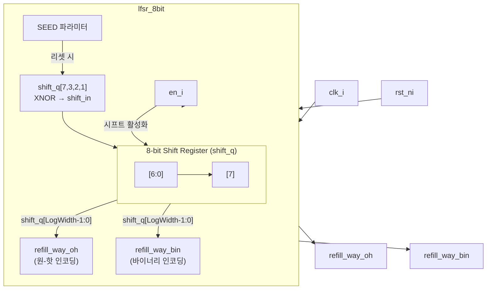

# lfsr_8bit.sv

## 개요

8비트 선형 피드백 시프트 레지스터(LFSR, Linear Feedback Shift Register) 모듈입니다. 캐시 리필 방향(way) 선택 등 의사 난수(pseudo-random) 패턴이 필요한 곳에 사용됩니다.

- 탭 다항식: `x^8 + x^4 + x^3 + x^2 + 1` (비트 [7], [3], [2], [1] 기반 XNOR)
- 매 클럭 주기마다 `en_i`가 어서트되면 레지스터를 한 비트 왼쪽으로 시프트합니다.
- 현재 시프트 레지스터 하위 비트를 이용해 원-핫 인코딩(`refill_way_oh`) 및 바이너리 인코딩(`refill_way_bin`) 출력을 제공합니다.

## 블록 다이어그램



## 포트/파라미터

### 파라미터

| 파라미터 | 타입 | 기본값 | 설명 |
|---------|------|--------|------|
| `SEED` | `logic [7:0]` | `8'b0` | LFSR 초기값 (리셋 시 로드됨) |
| `WIDTH` | `int unsigned` | `8` | 출력 원-핫 신호의 비트 폭. 최대 8 |

### 포트

| 포트 | 방향 | 타입 | 설명 |
|------|------|------|------|
| `clk_i` | 입력 | `logic` | 클럭 |
| `rst_ni` | 입력 | `logic` | 비동기 액티브 로우 리셋 |
| `en_i` | 입력 | `logic` | 시프트 활성화 (1이면 매 클럭마다 시프트) |
| `refill_way_oh` | 출력 | `logic [WIDTH-1:0]` | 현재 LFSR 값에 해당하는 원-핫 인코딩 출력 |
| `refill_way_bin` | 출력 | `logic [$clog2(WIDTH)-1:0]` | 현재 LFSR 값에 해당하는 바이너리 인코딩 출력 |

## 동작 설명

### 피드백 계산

매 클럭 주기마다 다음 식으로 새로운 LSB(shift_in)를 계산합니다:

```systemverilog
shift_in = !(shift_q[7] ^ shift_q[3] ^ shift_q[2] ^ shift_q[1]);
```

XNOR 연산을 사용하여 255 사이클 주기의 최대 길이 시퀀스를 생성합니다(올-제로 상태 제외).

### 시프트 동작

```systemverilog
if (en_i) shift_d = {shift_q[6:0], shift_in};  // 왼쪽 시프트
```

`en_i`가 어서트될 때만 레지스터가 업데이트되며, 디어서트 시 레지스터 값을 유지합니다.

### 출력 생성

```systemverilog
refill_way_oh = 'b0;
refill_way_oh[shift_q[LogWidth - 1:0]] = 1'b1;  // 원-핫
refill_way_bin = shift_q;                         // 바이너리
```

`WIDTH`비트 범위 내에서 LFSR 하위 비트(`LogWidth`비트)가 가리키는 인덱스를 원-핫 신호로 변환하여 출력합니다.

### lfsr_16bit와의 비교

| 항목 | lfsr_8bit | lfsr_16bit |
|------|-----------|------------|
| 레지스터 폭 | 8비트 | 16비트 |
| 최대 WIDTH | 8 | 16 |
| 시퀀스 주기 | 255 | 65535 |
| 피드백 탭 | [7], [3], [2], [1] | [15], [12], [5], [1] |

### 파라미터 제약

- `WIDTH <= 8`: 8비트 LFSR 특성상 WIDTH가 8을 초과할 수 없습니다.

## 의존성 및 관계

| 항목 | 설명 |
|------|------|
| `common_cells/assertions.svh` | `ASSERT_INIT` 매크로를 통한 파라미터 검증 |
| `lfsr_16bit.sv` | 동일 목적의 16비트 버전 |

주로 캐시 리필 웨이(way) 선택, 무작위 교체 정책(random replacement policy) 등에 사용됩니다.
