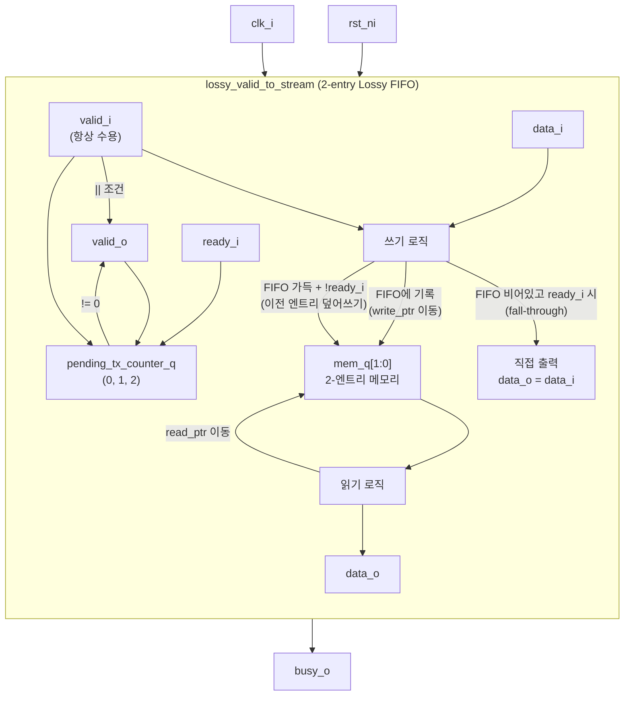

# lossy_valid_to_stream.sv

## 개요

백프레셔(backpressure)를 지원하지 않는 valid-only 소스 인터페이스를, ready-valid 스트림 인터페이스로 변환하는 모듈입니다. 내부적으로 2-엔트리 FIFO로 구현되며, FIFO가 가득 찬 상태에서 새 입력이 들어오면 이전 엔트리를 **덮어써서(overwrite)** 항상 최신 데이터를 유지합니다.

> **손실 주의(Lossy)**: 입력이 출력보다 빠르면 중간 트랜잭션이 손실될 수 있습니다. 항상 최신 값만 중요한 경우(예: 설정 레지스터 → IP 전달)에 적합합니다.

**주요 용도**: 설정 레지스터(configuration register)를 백프레셔가 발생할 수 있는 IP에 연결할 때, 이전 설정값이 아직 전달 중이어도 새 설정값이 즉시 반영되어야 하는 경우.

## 블록 다이어그램



## 포트/파라미터

### 파라미터

| 파라미터 | 타입 | 기본값 | 설명 |
|---------|------|--------|------|
| `DATA_WIDTH` | `int unsigned` | `32` | 데이터 비트 폭 (`T`가 `logic`일 때 적용) |
| `T` | `type` | `logic [DATA_WIDTH-1:0]` | 데이터 타입 |

### 포트

| 포트 | 방향 | 타입 | 설명 |
|------|------|------|------|
| `clk_i` | 입력 | `logic` | 클럭 |
| `rst_ni` | 입력 | `logic` | 비동기 액티브 로우 리셋 |
| `valid_i` | 입력 | `logic` | 입력 데이터 유효 신호 (ready_o 없음: 항상 수용) |
| `data_i` | 입력 | `T` | 입력 데이터 |
| `valid_o` | 출력 | `logic` | 출력 데이터 유효 신호 |
| `ready_i` | 입력 | `logic` | 출력 측 준비 신호 |
| `data_o` | 출력 | `T` | 출력 데이터 |
| `busy_o` | 출력 | `logic` | 미처리 트랜잭션 존재 여부 (`pending_tx_counter_q != 0`) |

## 동작 설명

### 내부 상태

- `mem_q[1:0]`: 2-엔트리 데이터 메모리
- `write_ptr_q` / `read_ptr_q`: 1비트 쓰기/읽기 포인터
- `pending_tx_counter_q`: 미처리 트랜잭션 수 (0, 1, 또는 2)

### 쓰기 로직 (write_logic)

| 조건 | 동작 |
|------|------|
| `valid_i && pending_tx_counter_q == 0 && ready_i` | Fall-through: FIFO에 쓰지 않고 직접 출력 |
| `valid_i && (pending_tx_counter_q != 0 || !ready_i) && pending_tx_counter_q < 2` | `mem_q[write_ptr_q]`에 쓰고 write_ptr 증가 |
| `valid_i && pending_tx_counter_q == 2 && !ready_i` | **이전 엔트리 덮어쓰기**: `mem_q[write_ptr_q - 1]` 갱신 (write_ptr 유지) |

### 읽기 로직 (read_logic)

| 조건 | 동작 |
|------|------|
| `pending_tx_counter_q == 0 && valid_i` | `data_o = data_i` (fall-through) |
| `valid_o && ready_i` | `data_o = mem_q[read_ptr_q]`, read_ptr 증가 |

### 트랜잭션 카운터 (count_transactions)

| 조건 | 카운터 변화 |
|------|------------|
| `valid_i && valid_o && ready_i` 동시 | 변화 없음 (동시 입출력) |
| `valid_i && !(valid_o && ready_i) && counter < 2` | +1 |
| `!valid_i && valid_o && ready_i` | -1 |
| `valid_i && counter == 2` | 변화 없음 (가득 참, 덮어쓰기만) |

### valid_o 조건

```systemverilog
assign valid_o = pending_tx_counter_q != 0 || valid_i;
```

FIFO에 데이터가 있거나 현재 입력이 유효하면 출력도 유효합니다.

### busy_o 의미

```systemverilog
assign busy_o = pending_tx_counter_q != 0;
```

`busy_o`가 0이면 모든 트랜잭션이 처리 완료된 상태입니다. 입력 측에서 이를 확인하여 최신 데이터가 출력으로 전달되었는지 파악할 수 있습니다.

## 의존성 및 관계

이 모듈은 외부 의존성이 없습니다(include 파일 없음).

| 관련 모듈 | 설명 |
|----------|------|
| 일반 `stream_fifo` | 가득 차면 입력을 막는 표준 FIFO (손실 없음) |
| `passthrough_stream_fifo` | 표준 ready-valid 스트림 FIFO (손실 없음) |

설정 레지스터와 백프레셔 IP 사이의 인터페이스 변환, 또는 항상 최신 값만 필요한 신호 변환에 적합합니다.
