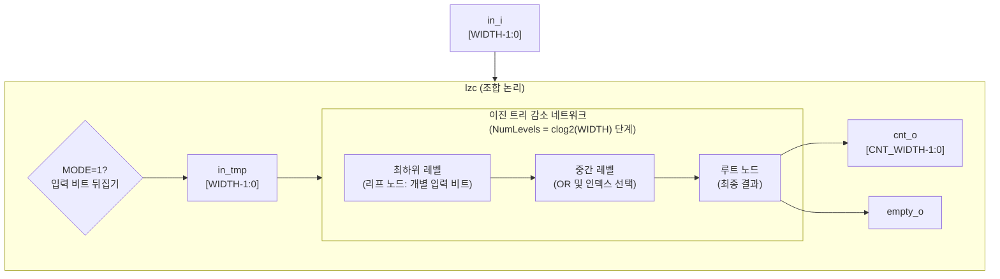
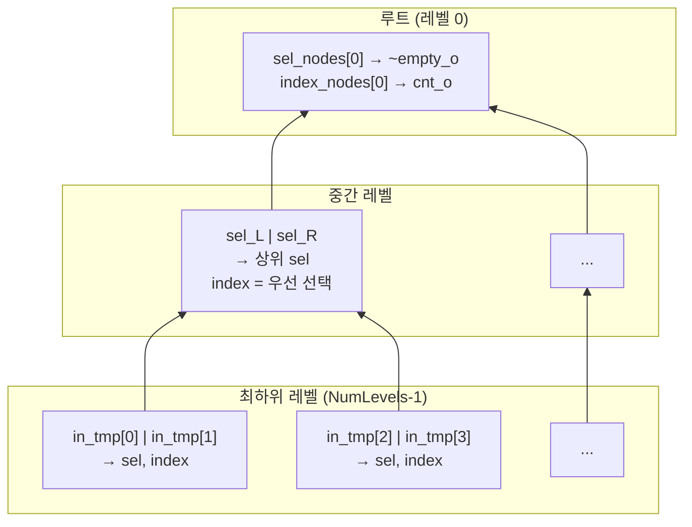

# lzc.sv

## 개요

선행 0 계수기(LZC, Leading Zero Counter) 또는 후행 0 계수기(TZC, Trailing Zero Counter) 모듈입니다. `MODE` 파라미터로 두 가지 동작 중 하나를 선택합니다. 순수 조합 논리로 구현되어 클럭이 필요 없습니다.

- **MODE = 0** (기본): 후행 0 계수기 (LSB부터 첫 번째 1까지의 0 개수)
- **MODE = 1**: 선행 0 계수기 (MSB부터 첫 번째 1까지의 0 개수)
- 입력이 모두 0이면 `empty_o`가 어서트되고 `cnt_o`는 최대 0 개수 - 1을 출력합니다.
- 트리(tree) 구조의 2진 감소 네트워크로 구현되어 효율적인 게이트 구조를 갖습니다.

## 블록 다이어그램



### 트리 구조 상세



## 포트/파라미터

### 파라미터

| 파라미터 | 타입 | 기본값 | 설명 |
|---------|------|--------|------|
| `WIDTH` | `int unsigned` | `2` | 입력 벡터의 비트 폭 (1 이상) |
| `MODE` | `bit` | `1'b0` | `0`: 후행 0 계수(LSB 기준), `1`: 선행 0 계수(MSB 기준) |
| `CNT_WIDTH` | `int unsigned` | (자동 계산) | 출력 카운터의 비트 폭: `cf_math_pkg::idx_width(WIDTH)`. **변경 금지** |

### 포트

| 포트 | 방향 | 타입 | 설명 |
|------|------|------|------|
| `in_i` | 입력 | `logic [WIDTH-1:0]` | 0 계수를 수행할 입력 벡터 |
| `cnt_o` | 출력 | `logic [CNT_WIDTH-1:0]` | 선행/후행 0의 개수 |
| `empty_o` | 출력 | `logic` | 입력의 모든 비트가 0일 때 어서트 |

## 동작 설명

### 동작 예시 (MODE = 0, 후행 0 계수)

| `in_i` | `empty_o` | `cnt_o` | 설명 |
|--------|-----------|---------|------|
| `000_0000` | `1` | `6` | 모두 0: empty, 최대값 - 1 출력 |
| `000_0001` | `0` | `0` | 비트 0이 1: 후행 0 없음 |
| `000_1000` | `0` | `3` | 비트 3이 최하위 1: 후행 0이 3개 |
| `001_0100` | `0` | `2` | 비트 2가 최하위 1: 후행 0이 2개 |

### MODE 동작

- **MODE = 0**: `in_tmp = in_i` (그대로 사용)
- **MODE = 1**: `in_tmp[i] = in_i[WIDTH-1-i]` (비트 뒤집기 → MSB를 LSB처럼 처리)

### 내부 트리 구조

`NumLevels = $clog2(WIDTH)` 레벨의 이진 트리로 구현됩니다:

1. **최하위 레벨**: 인접한 두 입력 비트를 OR하여 `sel_nodes` 생성, 우선 순위에 따라 `index_nodes` 결정
2. **중간 레벨**: 하위 두 `sel_nodes`를 OR하여 상위 `sel_nodes` 생성, 좌측 sel이 우선
3. **루트**: `sel_nodes[0]`이 1이면 `empty_o = 0`, `index_nodes[0]`이 `cnt_o`

### WIDTH = 1 특수 처리 (퇴화 경우)

```systemverilog
assign cnt_o[0] = !in_i[0];
assign empty_o  = !in_i[0];
```

### Verilator 최적화

`sel_nodes`와 `index_nodes` 배열에 `/* verilator split_var */` 힌트를 적용하여 시뮬레이션 성능을 향상시킵니다.

## 의존성 및 관계

| 항목 | 설명 |
|------|------|
| `common_cells/assertions.svh` | `ASSERT_INIT` 매크로를 통한 파라미터 검증 (`WIDTH > 0`) |
| `cf_math_pkg` | `idx_width()` 함수로 `CNT_WIDTH` 계산 |

이 모듈은 부동소수점 정규화, 우선순위 인코더, 비트 스캔 등 다양한 하드웨어 연산에 활용됩니다.
