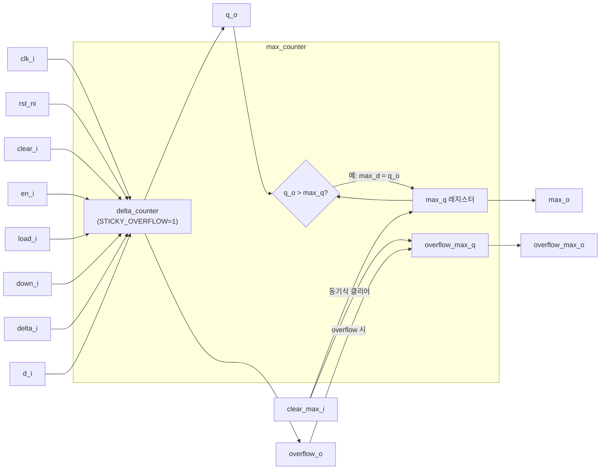

# max_counter (`max_counter.sv`)

## 개요

현재 카운터 값과 함께 관측된 최대값을 추적하는 업/다운 카운터입니다. `delta_counter`를 기반으로 동작하며, 별도의 `max_q` 레지스터에 카운터 동작 기간 동안의 최대값을 저장합니다. 하드웨어 성능 모니터링, 큐 깊이 추적, 버퍼 사용량 최대치 계측 등에 활용됩니다.

## 블록 다이어그램



## 포트 목록

| 포트명 | 방향 | 비트폭 | 설명 |
|--------|------|--------|------|
| `clk_i` | input | 1 | 클록 신호 |
| `rst_ni` | input | 1 | 비동기 액티브-로우 리셋 |
| `clear_i` | input | 1 | 카운터 동기식 클리어 |
| `clear_max_i` | input | 1 | 최대값 레지스터 동기식 클리어 |
| `en_i` | input | 1 | 카운터 인에이블 |
| `load_i` | input | 1 | 외부 값 로드 인에이블 |
| `down_i` | input | 1 | 다운카운트 선택 (0=업, 1=다운) |
| `delta_i` | input | WIDTH | 증감량 |
| `d_i` | input | WIDTH | 로드할 입력 데이터 |
| `q_o` | output | WIDTH | 카운터 현재 값 |
| `max_o` | output | WIDTH | 관측된 최대 카운터 값 |
| `overflow_o` | output | 1 | 카운터 오버플로 플래그 (스티키) |
| `overflow_max_o` | output | 1 | 최대값 갱신 시 오버플로가 있었음을 표시 |

## 파라미터

| 파라미터명 | 기본값 | 설명 |
|-----------|--------|------|
| `WIDTH` | 4 | 카운터 및 최대값 레지스터 비트 폭 |

## 동작 설명

`max_counter`는 내부적으로 `STICKY_OVERFLOW=1`로 설정된 `delta_counter`를 사용합니다.

### 최대값 갱신 로직

매 사이클 조합 로직에서 현재 카운터 출력(`q_o`)이 저장된 최대값(`max_q`)보다 크면 최대값을 갱신합니다.

```
if (clear_max_i):   max_d = 0, overflow_max_d = 0
elif (q_o > max_q): max_d = q_o
                    if (overflow_o): overflow_max_d = 1
```

- `clear_i`와 `clear_max_i`는 독립적으로 동작합니다. 카운터를 클리어해도 최대값은 유지되며, 반대도 마찬가지입니다.
- `overflow_max_o`는 최대값 갱신 시점에 오버플로가 발생했었음을 나타내며, `clear_max_i`로 클리어됩니다.
- `max_o`는 조합 논리로 즉시 갱신됩니다 (`max_d`를 바로 출력하여 `q_o > max_q`인 경우 동 사이클에 반영).

## 내부 구조

- `delta_counter` 인스턴스: `STICKY_OVERFLOW=1`로 고정하여 오버플로 누적 추적
- `max_q`, `overflow_max_q`: 독립 플립플롭으로 최대값 및 최대값 오버플로 플래그 저장
- `max_o`는 레지스터 출력(`max_q`)과 조합 갱신값(`q_o`) 중 큰 값을 동시 출력

## 의존성

- `delta_counter` (`src/delta_counter.sv`)

## 사용 예시

```systemverilog
// 8비트 최대값 추적 카운터
max_counter #(
    .WIDTH (8)
) u_max_cnt (
    .clk_i         (clk),
    .rst_ni        (rst_n),
    .clear_i       (cnt_clear),
    .clear_max_i   (max_clear),
    .en_i          (enable),
    .load_i        (load),
    .down_i        (1'b0),      // 업카운트만 사용
    .delta_i       (8'd1),
    .d_i           ('0),
    .q_o           (current_val),
    .max_o         (peak_val),
    .overflow_o    (cnt_ovf),
    .overflow_max_o(peak_ovf)
);
```
