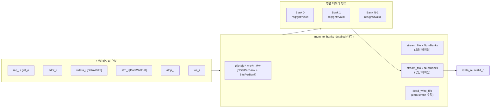

# mem_to_banks (`mem_to_banks.sv`)

## 상태: 활성

## 개요

단일 메모리 요청을 여러 병렬 뱅크로 분할하는 래퍼 모듈입니다. 각 뱅크는 독립적인 req/gnt 핸드셰이크 및 rvalid 응답 인터페이스를 가집니다. 내부적으로 `mem_to_banks_detailed`를 인스턴스화하며, AXI4+ATOP의 원자적 신호(`atop`)를 사이드밴드 신호로 처리합니다.

주요 특징:
- 입력 데이터를 `NumBanks`개 뱅크로 균등 분할
- 각 뱅크에 독립적 req/gnt 흐름 제어
- 스트로브가 0인 쓰기 트랜잭션 숨김 기능 (`HideStrb`)
- 미완료 트랜잭션 추적 및 응답 재조립

## 블록 다이어그램



## 포트 목록

| 포트명 | 방향 | 비트폭 | 설명 |
|--------|------|--------|------|
| `clk_i` | 입력 | 1 | 클록 |
| `rst_ni` | 입력 | 1 | 비동기 리셋 (Active Low) |
| `req_i` | 입력 | 1 | 메모리 요청 유효 |
| `gnt_o` | 출력 | 1 | 요청 허용 |
| `addr_i` | 입력 | AddrWidth | 바이트 단위 주소 |
| `wdata_i` | 입력 | DataWidth | 쓰기 데이터 |
| `strb_i` | 입력 | DataWidth/8 | 바이트 단위 쓰기 스트로브 |
| `atop_i` | 입력 | AtopWidth | AXI4+ATOP 원자 신호 |
| `we_i` | 입력 | 1 | 쓰기 활성화 (High: 쓰기) |
| `rvalid_o` | 출력 | 1 | 응답 유효 (읽기/쓰기 모두) |
| `rdata_o` | 출력 | DataWidth | 읽기 응답 데이터 |
| `bank_req_o` | 출력 | NumBanks | 뱅크별 요청 유효 |
| `bank_gnt_i` | 입력 | NumBanks | 뱅크별 요청 허용 |
| `bank_addr_o` | 출력 | AddrWidth × NumBanks | 뱅크별 바이트 주소 |
| `bank_wdata_o` | 출력 | (DataWidth/NumBanks) × NumBanks | 뱅크별 쓰기 데이터 |
| `bank_strb_o` | 출력 | (DataWidth/NumBanks/8) × NumBanks | 뱅크별 스트로브 |
| `bank_atop_o` | 출력 | AtopWidth × NumBanks | 뱅크별 원자 신호 |
| `bank_we_o` | 출력 | NumBanks | 뱅크별 쓰기 활성화 |
| `bank_rvalid_i` | 입력 | NumBanks | 뱅크별 응답 유효 |
| `bank_rdata_i` | 입력 | (DataWidth/NumBanks) × NumBanks | 뱅크별 읽기 데이터 |

## 파라미터

| 파라미터명 | 기본값 | 설명 |
|-----------|--------|------|
| `AddrWidth` | 32 | 주소 비트폭 |
| `DataWidth` | 32 | 입력 데이터 비트폭 (2의 거듭제곱이어야 함) |
| `AtopWidth` | 32 | ATOP 신호 비트폭 |
| `NumBanks` | 1 | 출력 뱅크 수 (DataWidth를 균등 분할할 수 있어야 함) |
| `HideStrb` | 0 | 1이면 스트로브가 0인 쓰기 트랜잭션을 뱅크에 전달하지 않음 |
| `MaxTrans` | 1 | 최대 동시 미완료 트랜잭션 수 |
| `FifoDepth` | 1 | 내부 스트림 FIFO 깊이 (최소 1) |
| `atop_t` | logic[AtopWidth-1:0] | ATOP 타입 |

## 동작 설명

이 모듈은 `mem_to_banks_detailed`의 얇은 래퍼로, `atop_i`를 `wuser_i`(쓰기 사이드밴드)로 매핑하여 전달합니다. 응답 사이드밴드(`ruser_o`)는 사용하지 않습니다.

내부 상세 동작은 `mem_to_banks_detailed` 문서를 참조하세요.

```
atop_i  →  wuser_i  →  bank_wuser_o  →  bank_atop_o
ruser_o : 미연결 (항상 0 입력)
```

## 의존성

| 모듈 | 용도 |
|------|------|
| `mem_to_banks_detailed` | 실제 뱅크 분할 로직 구현 |

## 사용 예시

```systemverilog
mem_to_banks #(
    .AddrWidth  (32),
    .DataWidth  (128),   // 128비트 데이터를 4개 뱅크로 분할
    .AtopWidth  (6),
    .NumBanks   (4),
    .HideStrb   (1'b1),  // zero-strobe 쓰기 숨김 활성화
    .MaxTrans   (4),
    .FifoDepth  (2)
) u_mem_to_banks (
    .clk_i,
    .rst_ni,
    .req_i      (mem_req),
    .gnt_o      (mem_gnt),
    .addr_i     (mem_addr),
    .wdata_i    (mem_wdata),
    .strb_i     (mem_strb),
    .atop_i     (mem_atop),
    .we_i       (mem_we),
    .rvalid_o   (mem_rvalid),
    .rdata_o    (mem_rdata),
    .bank_req_o (bank_req),
    .bank_gnt_i (bank_gnt),
    .bank_addr_o(bank_addr),
    .bank_wdata_o(bank_wdata),
    .bank_strb_o(bank_strb),
    .bank_atop_o(bank_atop),
    .bank_we_o  (bank_we),
    .bank_rvalid_i(bank_rvalid),
    .bank_rdata_i(bank_rdata)
);
```
