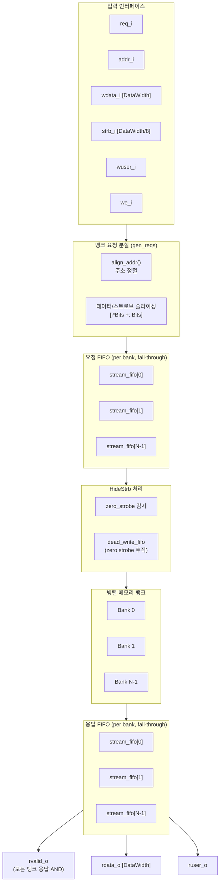

# mem_to_banks_detailed (`mem_to_banks_detailed.sv`)

## 상태: 활성

## 개요

단일 메모리 요청을 여러 병렬 뱅크로 분할하는 상세 구현 모듈입니다. `mem_to_banks`와 달리 쓰기 사이드밴드(`wuser`)와 읽기 사이드밴드(`ruser`)를 모두 별도로 지원합니다. 각 뱅크에 독립적인 req/gnt 흐름 제어와 rvalid 응답 동기화를 제공하며, `stream_fifo`를 통한 요청/응답 버퍼링으로 타이밍 완화를 지원합니다.

주요 특징:
- 주소 정렬(align) 후 뱅크별 주소 자동 계산
- 요청/응답 모두 fall-through stream_fifo 버퍼링
- 스트로브가 0인 쓰기에 대한 "dead response" 처리 (`HideStrb`)
- 모든 뱅크의 gnt와 resp_ready가 동시에 준비되어야 전체 gnt 발행

## 블록 다이어그램



## 포트 목록

| 포트명 | 방향 | 비트폭 | 설명 |
|--------|------|--------|------|
| `clk_i` | 입력 | 1 | 클록 |
| `rst_ni` | 입력 | 1 | 비동기 리셋 (Active Low) |
| `req_i` | 입력 | 1 | 메모리 요청 유효 |
| `gnt_o` | 출력 | 1 | 요청 허용 |
| `addr_i` | 입력 | AddrWidth | 바이트 단위 주소 |
| `wdata_i` | 입력 | DataWidth | 쓰기 데이터 |
| `strb_i` | 입력 | DataWidth/8 | 바이트 쓰기 스트로브 |
| `wuser_i` | 입력 | wuser_t | 쓰기 요청 사이드밴드 |
| `we_i` | 입력 | 1 | 쓰기 활성화 (High: 쓰기) |
| `rvalid_o` | 출력 | 1 | 응답 유효 |
| `rdata_o` | 출력 | DataWidth | 읽기 응답 데이터 |
| `ruser_o` | 출력 | NumBanks × RUserWidth | 읽기 응답 사이드밴드 |
| `bank_req_o` | 출력 | NumBanks | 뱅크별 요청 유효 |
| `bank_gnt_i` | 입력 | NumBanks | 뱅크별 요청 허용 |
| `bank_addr_o` | 출력 | AddrWidth × NumBanks | 뱅크별 바이트 주소 |
| `bank_wdata_o` | 출력 | oup_data_t × NumBanks | 뱅크별 쓰기 데이터 |
| `bank_strb_o` | 출력 | oup_strb_t × NumBanks | 뱅크별 스트로브 |
| `bank_wuser_o` | 출력 | wuser_t × NumBanks | 뱅크별 쓰기 사이드밴드 |
| `bank_we_o` | 출력 | NumBanks | 뱅크별 쓰기 활성화 |
| `bank_rvalid_i` | 입력 | NumBanks | 뱅크별 응답 유효 |
| `bank_rdata_i` | 입력 | oup_data_t × NumBanks | 뱅크별 읽기 데이터 |
| `bank_ruser_i` | 입력 | oup_ruser_t × NumBanks | 뱅크별 읽기 사이드밴드 |

## 파라미터

| 파라미터명 | 기본값 | 설명 |
|-----------|--------|------|
| `AddrWidth` | 32 | 주소 비트폭 |
| `DataWidth` | 32 | 입력 데이터 비트폭 (2의 거듭제곱, NumBanks로 균등 분할 가능해야 함) |
| `WUserWidth` | 0 | 쓰기 사이드밴드 비트폭 |
| `RUserWidth` | 0 | 읽기 사이드밴드 비트폭 |
| `NumBanks` | 1 | 출력 뱅크 수 |
| `HideStrb` | 0 | 1이면 zero-strobe 쓰기를 뱅크에 전달하지 않고 가상 응답 처리 |
| `MaxTrans` | 1 | 최대 동시 미완료 트랜잭션 수 (dead_write_fifo 크기 결정) |
| `FifoDepth` | 1 | stream_fifo 깊이 (최소 1) |
| `wuser_t` | logic[WUserWidth-1:0] | 쓰기 사이드밴드 타입 |

## 동작 설명

### 주소 정렬 및 분할

입력 주소를 전체 데이터 폭 기준으로 정렬 후 뱅크 인덱스를 더해 각 뱅크 주소를 계산합니다:

```
aligned_base = (addr >> log2(DataBytes)) << log2(DataBytes)
bank_addr[i] = aligned_base + i * BytesPerBank
```

### 요청 버퍼링

각 뱅크에 `stream_fifo`(fall-through)가 삽입되어 요청을 버퍼링합니다. `gnt_o`는 모든 뱅크의 요청 FIFO와 응답 FIFO가 준비된 경우에만 발행됩니다:

```
gnt_o = (&req_ready) & (&resp_ready) & !dead_write_fifo_full
```

### HideStrb 동작

`HideStrb=1`인 경우:
- 쓰기이면서 스트로브가 0이면 해당 뱅크에 `bank_req_o=0`으로 요청을 숨깁니다.
- 대신 내부적으로 즉시 gnt를 생성하고, `dead_write_fifo`에 해당 뱅크 마스크를 기록합니다.
- `rvalid_o` 생성 시 dead response 비트를 활용해 응답을 재조합합니다.

### 응답 조합

모든 뱅크의 응답 FIFO가 유효(`resp_valid`)이거나 dead response인 경우에만 `rvalid_o`를 발행합니다:

```
rvalid_o = &(resp_valid | dead_response)
```

## 의존성

| 모듈 | 용도 |
|------|------|
| `stream_fifo` | 요청 및 응답 fall-through 버퍼링 |
| `fifo_v3` | dead_write_fifo 구현 |
| `common_cells/assertions.svh` | 파라미터 검증 어서션 |

## 사용 예시

```systemverilog
// 상세 사이드밴드가 필요한 경우 직접 인스턴스화
mem_to_banks_detailed #(
    .AddrWidth  (32),
    .DataWidth  (64),
    .WUserWidth (6),     // AXI ATOP 폭
    .RUserWidth (4),     // 응답 사이드밴드
    .NumBanks   (2),
    .HideStrb   (1'b1),
    .MaxTrans   (8),
    .FifoDepth  (2),
    .wuser_t    (logic [5:0])
) u_mem_to_banks_det (
    .clk_i,
    .rst_ni,
    .req_i, .gnt_o,
    .addr_i, .wdata_i, .strb_i,
    .wuser_i (atop_sig),
    .we_i,
    .rvalid_o, .rdata_o,
    .ruser_o  (read_sideband),
    .bank_req_o, .bank_gnt_i,
    .bank_addr_o, .bank_wdata_o, .bank_strb_o,
    .bank_wuser_o, .bank_we_o,
    .bank_rvalid_i, .bank_rdata_i,
    .bank_ruser_i
);
```

`atop` 신호만 필요한 일반적인 경우에는 `mem_to_banks` 래퍼 사용을 권장합니다.
