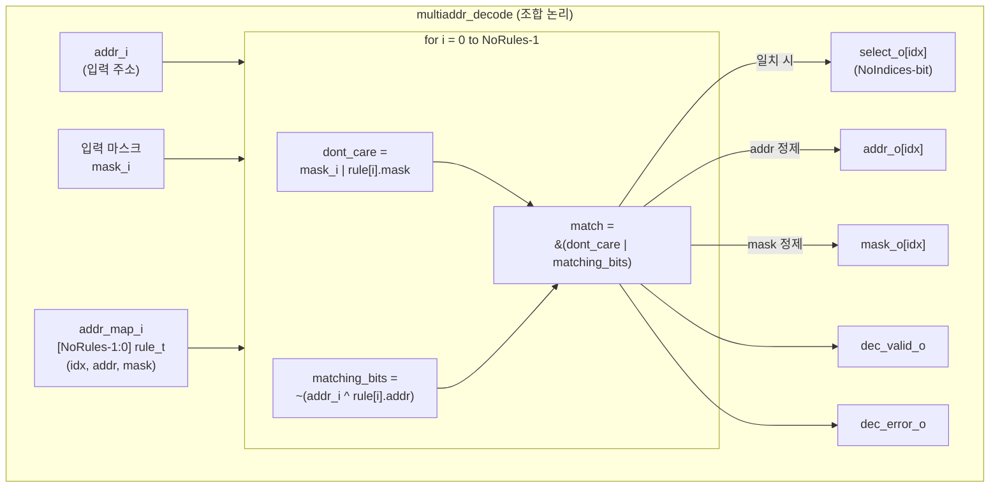

# multiaddr_decode.sv

## 개요

다중 주소 디코더(Multi-Address Decoder) 모듈입니다. `{addr, mask}` 형식으로 표현된 입력 주소 집합(address set)을 받아, 주소 맵(`addr_map_i`)의 각 규칙(rule)과 교집합이 있는지 검사하고 일치하는 인덱스 비트마스크(`select_o`)와 정제된 주소 집합(`addr_o`, `mask_o`)을 출력합니다.

**`{addr, mask}` 인코딩 방식**: 마스크의 1 비트는 해당 주소 비트가 "don't care"임을 의미합니다. 즉, 해당 비트는 0이든 1이든 유효한 주소에 포함됩니다. 이 방식으로 `2^N` 크기의 정렬된 연속 주소 구간을 표현할 수 있습니다.

순수 조합 논리(combinational logic)로 구현됩니다.

## 블록 다이어그램



## 포트/파라미터

### 파라미터

| 파라미터 | 타입 | 기본값 | 설명 |
|---------|------|--------|------|
| `NoIndices` | `int unsigned` | `0` | 규칙에서 사용 가능한 최대 인덱스 수. `select_o`의 비트 폭 |
| `NoRules` | `int unsigned` | `0` | 주소 맵의 규칙(rule) 총 개수 (1 이상 필요) |
| `addr_t` | `type` | `logic` | 주소 타입 (규칙과 입력에 동일 적용) |
| `rule_t` | `type` | `logic` | 규칙 구조체 타입. `{idx, addr, mask}` 세 필드 필요 |

### rule_t 구조 (사용자 정의 필요)

```systemverilog
typedef struct packed {
  int unsigned idx;   // 규칙 인덱스 (< NoIndices)
  addr_t       addr;  // 규칙 기준 주소
  addr_t       mask;  // 규칙 마스크 (1 = don't care)
} rule_t;
```

### 포트

| 포트 | 방향 | 타입 | 설명 |
|------|------|------|------|
| `addr_i` | 입력 | `addr_t` | 디코딩할 입력 주소 |
| `mask_i` | 입력 | `addr_t` | 입력 주소의 마스크 (1 = don't care) |
| `addr_map_i` | 입력 | `rule_t [NoRules-1:0]` | 주소 맵 규칙 배열 |
| `select_o` | 출력 | `logic [NoIndices-1:0]` | 일치하는 인덱스 비트마스크 |
| `addr_o` | 출력 | `addr_t [NoIndices-1:0]` | 각 인덱스별 정제된 출력 주소 |
| `mask_o` | 출력 | `addr_t [NoIndices-1:0]` | 각 인덱스별 정제된 출력 마스크 |
| `dec_valid_o` | 출력 | `logic` | 하나 이상의 규칙이 일치하면 어서트 |
| `dec_error_o` | 출력 | `logic` | 일치하는 규칙이 없으면 어서트 |

## 동작 설명

### 매칭 조건

각 규칙 `i`에 대해 다음과 같이 매칭 여부를 결정합니다:

```systemverilog
dont_care    = mask_i | addr_map_i[i].mask;        // 입력 또는 규칙에서 don't care인 비트
matching_bits = ~(addr_i ^ addr_map_i[i].addr);    // 두 주소의 일치하는 비트
match        = &(dont_care | matching_bits);        // 모든 비트가 don't care이거나 일치
```

don't care 비트(입력 마스크 또는 규칙 마스크에서 1인 비트)는 항상 일치로 처리됩니다. 즉, 두 주소 집합 사이에 공통 원소가 하나라도 있으면 일치합니다.

### 출력 주소 정제

일치가 발생했을 때, 실제로 겹치는 주소 부분집합을 계산하여 출력합니다:

```systemverilog
mask_o[idx] = mask_i & addr_map_i[i].mask;
            // 양쪽 모두 don't care인 비트만 출력에서 don't care 유지
addr_o[idx] = (~mask_i & addr_i) | (mask_i & addr_map_i[i].addr);
            // 입력 마스크가 0인 비트: 입력 주소 값 유지
            // 입력 마스크가 1인 비트: 규칙 주소 값으로 해석
```

### 예시

| addr_i | mask_i | rule.addr | rule.mask | match? | 설명 |
|--------|--------|-----------|-----------|--------|------|
| `0100` | `0000` | `0100` | `0000` | O | 정확히 일치 |
| `0100` | `0011` | `0110` | `0000` | O | 입력 don't care 비트[1,0]가 규칙 주소와 겹침 |
| `0100` | `0000` | `0110` | `0000` | X | 비트[1]이 다름 |
| `0100` | `0001` | `0101` | `0010` | O | 양측 don't care 합집합으로 겹침 존재 |

### 동작 특성

- 여러 규칙이 동시에 일치 가능 (OR 누적)
- 동일한 `idx`를 가진 여러 규칙이 일치하면 `select_o[idx]`가 어서트되고 마지막 일치 규칙의 주소가 사용됨
- `dec_valid_o`와 `dec_error_o`는 항상 서로 반대값

## 의존성 및 관계

| 항목 | 설명 |
|------|------|
| `common_cells/assertions.svh` | `ASSUME_I` 매크로를 통한 파라미터 및 주소 맵 유효성 검증 |

이 모듈은 `addr_decode.sv`(단일 주소 디코더)의 다중 주소 확장 버전으로, 주소 범위가 마스크로 표현되는 시스템에서 주소 라우팅 및 디코딩에 사용됩니다.
