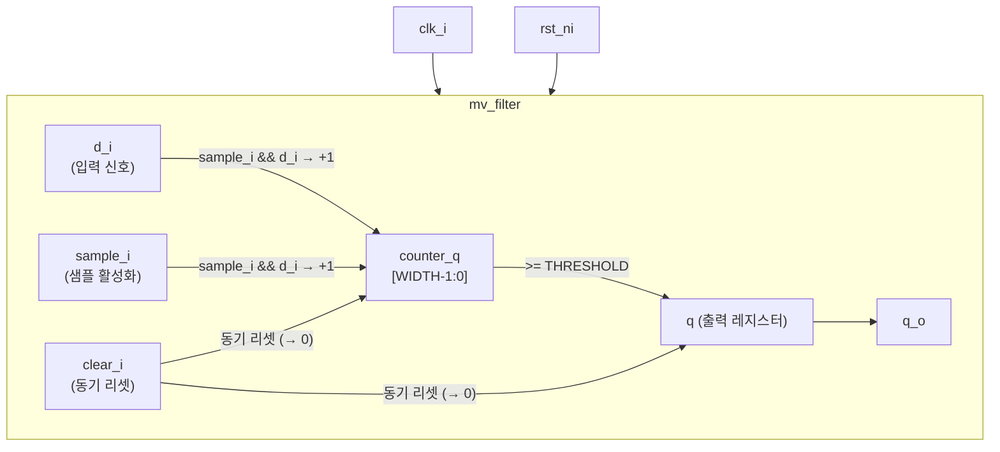
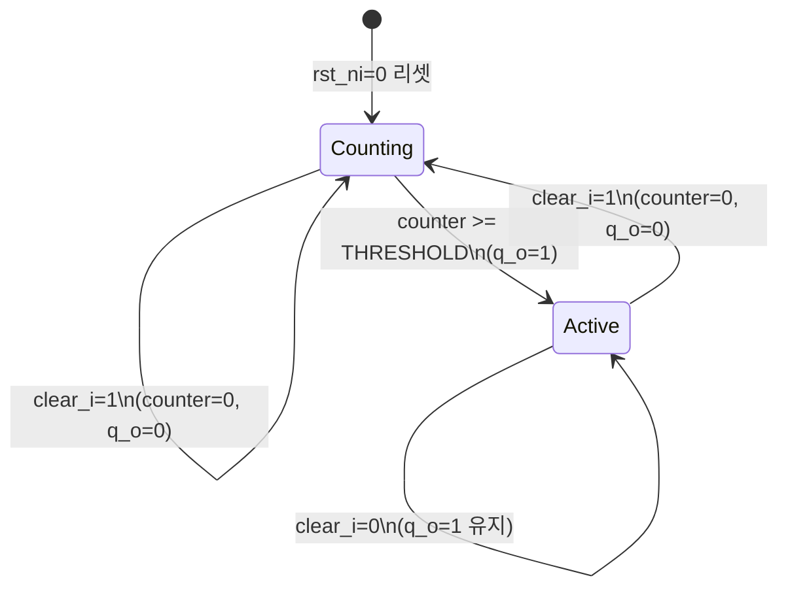

# mv_filter.sv

## 개요

다수결 필터(Majority Vote Filter) 모듈입니다. 디지털 입력 신호 `d_i`에서 1의 누적 개수가 임계값(`THRESHOLD`)에 도달하면 출력 `q_o`를 1로 설정합니다. 노이즈가 있는 단일 비트 신호를 안정화하거나 디바운싱(debouncing)에 사용됩니다.

- `sample_i`가 어서트되고 `d_i = 1`이면 내부 카운터를 증가시킵니다.
- 카운터가 `THRESHOLD`에 도달하면 출력이 1이 됩니다.
- `clear_i`로 카운터와 출력을 즉시 리셋합니다.

## 블록 다이어그램



## 포트/파라미터

### 파라미터

| 파라미터 | 타입 | 기본값 | 설명 |
|---------|------|--------|------|
| `WIDTH` | `int unsigned` | `4` | 카운터의 비트 폭. 최대 카운터값 = `2^WIDTH - 1` |
| `THRESHOLD` | `int unsigned` | `10` | 출력이 1이 되는 카운터 임계값. `WIDTH`비트로 잘림 |

### 포트

| 포트 | 방향 | 타입 | 설명 |
|------|------|------|------|
| `clk_i` | 입력 | `logic` | 클럭 |
| `rst_ni` | 입력 | `logic` | 비동기 액티브 로우 리셋 |
| `sample_i` | 입력 | `logic` | 샘플 활성화 신호 |
| `clear_i` | 입력 | `logic` | 동기 리셋: 카운터와 출력을 0으로 클리어 |
| `d_i` | 입력 | `logic` | 필터링할 입력 데이터 비트 |
| `q_o` | 출력 | `logic` | 필터 출력 |

## 동작 설명

### 조합 논리 (always_comb)

우선순위 순서:

1. **임계값 도달**: `counter_q >= THRESHOLD` 이면 `d (출력 next) = 1`
2. **샘플링**: `sample_i && d_i` 이면 `counter_d = counter_q + 1`
3. **동기 클리어**: `clear_i` 이면 `counter_d = 0`, `d = 0` (최고 우선순위)

```
d (출력_next) = (counter_q >= THRESHOLD) ? 1 : q
counter_d     = (sample_i && d_i) ? counter_q + 1 : counter_q
// clear_i 시 모두 0으로 덮어씀
```

### 상태 전이



### 동작 특성

- **일방향 필터**: 0→1 전환만 카운터로 제어합니다. 입력 `d_i = 0`은 카운터를 감소시키지 않습니다.
- **동기 클리어**: `clear_i`는 클럭 엣지에 동기화되어 처리됩니다 (비동기 리셋과 구분).
- **출력 래치 특성**: 임계값 도달 후 `clear_i`가 없으면 출력은 1을 유지합니다.

### 파라미터 설정 예시

| WIDTH | THRESHOLD | 설명 |
|-------|-----------|------|
| 4 | 10 | 최대 15까지 카운트, 10회 연속 1 입력 시 출력 활성화 |
| 8 | 100 | 최대 255까지 카운트, 100회 입력 시 출력 활성화 |
| 4 | 15 | 최대 카운터 값에서만 출력 활성화 |

## 의존성 및 관계

이 모듈은 외부 의존성이 없습니다(include 파일 없음).

입력 신호 디바운싱, 글리치 필터링, 다수결 기반 신호 안정화 등에 사용됩니다. 특히 외부 입력 핀이나 불안정한 신호원에서 노이즈를 제거하는 데 적합합니다.
