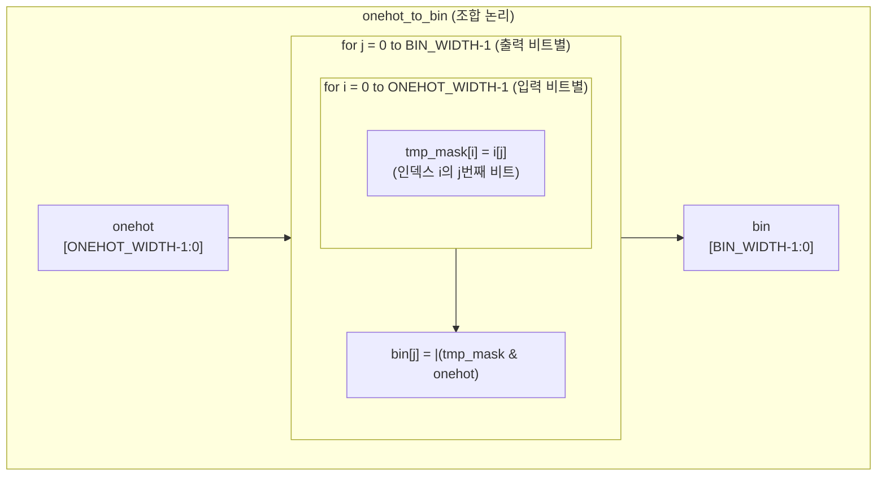
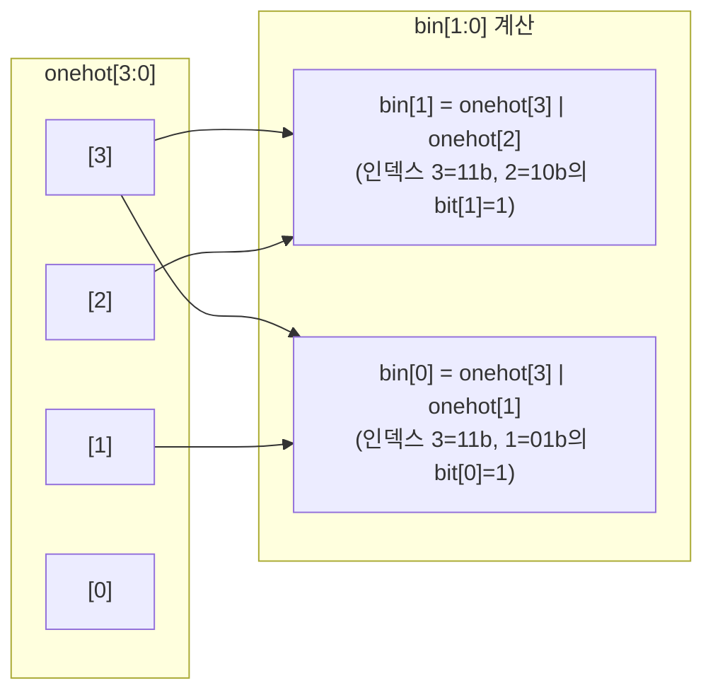

# onehot_to_bin.sv

## 개요

원-핫(One-Hot) 인코딩을 바이너리(Binary) 인코딩으로 변환하는 조합 논리 모듈입니다. `ONEHOT_WIDTH`비트의 원-핫 입력 신호에서 어서트된 비트의 위치(인덱스)를 `BIN_WIDTH`비트 바이너리로 출력합니다.

- 순수 조합 논리로 구현됩니다 (클럭 불필요).
- `generate` 루프를 사용하여 출력의 각 비트를 독립적으로 계산합니다.
- 최종 시뮬레이션에서 입력이 원-핫이 아닌 경우(2개 이상 비트 어서트) 어서션 실패를 발생시킵니다.

## 블록 다이어그램



### 동작 원리 (예시: ONEHOT_WIDTH=4)



## 포트/파라미터

### 파라미터

| 파라미터 | 타입 | 기본값 | 설명 |
|---------|------|--------|------|
| `ONEHOT_WIDTH` | `int unsigned` | `16` | 입력 원-핫 신호의 비트 폭 |
| `BIN_WIDTH` | `int unsigned` | (자동 계산) | 출력 바이너리 신호의 비트 폭. `ONEHOT_WIDTH==1 ? 1 : $clog2(ONEHOT_WIDTH)`. **변경 금지** |

### 포트

| 포트 | 방향 | 타입 | 설명 |
|------|------|------|------|
| `onehot` | 입력 | `logic [ONEHOT_WIDTH-1:0]` | 원-핫 인코딩 입력 (하나의 비트만 어서트) |
| `bin` | 출력 | `logic [BIN_WIDTH-1:0]` | 어서트된 비트의 인덱스 (바이너리 인코딩) |

## 동작 설명

### 변환 알고리즘

출력 바이너리의 각 비트 `j`는 다음과 같이 계산됩니다:

```systemverilog
// 출력 j번째 비트:
// 인덱스 i의 j번째 비트가 1인 모든 onehot[i]를 OR
bin[j] = |(tmp_mask & onehot)
// 단, tmp_mask[i] = i[j] (i를 BIN_WIDTH 비트 바이너리로 표현했을 때의 j번째 비트)
```

즉, 각 출력 비트는 "해당 비트가 1인 인덱스들"에 대응하는 원-핫 비트들의 OR입니다.

### 변환 진리표 (ONEHOT_WIDTH = 4)

| `onehot[3:0]` | 어서트 인덱스 | `bin[1:0]` |
|---------------|-------------|-----------|
| `0001` | 0 | `00` |
| `0010` | 1 | `01` |
| `0100` | 2 | `10` |
| `1000` | 3 | `11` |
| `0000` | (없음) | `00` (정의되지 않음) |

### ONEHOT_WIDTH 별 BIN_WIDTH

| `ONEHOT_WIDTH` | `BIN_WIDTH` |
|----------------|------------|
| 1 | 1 |
| 2 | 1 |
| 4 | 2 |
| 8 | 3 |
| 16 | 4 |
| 256 | 8 |

### 어서션

시뮬레이션 종료 시점(`ASSERT_FINAL`)에 입력이 원-핫 또는 올-제로(`$onehot0`)인지 검사합니다. 2개 이상의 비트가 동시에 어서트되면 에러를 발생시킵니다.

## 의존성 및 관계

| 항목 | 설명 |
|------|------|
| `common_cells/assertions.svh` | `ASSERT_FINAL` 매크로를 통한 입력 유효성 검증 |
| `lfsr_8bit.sv` / `lfsr_16bit.sv` | 원-핫 출력(`refill_way_oh`)을 바이너리로 변환하는 용도로 연계 가능 |

우선순위 인코더 출력 변환, 캐시 웨이 선택 신호 변환, 인터럽트 벡터 인코딩 등에 사용됩니다.
