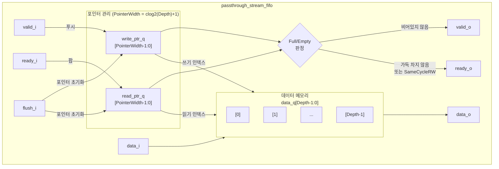

# passthrough_stream_fifo.sv

## 개요

타이밍 경로를 차단하지 않는 스트림 FIFO 모듈입니다. 일반적인 스트림 FIFO와 달리 FIFO가 가득 찬 상태에서도 동일 사이클 내에 팝(pop)이 발생하면 푸시(push)를 허용합니다. 이를 통해 버퍼 공간을 더 효율적으로 활용할 수 있지만, 더 긴 타이밍 경로가 생성됩니다.

- `SameCycleRW` 파라미터로 동일 사이클 읽기/쓰기 허용 여부를 제어합니다.
- 읽기/쓰기 포인터를 추가 비트(오버플로우 추적)로 관리하여 full/empty 상태를 판별합니다.
- `flush_i`로 FIFO 내용을 즉시 클리어합니다.

## 블록 다이어그램



### 포인터 구조


## 포트/파라미터

### 파라미터

| 파라미터 | 타입 | 기본값 | 설명 |
|---------|------|--------|------|
| `Depth` | `int unsigned` | `8` | FIFO 깊이 (2 ~ 2^32 지원) |
| `PrintInfo` | `bit` | `1'b0` | `1`이면 시뮬레이션 시작 시 정보 출력 |
| `SameCycleRW` | `bit` | `1'b1` | `1`이면 FIFO가 가득 찼을 때 읽기와 쓰기를 동일 사이클에 허용 |
| `type_t` | `type` | `logic` | FIFO에 저장할 데이터 타입 |

### 포트

| 포트 | 방향 | 타입 | 설명 |
|------|------|------|------|
| `clk_i` | 입력 | `logic` | 클럭 |
| `rst_ni` | 입력 | `logic` | 비동기 액티브 로우 리셋 |
| `flush_i` | 입력 | `logic` | FIFO 플러시 (포인터를 0으로 초기화) |
| `testmode_i` | 입력 | `logic` | 클럭 게이트 바이패스 (테스트 모드) |
| `data_i` | 입력 | `type_t` | 푸시할 입력 데이터 |
| `valid_i` | 입력 | `logic` | 입력 데이터 유효 신호 (푸시 요청) |
| `ready_o` | 출력 | `logic` | FIFO가 가득 차지 않음 (푸시 가능) |
| `data_o` | 출력 | `type_t` | 팝할 출력 데이터 |
| `valid_o` | 출력 | `logic` | FIFO가 비어있지 않음 (팝 가능) |
| `ready_i` | 입력 | `logic` | 출력 측 준비 신호 (팝 요청) |

## 동작 설명

### 포인터 구조

`PointerWidth = $clog2(Depth) + 1` 비트의 포인터를 사용합니다. MSB는 오버플로우(래핑) 추적 비트로, 하위 비트가 `Depth-1`을 넘어 0으로 돌아올 때 반전됩니다.

### Full/Empty 판정

| 조건 | 상태 |
|------|------|
| `read_ptr_q[MSB] == write_ptr_q[MSB]` 이고 `read_ptr_q[나머지] != write_ptr_q[나머지]` | 데이터 있음 (not empty) |
| `read_ptr_q[MSB] != write_ptr_q[MSB]` | 항상 데이터 있음 (full 상태) |
| `read_ptr_q[MSB] == write_ptr_q[MSB]` 이고 `read_ptr_q[나머지] == write_ptr_q[나머지]` | 비어있음 (empty) |

```systemverilog
// valid_o (not empty)
valid_o = read_ptr_q[MSB] == write_ptr_q[MSB]
        ? read_ptr_q[나머지] != write_ptr_q[나머지] : 1'b1;

// ready_o (not full, 또는 SameCycleRW이고 현재 팝 중)
ready_o = (MSB_같음 ? 1'b1 : write_addr != read_addr)
        || (SameCycleRW && ready_i && valid_o);
```

### SameCycleRW 효과

`SameCycleRW = 1`일 때: FIFO가 가득 찬 상태에서 `ready_i && valid_o`이면 `ready_o`를 어서트합니다. 즉, 팝과 동일 사이클에 푸시를 허용합니다. 이로 인해 `valid_o → ready_o` 조합 경로가 생성됩니다.

### 포인터 업데이트

```systemverilog
// 오버플로우 시 하위 비트를 0으로 리셋하고 MSB 반전
if (ptr[나머지] == Depth-1) begin
    ptr_d[나머지] = '0;
    ptr_d[MSB]    = !ptr_q[MSB];
end else begin
    ptr_d = ptr_q + 1;
end
```

### 플러시 동작

`flush_i`가 어서트되면 읽기/쓰기 포인터를 모두 0으로 리셋하고 `valid_o = 0`, `ready_o = 0`을 출력합니다.

### 어서션

| 어서션 | 조건 | 설명 |
|--------|------|------|
| `CheckFullPush` | `!ready_o & valid_i` 불가 | 가득 찬 상태에서 푸시 금지 |
| `CheckEmptyPop` | `!valid_o & ready_i` 불가 | 비어있는 상태에서 팝 금지 |

## 의존성 및 관계

| 항목 | 설명 |
|------|------|
| `common_cells/assertions.svh` | `ASSERT_NEVER` 매크로를 통한 프로토콜 검증 |
| `common_cells/registers.svh` | `FF`, `FFL` 플립플롭 매크로 |

| 관련 모듈 | 차이점 |
|----------|--------|
| `stream_fifo.sv` | 타이밍 경로를 차단하는 표준 스트림 FIFO |
| `lossy_valid_to_stream.sv` | 손실 허용 2-엔트리 FIFO |
| `spill_register.sv` | 단일 엔트리 스필 레지스터 |

타이밍보다 버퍼 효율을 우선시하는 스트림 파이프라인 연결에 사용됩니다.
