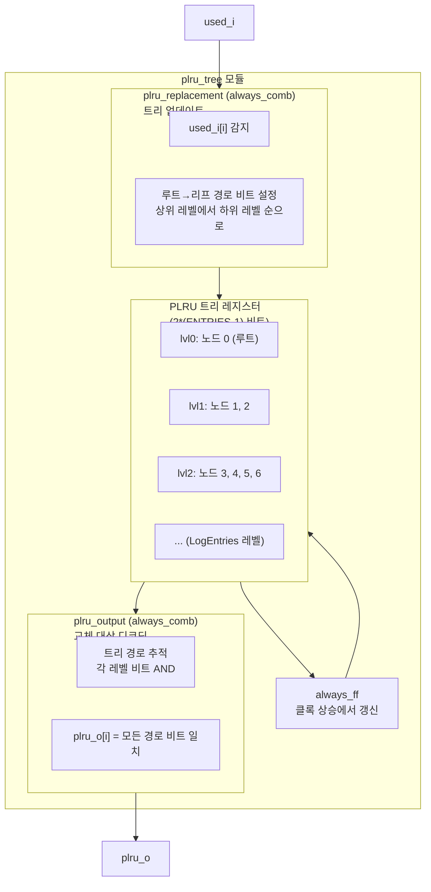

# plru_tree (`plru_tree.sv`)

## 상태: 활성

## 개요

의사 LRU(Pseudo Least Recently Used, PLRU) 교체 알고리즘을 이진 트리 구조로 구현한 모듈입니다. 주로 TLB(Translation Lookaside Buffer), 캐시 교체 정책 등에서 활용되며, 각 엔트리의 최근 사용 여부를 이진 트리 비트로 추적하여 교체 대상을 빠르게 결정합니다.

주요 특징:
- `ENTRIES`개 엔트리의 PLRU 상태를 `2*(ENTRIES-1)` 비트 트리로 표현
- One-hot 입력(`used_i`)으로 사용된 엔트리를 표시
- One-hot 출력(`plru_o`)으로 교체 대상 엔트리를 표시
- 조합 논리로 즉시 PLRU 출력 계산, 레지스터는 상태 저장에만 사용
- ENTRIES는 반드시 2의 거듭제곱이어야 함

## 블록 다이어그램



### 트리 구조 (ENTRIES=8 예시)

```
레벨 0:          노드 0             (루트)
               /       \
레벨 1:      노드 1     노드 2
            /   \       /   \
레벨 2:   노드3 노드4 노드5 노드6
          /\ /\   /\   /\
엔트리:  0 1 2 3  4 5  6 7
```

트리 노드 비트 해석:
- `0`: 왼쪽 자식 방향이 LRU (교체 대상)
- `1`: 오른쪽 자식 방향이 LRU (교체 대상)

엔트리 `i`가 사용되면, 루트에서 엔트리 `i`까지의 경로에 있는 모든 노드를 반대 방향으로 설정합니다 (다음 번에 반대쪽이 선택되도록).

## 포트 목록

| 포트명 | 방향 | 비트폭 | 설명 |
|--------|------|--------|------|
| `clk_i` | 입력 | 1 | 클록 |
| `rst_ni` | 입력 | 1 | 비동기 리셋 (Active Low) |
| `used_i` | 입력 | ENTRIES | 사용된 엔트리 (One-hot) |
| `plru_o` | 출력 | ENTRIES | 교체 대상 엔트리 (One-hot) |

## 파라미터

| 파라미터명 | 기본값 | 설명 |
|-----------|--------|------|
| `ENTRIES` | 16 | 관리할 엔트리 수. 반드시 2의 거듭제곱이어야 함 |

내부 `localparam`:
- `LogEntries = $clog2(ENTRIES)`: 트리 레벨 수
- 트리 비트 수: `2*(ENTRIES-1)`

## 동작 설명

### PLRU 업데이트 (plru_replacement)

엔트리 `i`가 사용될 때(used_i[i]=1), 루트에서 해당 엔트리까지의 경로를 따라 각 레벨의 노드 비트를 설정합니다. 각 레벨에서 비트는 현재 방향의 반대를 가리키도록 설정됩니다:

```
new_index = ~(i >> (shift-1))  // 현재 레벨에서의 반대 방향
plru_tree_d[idx_base + (i >> shift)] = new_index
```

8-엔트리 TLB 예시:
| 사용된 엔트리 | 설정되는 트리 노드 |
|---|---|
| used_i[7] | plru_tree[0,2,6] = {1,1,1} |
| used_i[6] | plru_tree[0,2,6] = {1,1,0} |
| used_i[0] | plru_tree[0,1,3] = {0,0,0} |

### PLRU 출력 디코딩 (plru_output)

각 엔트리 `i`에 대해 루트에서 리프까지의 경로를 확인합니다. 경로의 모든 노드 비트가 해당 엔트리 방향을 가리키면 그 엔트리가 PLRU 대상입니다:

```
// 엔트리 i의 레벨 lvl에서:
new_index = i >> (shift-1)   // 이 레벨에서 엔트리 i의 방향
if (new_index) plru_o[i] &= plru_tree_q[node]
else           plru_o[i] &= ~plru_tree_q[node]
```

### 리셋

리셋 시 모든 트리 비트가 0으로 초기화되므로, 처음에는 엔트리 0이 PLRU 대상이 됩니다.

### 어서션

- `ENTRIES`가 2의 거듭제곱이 아니면 합성 시 오류 발생
- `plru_o`는 항상 One-hot이거나 전체 0이어야 함 (런타임 검증)

## 의존성

| 모듈/파일 | 용도 |
|-----------|------|
| `common_cells/assertions.svh` | `ASSERT_INIT`, `ASSERT` 매크로 |

## 사용 예시

```systemverilog
// 8-엔트리 TLB에서 PLRU 교체 정책 적용
plru_tree #(
    .ENTRIES (8)
) u_plru (
    .clk_i   (clk),
    .rst_ni  (rst_n),
    .used_i  (tlb_hit_way),   // 히트된 웨이 (One-hot)
    .plru_o  (tlb_plru_way)   // 교체할 웨이 (One-hot)
);

// TLB 미스 시 plru_o가 가리키는 웨이에 새 항목 삽입
// TLB 히트 시 used_i에 히트 웨이를 One-hot으로 전달
```

### 동작 예시 (ENTRIES=4)

```
초기 상태: plru_tree = 2'b00 → plru_o = 4'b0001 (엔트리 0이 교체 대상)
used_i = 4'b0001 (엔트리 0 사용) → plru_tree 업데이트 → plru_o = 4'b0010 (엔트리 1이 교체 대상)
used_i = 4'b0010 (엔트리 1 사용) → plru_o = 4'b0001 (엔트리 0이 교체 대상)
```
