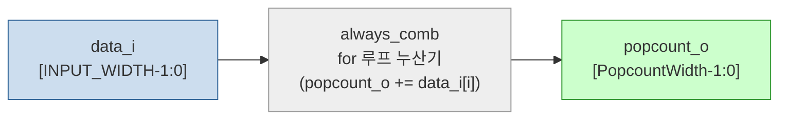

# popcount.sv

## 개요

`popcount` 모듈은 입력 벡터의 해밍 가중치(Hamming weight), 즉 비트 중 1의 개수를 계산합니다. 임의의 너비 입력 벡터를 처리할 수 있으며, 출력 너비는 `ceil(log2(INPUT_WIDTH)) + 1` 비트로 자동 결정됩니다. 내부적으로 `for` 루프를 사용한 평탄(flat) 고수준 기술 방식으로 구현되어 현대 합성 도구의 최적화 휴리스틱을 효과적으로 활용합니다.

## 블록 다이어그램

## 포트/파라미터

### 파라미터

| 이름 | 종류 | 기본값 | 설명 |
|------|------|--------|------|
| `INPUT_WIDTH` | `int unsigned` | `256` | 입력 벡터의 비트 너비 (1 이상이어야 함) |
| `PopcountWidth` | `int unsigned` (localparam) | `$clog2(INPUT_WIDTH) + 1` | 출력 결과 비트 너비 (자동 계산, 재정의 불가) |

### 포트

| 이름 | 방향 | 너비 | 설명 |
|------|------|------|------|
| `data_i` | input | `INPUT_WIDTH` | 팝카운트를 계산할 입력 비트 벡터 |
| `popcount_o` | output | `PopcountWidth` | 입력 벡터에서 1의 개수 (해밍 가중치) |

## 동작 설명

`always_comb` 블록 안에서 `popcount_o`를 0으로 초기화한 뒤, `for` 루프로 `data_i`의 각 비트를 순차적으로 누산합니다. SystemVerilog 합성 도구는 이 구조를 자동으로 최적화된 가산기 트리(adder tree)로 변환합니다.

- 출력 너비 `PopcountWidth = $clog2(INPUT_WIDTH) + 1` 이므로, 모든 비트가 1인 경우(`INPUT_WIDTH`)까지 오버플로 없이 표현 가능합니다.
- `INPUT_WIDTH < 1`이면 `$error`를 발생시키는 파라미터 검사가 포함되어 있습니다.
- 이전 구현 방식(이진 가산기 트리 직접 기술)보다 합성 도구 친화적이며 동등하거나 더 나은 결과를 생성합니다.

## 의존성 및 관계

| 구분 | 내용 |
|------|------|
| 상위 의존 | 없음 (독립 조합 회로 모듈) |
| 하위 인스턴스 | 없음 |
| 활용 예 | `rr_arb_tree`의 공정 중재 로직, 패리티 계산, 에러 정정 등 다양한 비트 카운팅 용도 |
