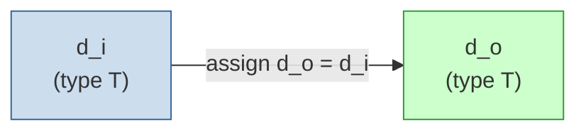

# read.sv

## 개요

`read` 모듈은 신호를 단순히 통과(wire-through)시키는 더미(dummy) 회로입니다. 합성 시 `non-ungrouped` 컴파일 과정에서 신호가 최적화로 인해 제거되는 것을 방지하기 위해 사용됩니다. `(* no_ungroup *)` 속성이 지정되어 있어 합성 도구가 이 모듈을 상위 모듈과 병합(ungroup)하지 않습니다.

## 블록 다이어그램

## 포트/파라미터

### 파라미터

| 이름 | 종류 | 기본값 | 설명 |
|------|------|--------|------|
| `Width` | `int unsigned` | `1` | 기본 데이터 너비 (타입 T를 재정의하지 않을 때 사용) |
| `T` | `type` | `logic [Width-1:0]` | 데이터 타입 (사용자 정의 타입으로 재정의 가능) |

### 포트

| 이름 | 방향 | 타입 | 설명 |
|------|------|------|------|
| `d_i` | input | `T` | 입력 신호 |
| `d_o` | output | `T` | 출력 신호 (d_i와 동일) |

## 동작 설명

내부 구현은 `assign d_o = d_i`의 단순 연결(wire)이며, 기능적으로는 아무런 변환을 수행하지 않습니다.

핵심 목적은 합성 속성 `(* no_ungroup *)`을 통해 합성 도구가 이 모듈 경계를 보존하도록 강제하는 것입니다. 이를 통해:

- 합성 넷리스트에서 특정 신호가 사라지지 않도록 보호합니다.
- 시뮬레이션 또는 포스트-합성 분석 시 신호 추적이 가능하도록 유지합니다.
- 타입 파라미터 `T`를 통해 임의의 구조체 타입이나 인터페이스 타입에도 적용할 수 있습니다.

## 의존성 및 관계

| 구분 | 내용 |
|------|------|
| 상위 의존 | 없음 (독립 모듈) |
| 하위 인스턴스 | 없음 |
| 활용 예 | 합성 후 신호 보존이 필요한 모든 곳; 디버그 프로브(probe) 삽입 목적 |
