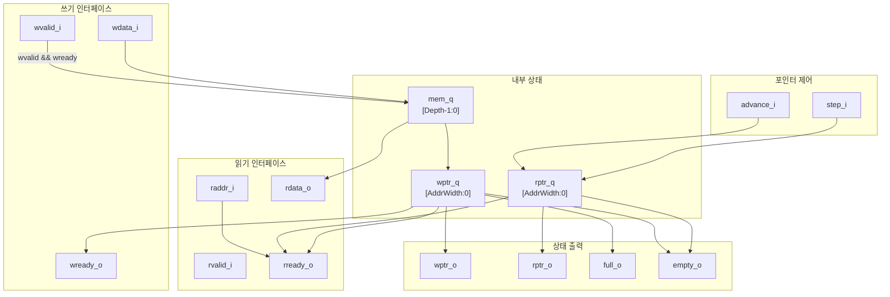

# ring_buffer.sv

## 개요

`ring_buffer` 모듈은 분리된 쓰기와 읽기 접근을 지원하는 유연한 링 버퍼(ring buffer)입니다. 순차적 쓰기와 제한적 랜덤 읽기를 valid/ready 핸드셰이크 프로토콜로 제공합니다. 이중 포인터(dual-pointer) 메커니즘에 1비트 확장을 더해 버퍼의 가득 찬 상태(full)와 빈 상태(empty)를 구분합니다. 읽기 포인터는 `advance_i` 인터페이스를 통해 독립적으로 전진시킬 수 있어, 읽기 소비 시점과 읽기 주소 요청을 분리합니다.

## 블록 다이어그램

## 포트/파라미터

### 파라미터

| 이름 | 종류 | 기본값 | 설명 |
|------|------|--------|------|
| `Depth` | `int unsigned` | `32` | 링 버퍼 깊이 (2의 거듭제곱이어야 함) |
| `data_t` | `type` | `logic` | 저장할 데이터 타입 |
| `AddrWidth` | `int unsigned` (localparam) | `cf_math_pkg::idx_width(Depth)` | 주소 비트 너비 (자동 계산) |
| `StepWidth` | `int unsigned` (localparam) | `cf_math_pkg::idx_width(Depth+1)` | step 신호 비트 너비 (자동 계산) |

### 포트

| 이름 | 방향 | 타입 | 설명 |
|------|------|------|------|
| `clk_i` | input | `logic` | 클록 신호 |
| `rst_ni` | input | `logic` | 비동기 리셋 (active low) |
| `wvalid_i` | input | `logic` | 쓰기 데이터 유효 신호 |
| `wready_o` | output | `logic` | 쓰기 수용 준비 신호 (버퍼가 가득 차지 않으면 1) |
| `wdata_i` | input | `data_t` | 쓰기 데이터 |
| `rvalid_i` | input | `logic` | 읽기 요청 유효 신호 |
| `rready_o` | output | `logic` | 읽기 요청 수용 가능 신호 (raddr_i가 유효 범위 내) |
| `raddr_i` | input | `addr_t` | 읽기 주소 |
| `rdata_o` | output | `data_t` | 읽기 데이터 (비동기 출력) |
| `advance_i` | input | `logic` | 읽기 포인터 전진 요청 |
| `step_i` | input | `step_t` | 읽기 포인터 전진 크기 |
| `wptr_o` | output | `addr_t` | 현재 쓰기 포인터 |
| `rptr_o` | output | `addr_t` | 현재 읽기 포인터 |
| `full_o` | output | `logic` | 버퍼 가득 참 표시 |
| `empty_o` | output | `logic` | 버퍼 비어 있음 표시 |

## 동작 설명

### 쓰기 동작
- `wvalid_i && wready_o` (즉, `!full_o`)가 동시에 참일 때 `wdata_i`를 `mem_q[wptr_q]`에 저장하고 `wptr_q`를 1 증가합니다.

### 읽기 동작
- 읽기는 랜덤 주소(`raddr_i`)를 직접 지정하는 방식입니다.
- `rready_o`는 요청 주소가 유효한 범위 내에 있을 때만 1로 출력됩니다.
  - `rptr_o < wptr_o`인 경우: `raddr_i` ∈ `[rptr_o, wptr_o)`
  - `rptr_o > wptr_o`(랩어라운드)인 경우: `raddr_i` ∈ `[rptr_o, Depth) ∪ [0, wptr_o)`
  - `rptr_o == wptr_o && !empty`(버퍼 가득 참)인 경우: 모든 주소 유효

### 포인터 관리
- 포인터는 `AddrWidth + 1` 비트로 관리합니다 (최상위 1비트는 랩 비트).
- `empty`: `wptr_q == rptr_q` (두 포인터가 동일)
- `full`: 하위 주소 비트가 같지만 전체 값이 다른 경우 (랩 비트 차이)
- `advance_i`가 어서트되면 `rptr_q`를 `step_i`만큼 증가합니다.

### 어서션
- 읽기 포인터가 쓰기 포인터를 초과하지 않도록 검사합니다.
- 쓰기 포인터가 읽기 포인터를 초과하지 않도록 검사합니다.
- `Depth`는 2의 거듭제곱이어야 합니다 (`ASSERT_INIT`으로 검사).

## 의존성 및 관계

| 구분 | 내용 |
|------|------|
| 인클루드 | `common_cells/registers.svh`, `common_cells/assertions.svh` |
| 사용 패키지 | `cf_math_pkg` (`idx_width`, `is_power_of_2` 함수) |
| 하위 인스턴스 | 없음 (레지스터는 매크로 `FF`로 직접 생성) |
| 제약 조건 | `Depth`는 반드시 2의 거듭제곱이어야 함 |
| 활용 예 | 명령어 재실행(replay) 버퍼, 프리페치 버퍼, 랜덤 접근이 필요한 스트림 버퍼 |
