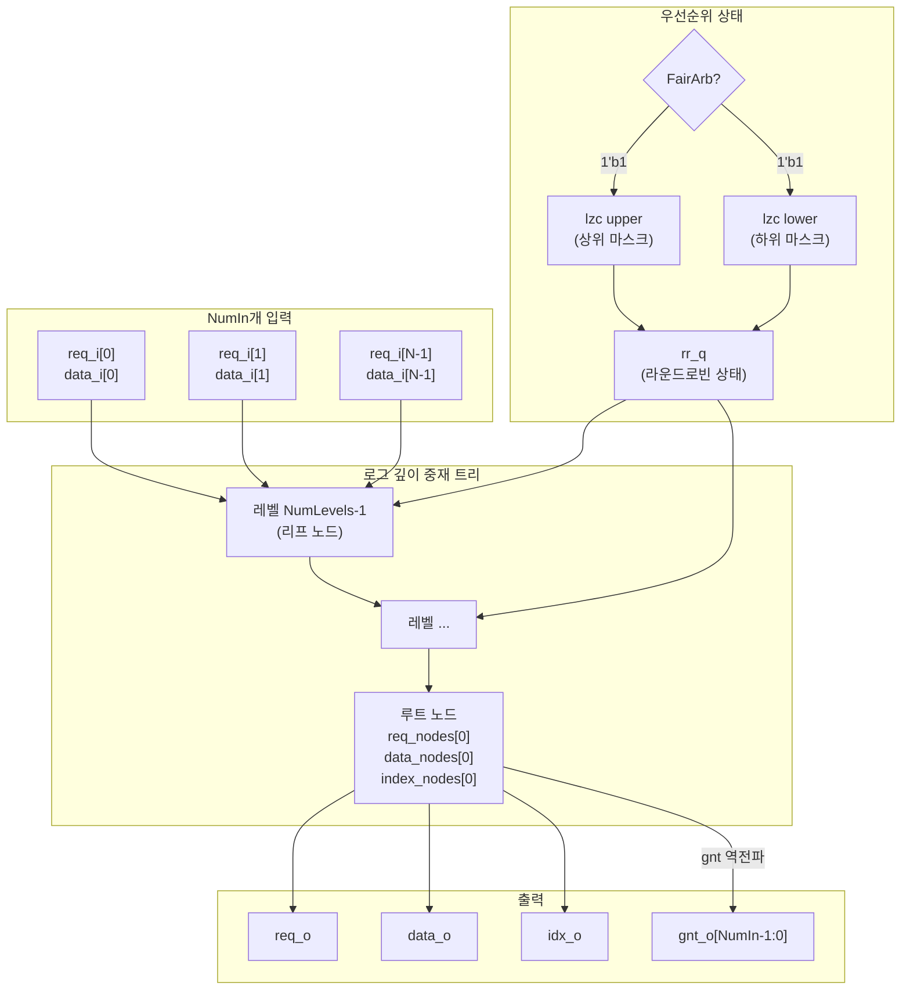

# rr_arb_tree.sv

## 개요

`rr_arb_tree`는 라운드 로빈(round-robin) 중재 방식을 사용하는 로그 시간 복잡도의 중재 트리(arbitration tree) 모듈입니다. `NumIn`개의 입력 요청 중 하나를 선택하여 단일 출력으로 전달하며, 기아 현상(starvation)이 없는 공정 중재를 보장합니다. 다양한 동작 모드(공정/비공정 중재, 외부 우선순위, AXI valid/ready 핸드셰이크, 잠금 기능)를 파라미터로 구성할 수 있습니다.

## 블록 다이어그램

## 포트/파라미터

### 파라미터

| 이름 | 타입 | 기본값 | 설명 |
|------|------|--------|------|
| `NumIn` | `int unsigned` | `64` | 중재할 입력 수 |
| `DataWidth` | `int unsigned` | `32` | 페이로드 비트 너비 (DataType 미사용 시) |
| `DataType` | `type` | `logic [DataWidth-1:0]` | 페이로드 데이터 타입 (사용자 정의 가능) |
| `ExtPrio` | `bit` | `1'b0` | 1이면 외부 rr_i 신호로 우선순위 제어 |
| `AxiVldRdy` | `bit` | `1'b0` | 1이면 AXI valid/ready 핸드셰이크 사용 |
| `LockIn` | `bit` | `1'b0` | 1이면 출력이 수용되기 전까지 중재 결과 고정 |
| `FairArb` | `bit` | `1'b1` | 1이면 공정 처리량 분배, 0이면 단순 +1 회전 |
| `IdxWidth` | `int unsigned` (localparam) | `$clog2(NumIn)` | 인덱스 신호 비트 너비 |
| `idx_t` | `type` (localparam) | `logic [IdxWidth-1:0]` | 인덱스 타입 |

### 포트

| 이름 | 방향 | 타입 | 설명 |
|------|------|------|------|
| `clk_i` | input | `logic` | 클록 (상승 에지 트리거) |
| `rst_ni` | input | `logic` | 비동기 리셋 (active low) |
| `flush_i` | input | `logic` | 중재 상태 초기화 (`ExtPrio=0` 또는 `LockIn=1`일 때 사용) |
| `rr_i` | input | `idx_t` | 외부 라운드 로빈 우선순위 (`ExtPrio=1`일 때만 유효) |
| `req_i` | input | `logic [NumIn-1:0]` | 입력 요청 신호 벡터 |
| `gnt_o` | output | `logic [NumIn-1:0]` | 입력별 승인 신호 벡터 |
| `data_i` | input | `DataType [NumIn-1:0]` | 입력 데이터 벡터 |
| `req_o` | output | `logic` | 출력 요청 유효 신호 |
| `gnt_i` | input | `logic` | 출력 요청 승인 신호 |
| `data_o` | output | `DataType` | 중재 선택된 데이터 |
| `idx_o` | output | `idx_t` | 중재 선택된 입력 인덱스 |

## 동작 설명

### 중재 트리 구조
`NumLevels = $clog2(NumIn)` 깊이의 이진 트리를 `generate` 구문으로 생성합니다. 각 노드는 두 자식 중 라운드 로빈 상태 비트(`rr_q`)를 기준으로 하나를 선택합니다.

- 리프 노드: 두 입력 요청(`req_d[l*2]`, `req_d[l*2+1]`)을 OR하고, `rr_q`의 해당 레벨 비트로 선택 신호(`sel`)를 결정합니다.
- 내부 노드: 두 자식 노드의 요청을 OR하고, 동일 방식으로 선택합니다.
- 루트 노드: 최종 `req_o`, `data_o`, `idx_o`를 출력합니다. 승인 신호(`gnt_i`)는 트리를 역방향으로 전파되어 선택된 입력에만 `gnt_o`가 전달됩니다.

### 공정 중재 (FairArb=1)
- `upper_mask`: 현재 `rr_q`보다 높은 인덱스를 가진 활성 요청만 포함
- `lower_mask`: 현재 `rr_q` 이하 인덱스의 활성 요청만 포함
- 두 개의 `lzc` (leading zero counter)로 다음 우선순위 인덱스 결정
- 상위가 비어 있으면 하위의 결과 사용 (wrap-around)

### 비공정 중재 (FairArb=0)
- 매 승인 후 `rr_q`를 단순히 +1 증가 (NumIn-1에서 0으로 순환)

### LockIn 모드
- `req_o`가 어서트되었지만 `gnt_i`가 없을 때 이전 요청 상태를 래치에 저장
- 이후 사이클에서 래치된 요청만 중재 (요청 변경 방지)

### NumIn=1 특수 처리
입력이 하나일 때는 트리 없이 직접 연결합니다.

## 의존성 및 관계

| 구분 | 내용 |
|------|------|
| 인클루드 | `common_cells/assertions.svh` |
| 하위 인스턴스 | `lzc` (FairArb=1일 때 2개 인스턴스) |
| 상위 사용처 | `stream_arbiter_flushable`, `stream_arbiter` |
| 관련 모듈 | `lzc` (leading zero counter) |
