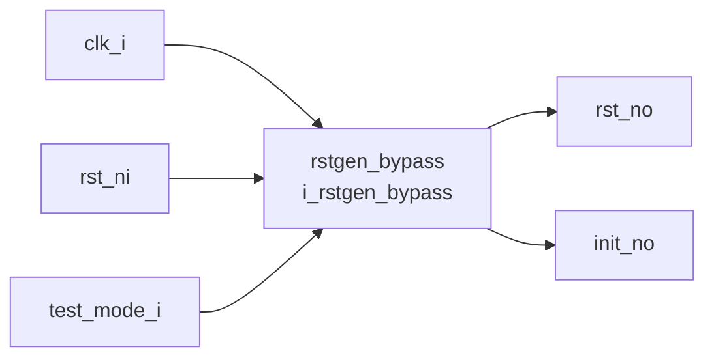

# rstgen (`rstgen.sv`)

## 개요

리셋 동기화기(Reset Synchronizer) 모듈입니다. 비동기 리셋 신호를 클록 도메인에 안전하게 동기화하여 출력합니다. 내부적으로 `rstgen_bypass`를 래핑하며, 테스트 모드에서 전용 테스트 리셋 경로를 지원합니다. 리셋의 어서션(assertion)은 비동기로 즉시 전파되고, 디어서션(deassertion)은 클록에 동기화되어 안전하게 해제됩니다.

## 블록 다이어그램



## 포트 목록

| 포트명 | 방향 | 비트폭 | 설명 |
|--------|------|--------|------|
| `clk_i` | input | 1 | 클록 입력 |
| `rst_ni` | input | 1 | 비동기 리셋 (active-low) |
| `test_mode_i` | input | 1 | 테스트 모드 활성화 신호 |
| `rst_no` | output | 1 | 동기화된 리셋 출력 (active-low) |
| `init_no` | output | 1 | 초기화 완료 신호 (active-low, 리셋 해제 후 일정 주기 후 High) |

## 파라미터

없음 (파라미터는 내부 `rstgen_bypass` 인스턴스의 기본값 사용)

## 동작 설명

- **일반 모드** (`test_mode_i = 0`): `rst_ni`가 어서트되면 즉시 내부 리셋 체인이 클리어됩니다. `rst_ni`가 디어서트(High)될 때 `NumRegs`개의 플립플롭 체인을 통해 클록 동기화된 이후에 `rst_no`가 High로 전환됩니다.
- **테스트 모드** (`test_mode_i = 1`): `rst_no`와 `init_no`는 직접 리셋 신호에 연결되어 동기화기를 우회합니다.

`rstgen`에서는 `rst_test_mode_ni` 포트에 `rst_ni`를 그대로 연결하므로, 테스트 모드 리셋과 일반 리셋이 동일한 신호를 공유합니다.

## 내부 구조

`rstgen_bypass` 모듈을 단일 인스턴스로 래핑합니다. `rst_test_mode_ni` 입력에 `rst_ni`를 연결합니다.

## 의존성

- `rstgen_bypass`

## 사용 예시

```systemverilog
rstgen i_rstgen (
    .clk_i        ( clk         ),
    .rst_ni       ( por_rst_n   ),
    .test_mode_i  ( test_mode   ),
    .rst_no       ( synced_rst_n ),
    .init_no      ( init_done_n )
);
```
