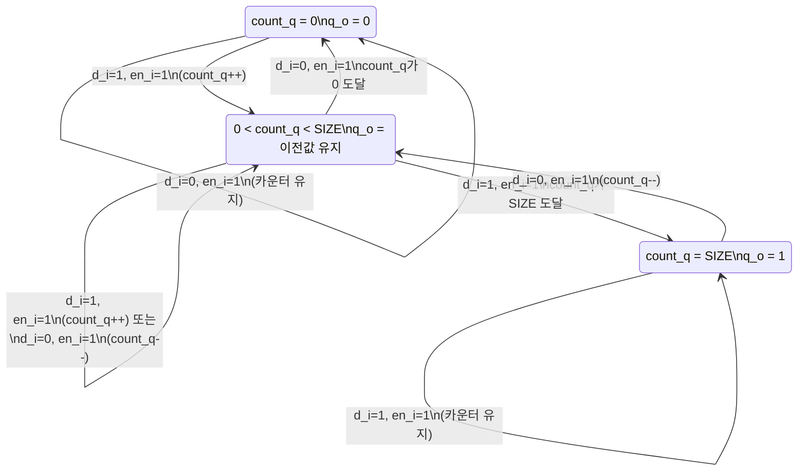

# serial_deglitch.sv

## 개요

`serial_deglitch` 모듈은 직렬 라인(serial line)에서 발생하는 글리치(glitch, 잡음에 의한 일시적 신호 오류)를 제거하는 디글리처(deglitcher)입니다. 입력 신호를 여러 클록 사이클 동안 샘플링하여 연속적으로 `SIZE` 사이클만큼 동일한 값을 유지해야만 출력 상태가 변경됩니다. 카운터 기반의 히스테리시스(hysteresis) 메커니즘을 사용합니다.

## 블록 다이어그램

## 포트/파라미터

### 파라미터

| 이름 | 타입 | 기본값 | 설명 |
|------|------|--------|------|
| `SIZE` | `int unsigned` | `4` | 디글리치 카운터의 최대값 (히스테리시스 크기) |

### 포트

| 이름 | 방향 | 타입 | 설명 |
|------|------|------|------|
| `clk_i` | input | `logic` | 클록 신호 |
| `rst_ni` | input | `logic` | 비동기 리셋 (active low) |
| `en_i` | input | `logic` | 모듈 활성화 신호 |
| `d_i` | input | `logic` | 직렬 데이터 입력 (글리치가 포함될 수 있음) |
| `q_o` | output | `logic` | 필터링된 출력 |

## 동작 설명

내부 카운터 `count_q`는 `[0, SIZE]` 범위를 가집니다.

- `en_i`가 활성화된 상태에서:
  - `d_i = 1`이고 `count_q < SIZE`이면 카운터를 1 증가
  - `d_i = 0`이고 `count_q > 0`이면 카운터를 1 감소
- 출력 로직 (`always_comb`):
  - `count_q == SIZE`이면 `q_o = 1`
  - `count_q == 0`이면 `q_o = 0`
  - 그 외의 중간 값에서는 `q_o`가 이전 값을 유지(래치 동작 주의: `always_comb`의 불완전 조건 분기로 인한 의도된 래치)

이 구조로 인해 입력이 `SIZE` 사이클 연속으로 1이어야 출력이 High로 전환되고, 반대로 `SIZE` 사이클 연속으로 0이어야 Low로 전환되는 히스테리시스 특성이 생깁니다.

## 의존성 및 관계

| 구분 | 내용 |
|------|------|
| 상위 의존 | 없음 |
| 하위 인스턴스 | 없음 |
| 활용 예 | UART, SPI 등 직렬 통신 입력 신호의 글리치 제거, 버튼 디바운싱(debouncing), 노이즈가 많은 환경의 디지털 입력 필터링 |
