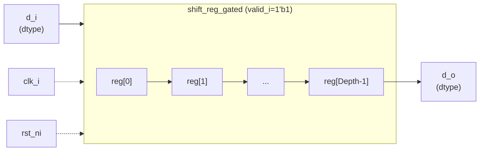

# shift_reg.sv

## 개요

`shift_reg`는 임의의 깊이(Depth)와 데이터 타입(dtype)을 지원하는 범용 시프트 레지스터 모듈입니다. 매 클록 사이클마다 데이터를 한 단계씩 시프트하는 단순한 파이프라인 지연 요소로, 내부적으로 `shift_reg_gated`를 `valid_i = 1'b1`로 인스턴스화하여 구현됩니다. ICG(Integrated Clock Gating)는 항상 비활성화 상태입니다.

## 블록 다이어그램

## 포트/파라미터

### 파라미터

| 이름 | 타입 | 기본값 | 설명 |
|------|------|--------|------|
| `dtype` | `type` | `logic` | 레지스터에 저장할 데이터 타입 |
| `Depth` | `int unsigned` | `1` | 시프트 레지스터 단계 수 (0이면 와이어로 동작) |

### 포트

| 이름 | 방향 | 타입 | 설명 |
|------|------|------|------|
| `clk_i` | input | `logic` | 클록 신호 |
| `rst_ni` | input | `logic` | 비동기 리셋 (active low) |
| `d_i` | input | `dtype` | 입력 데이터 |
| `d_o` | output | `dtype` | `Depth` 사이클 지연된 출력 데이터 |

## 동작 설명

- `Depth = 0`: 입력이 출력에 직접 연결되는 와이어로 동작합니다 (`shift_reg_gated` 내부 분기 처리).
- `Depth >= 1`: `Depth` 단계의 플립플롭 체인을 구성합니다. 각 사이클마다 데이터가 한 단계씩 이동하여 `Depth` 클록 후 `d_o`로 출력됩니다.
- `valid_i = 1'b1`로 고정되어 있으므로 모든 사이클에서 데이터가 시프트됩니다 (ICG 없음).
- 리셋 시 모든 레지스터는 0으로 초기화됩니다.

이 모듈은 고정 클록 사이클 지연이 필요한 파이프라인 설계에서 일반적으로 사용됩니다.

## 의존성 및 관계

| 구분 | 내용 |
|------|------|
| 하위 인스턴스 | `shift_reg_gated` (valid_i=1'b1로 고정 인스턴스화) |
| 인클루드 | `shift_reg_gated`가 `common_cells/registers.svh` 사용 |
| 관련 모듈 | `shift_reg_gated` (ICG 지원 버전) |
| 활용 예 | 파이프라인 정렬, 고정 지연 삽입, 신호 동기화 |
