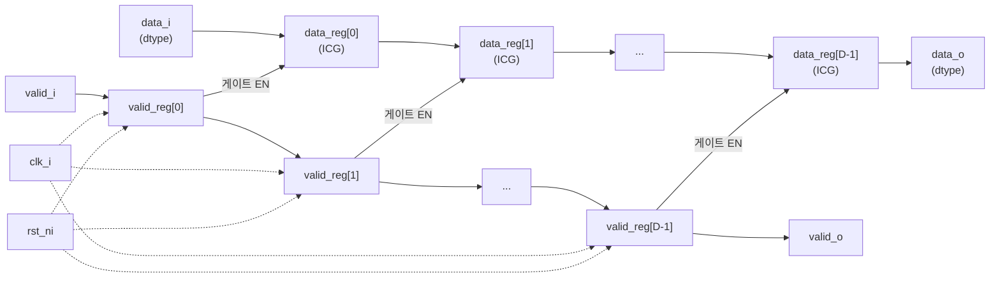

# shift_reg_gated.sv

## 개요

`shift_reg_gated`는 ICG(Integrated Clock Gating)를 지원하는 범용 시프트 레지스터 모듈입니다. `valid_i` 신호를 통해 데이터 플립플롭의 클록 게이팅을 활성화하여, 유효한 데이터가 없을 때 전력 소비를 줄입니다. `valid` 플래그는 게이팅 없이 별도로 시프트되며, 데이터 레지스터는 `valid`가 활성일 때만 로드됩니다.

## 블록 다이어그램

## 포트/파라미터

### 파라미터

| 이름 | 타입 | 기본값 | 설명 |
|------|------|--------|------|
| `Depth` | `int unsigned` | `8` | 시프트 레지스터 단계 수 (0이면 와이어로 동작) |
| `dtype` | `type` | `logic` | 레지스터에 저장할 데이터 타입 |

### 포트

| 이름 | 방향 | 타입 | 설명 |
|------|------|------|------|
| `clk_i` | input | `logic` | 클록 신호 |
| `rst_ni` | input | `logic` | 비동기 리셋 (active low) |
| `valid_i` | input | `logic` | 입력 데이터 유효 신호 (클록 게이트 제어) |
| `data_i` | input | `dtype` | 입력 데이터 |
| `valid_o` | output | `logic` | 출력 데이터 유효 신호 (Depth 사이클 지연) |
| `data_o` | output | `dtype` | 출력 데이터 (Depth 사이클 지연) |

## 동작 설명

### Depth = 0 (패스스루)
`valid_o = valid_i`, `data_o = data_i`로 직접 연결됩니다.

### Depth >= 1 (시프트 레지스터)
- `valid` 플래그와 `data`를 각각 별도의 레지스터 배열로 시프트합니다.
- `valid_q[i]`는 일반 플립플롭(`FF` 매크로)으로 클록 게이팅 없이 저장됩니다.
- `data_q[i]`는 로드 인에이블 플립플롭(`FFL` 매크로)으로, `valid_d[i]`가 enable 신호입니다. 합성 도구는 이를 ICG 셀로 변환하여 `valid`가 0일 때 데이터 플립플롭의 클록을 차단합니다.
- 출력: `valid_o = valid_q[Depth-1]`, `data_o = data_q[Depth-1]`

이 구조를 통해:
1. `valid_i = 0`인 사이클에는 데이터 레지스터 전체가 클록 게이팅됩니다.
2. `valid_i = 1`인 사이클에만 데이터가 실제로 시프트됩니다.
3. 파이프라인의 버블(bubble)이 많은 경우 상당한 동적 전력 절감이 가능합니다.

## 의존성 및 관계

| 구분 | 내용 |
|------|------|
| 인클루드 | `common_cells/registers.svh` (`FF`, `FFL` 매크로 사용) |
| 상위 사용처 | `shift_reg` (valid_i=1'b1로 고정하여 사용) |
| 하위 인스턴스 | 없음 |
| 활용 예 | 유효 데이터가 간헐적으로 전달되는 파이프라인 지연, 저전력 시프트 레지스터 구현 |
