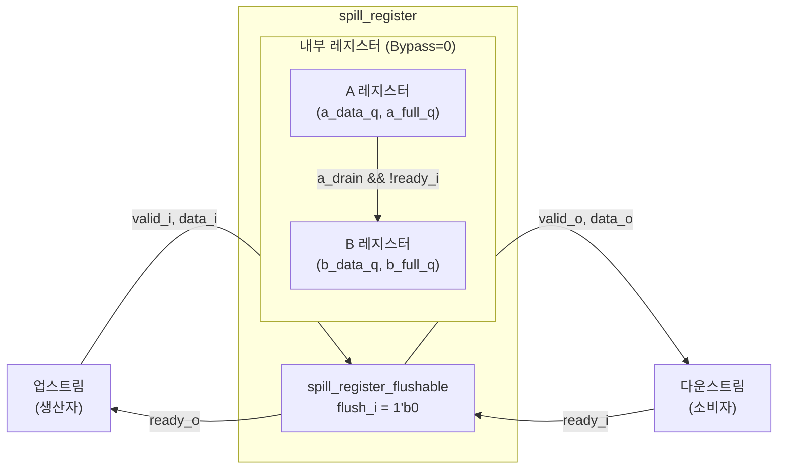

# spill_register (`spill_register.sv`)

## 개요

`spill_register`는 ready/valid 핸드셰이크 인터페이스를 갖는 파이프라인 레지스터로, 입력과 출력 사이의 **모든 조합 경로(valid, data, ready)를 완전히 차단**합니다. 이를 통해 타이밍 클로저를 개선하고 긴 조합 경로를 분리하는 데 사용됩니다.

`spill_register_flushable`의 래퍼(wrapper)로, `flush_i`를 `1'b0`으로 고정하여 플러시 기능을 제거한 단순화된 인터페이스를 제공합니다. `Bypass` 파라미터로 투명 모드로 전환할 수 있습니다.

## 블록 다이어그램



## 포트 목록

| 포트명 | 방향 | 비트폭 | 설명 |
|--------|------|--------|------|
| `clk_i` | input | 1 | 클록 |
| `rst_ni` | input | 1 | 비동기 리셋 (액티브 로우) |
| `valid_i` | input | 1 | 입력 데이터 유효 신호 |
| `ready_o` | output | 1 | 입력 수락 가능 신호 |
| `data_i` | input | T | 입력 데이터 |
| `valid_o` | output | 1 | 출력 데이터 유효 신호 |
| `ready_i` | input | 1 | 출력 수락 신호 |
| `data_o` | output | T | 출력 데이터 |

## 파라미터

| 파라미터명 | 기본값 | 설명 |
|-----------|--------|------|
| `T` | `logic` | 데이터 페이로드 타입 |
| `Bypass` | `1'b0` | `1'b1`이면 투명 모드 (데이터 직결, 레지스터 없음) |

## 동작 설명

`spill_register_flushable`에 위임하며, `flush_i = 1'b0`으로 고정됩니다. 내부 동작은 `spill_register_flushable` 문서를 참조하십시오.

### Bypass 모드 (`Bypass = 1'b1`)

모든 신호를 직접 연결합니다:
```
valid_o = valid_i
ready_o = ready_i
data_o  = data_i
```

### 일반 모드 (`Bypass = 1'b0`)

2개의 레지스터(A, B)를 사용하여 완전한 조합 경로 차단을 구현합니다. `ready_o = !a_full_q || !b_full_q`이며, B가 가득 찰 때만 백프레셔가 발생합니다.

## 내부 구조

`spill_register_flushable` 단일 인스턴스로 구성됩니다:

```systemverilog
spill_register_flushable #(
    .T(T), .Bypass(Bypass)
) spill_register_flushable_i (
    .flush_i(1'b0),
    ...
);
```

## 의존성

- `spill_register_flushable` — 실제 구현 모듈

## 사용 예시

```systemverilog
// 파이프라인 타이밍 경로 분리
spill_register #(
    .T      (logic [63:0]),
    .Bypass (1'b0)
) u_spill (
    .clk_i   (clk),
    .rst_ni  (rst_n),
    .valid_i (up_valid),
    .ready_o (up_ready),
    .data_i  (up_data),
    .valid_o (dn_valid),
    .ready_i (dn_ready),
    .data_o  (dn_data)
);

// 합성 파라미터로 바이패스 제어 (타이밍이 문제 없을 때)
spill_register #(
    .T      (my_struct_t),
    .Bypass (TIMING_OK)   // 조건부 삽입
) u_cond_spill ( ... );
```
