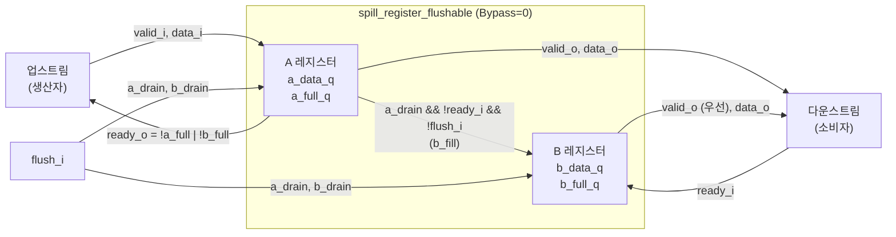
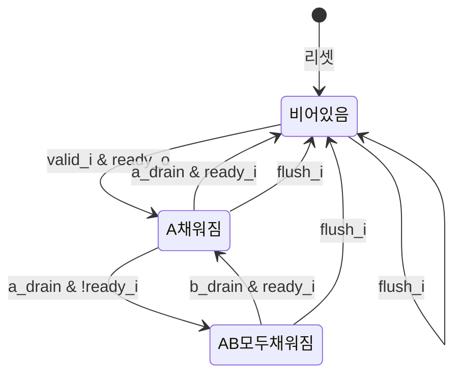

# spill_register_flushable (`spill_register_flushable.sv`)

## 개요

`spill_register_flushable`는 ready/valid 핸드셰이크 인터페이스에서 입력과 출력 간의 **모든 조합 경로를 완전히 차단**하는 플러시 가능한 스필 레지스터입니다. 2개의 내부 레지스터(A, B)를 사용하는 더블 버퍼 구조로 구현되며, 최대 처리량(throughput)을 유지하면서 타이밍 경로를 분리합니다. `flush_i` 신호로 내부 데이터를 소거할 수 있습니다.

## 블록 다이어그램



## 포트 목록

| 포트명 | 방향 | 비트폭 | 설명 |
|--------|------|--------|------|
| `clk_i` | input | 1 | 클록 |
| `rst_ni` | input | 1 | 비동기 리셋 (액티브 로우) |
| `valid_i` | input | 1 | 입력 데이터 유효 신호 |
| `flush_i` | input | 1 | 동기식 플러시 (내부 상태 소거) |
| `ready_o` | output | 1 | 입력 수락 가능 신호 |
| `data_i` | input | T | 입력 데이터 |
| `valid_o` | output | 1 | 출력 데이터 유효 신호 |
| `ready_i` | input | 1 | 출력 수락 신호 |
| `data_o` | output | T | 출력 데이터 |

## 파라미터

| 파라미터명 | 기본값 | 설명 |
|-----------|--------|------|
| `T` | `logic` | 데이터 페이로드 타입 |
| `Bypass` | `1'b0` | `1'b1`이면 완전 투명 모드 (레지스터 없이 직결) |

## 동작 설명

### A/B 더블 버퍼 구조

**A 레지스터**: 업스트림에서 들어온 데이터를 저장합니다.
- `a_fill`: `valid_i && ready_o && !flush_i` — 업스트림 핸드셰이크 시 채워짐
- `a_drain`: `(a_full_q && !b_full_q) || flush_i` — B가 비었거나 플러시 시 비워짐

**B 레지스터**: A 레지스터에서 흘러넘친(spill) 데이터를 저장합니다.
- `b_fill`: `a_drain && !ready_i && !flush_i` — A가 비워질 때 다운스트림이 아직 수락 불가면 채워짐
- `b_drain`: `(b_full_q && ready_i) || flush_i` — 다운스트림 수락 시 또는 플러시 시 비워짐

### 제어 신호

```
ready_o = !a_full_q || !b_full_q  // A 또는 B 중 하나라도 비어 있으면 수락 가능
valid_o = a_full_q | b_full_q     // A 또는 B 중 하나라도 채워져 있으면 유효 출력
data_o  = b_full_q ? b_data_q : a_data_q  // B 우선 출력 (FIFO 순서 유지)
```

### 상태 전이 다이어그램



### 타이밍 다이어그램

```
clk_i    : _/‾\_/‾\_/‾\_/‾\_/‾\_/‾\
valid_i  : ‾‾‾‾‾‾‾‾‾‾‾‾‾‾‾‾‾________
data_i   : ==A===B===C===============
ready_i  : __________‾‾‾‾‾‾‾‾‾‾‾‾‾‾‾
ready_o  : ‾‾‾‾‾‾‾‾‾‾‾‾‾‾‾‾‾‾‾‾‾____  (B도 가득 찰 때만 Low)
valid_o  : ______‾‾‾‾‾‾‾‾‾‾‾‾‾‾‾‾‾‾‾
data_o   : ======A===A===B===C=======
```

### 플러시 주의사항

`flush_i`와 `valid_i`를 동시에 어서트하면 안 됩니다 (어서션으로 검사):
```
flush_valid: flush_i |-> ~valid_i
```

## 내부 구조

- **A 레지스터 (a_data_q, a_full_q)**: 업스트림 입력을 받는 첫 번째 레지스터
- **B 레지스터 (b_data_q, b_full_q)**: 다운스트림이 즉시 수락하지 못할 때 A의 데이터를 임시 저장하는 두 번째 레지스터
- 출력은 B가 우선: B → A 순서로 나와 FIFO 순서를 보장합니다

## 의존성

- `common_cells/assertions.svh` — 어서션 매크로

## 사용 예시

```systemverilog
// 플러시 가능한 파이프라인 레지스터
spill_register_flushable #(
    .T      (logic [31:0]),
    .Bypass (1'b0)
) u_spill_flush (
    .clk_i   (clk),
    .rst_ni  (rst_n),
    .valid_i (up_valid),
    .flush_i (pipeline_flush),
    .ready_o (up_ready),
    .data_i  (up_data),
    .valid_o (dn_valid),
    .ready_i (dn_ready),
    .data_o  (dn_data)
);
```
