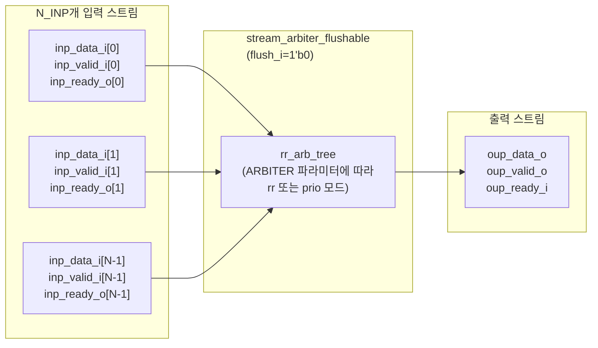

# stream_arbiter.sv

## 개요

`stream_arbiter`는 파라미터로 지정 가능한 수의 입력 스트림을 단일 출력 스트림으로 중재하는 모듈입니다. AXI4 스타일의 valid/ready 핸드셰이크를 사용하며, `oup_valid_o`가 어서트된 후에는 출력 핸드셰이크가 완료될 때까지 `oup_data_o`가 안정적으로 유지됩니다. 중재 방식은 라운드 로빈(`"rr"`) 또는 우선순위(`"prio"`) 중 선택할 수 있습니다. 내부적으로 `stream_arbiter_flushable`을 `flush_i = 1'b0`으로 래핑한 모듈입니다.

## 블록 다이어그램

## 포트/파라미터

### 파라미터

| 이름 | 타입 | 기본값 | 설명 |
|------|------|--------|------|
| `DATA_T` | `type` | `logic` | 스트림 데이터 타입 |
| `N_INP` | `integer` | `-1` | 입력 스트림 수 (반드시 지정해야 함) |
| `ARBITER` | `string` | `"rr"` | 중재 방식: `"rr"` (라운드 로빈) 또는 `"prio"` (우선순위) |

### 포트

| 이름 | 방향 | 타입 | 설명 |
|------|------|------|------|
| `clk_i` | input | `logic` | 클록 신호 |
| `rst_ni` | input | `logic` | 비동기 리셋 (active low) |
| `inp_data_i` | input | `DATA_T [N_INP-1:0]` | 입력 스트림 데이터 배열 |
| `inp_valid_i` | input | `logic [N_INP-1:0]` | 입력 스트림 유효 신호 배열 |
| `inp_ready_o` | output | `logic [N_INP-1:0]` | 입력 스트림 수용 준비 신호 배열 |
| `oup_data_o` | output | `DATA_T` | 중재된 출력 스트림 데이터 |
| `oup_valid_o` | output | `logic` | 출력 스트림 유효 신호 |
| `oup_ready_i` | input | `logic` | 출력 스트림 수용 준비 신호 |

## 동작 설명

`stream_arbiter`는 `stream_arbiter_flushable`의 단순 래퍼로, `flush_i`를 `1'b0`으로 고정합니다. 핵심 중재 로직은 `stream_arbiter_flushable`을 참조하십시오.

- `ARBITER = "rr"`: 공정한 라운드 로빈 방식으로 각 입력에 고른 처리량을 분배합니다.
- `ARBITER = "prio"`: 낮은 인덱스에 더 높은 우선순위를 부여하는 고정 우선순위 방식입니다.
- `oup_valid_o`가 어서트된 후 `oup_ready_i`가 올 때까지 `oup_data_o`는 변경되지 않습니다(LockIn 보장).

## 의존성 및 관계

| 구분 | 내용 |
|------|------|
| 하위 인스턴스 | `stream_arbiter_flushable` |
| 간접 하위 인스턴스 | `rr_arb_tree` |
| 관련 모듈 | `stream_arbiter_flushable` (flush 기능 포함 버전) |
| 활용 예 | 다중 마스터 버스 중재, 다중 소스 스트림 합류(merge), NoC 라우터 입력 중재 |
