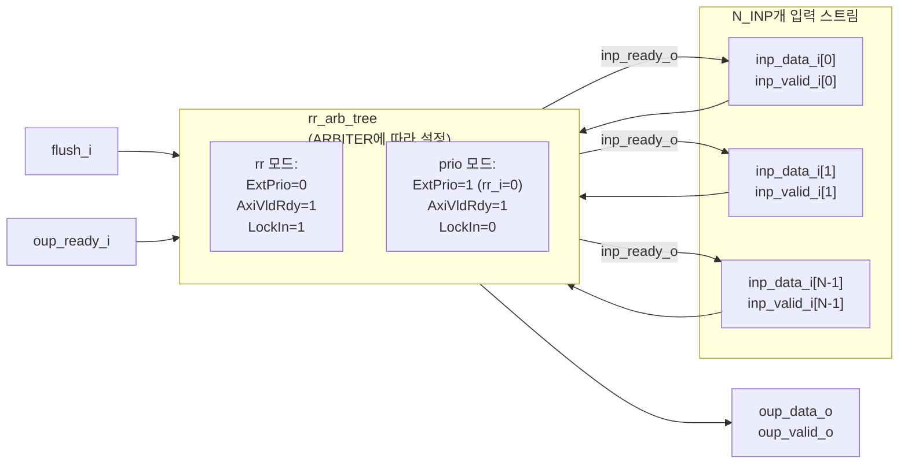

# stream_arbiter_flushable.sv

## 개요

`stream_arbiter_flushable`은 플러시(flush) 기능을 갖춘 스트림 중재 모듈입니다. 파라미터로 지정 가능한 수의 입력 스트림을 단일 출력 스트림으로 중재하며, AXI4 스타일의 valid/ready 핸드셰이크를 사용합니다. 내부적으로 `rr_arb_tree`를 사용하며, 중재 방식(`"rr"` 또는 `"prio"`)을 파라미터로 선택할 수 있습니다. `flush_i` 신호로 중재 상태를 초기화할 수 있습니다.

## 블록 다이어그램

## 포트/파라미터

### 파라미터

| 이름 | 타입 | 기본값 | 설명 |
|------|------|--------|------|
| `DATA_T` | `type` | `logic` | 스트림 데이터 타입 |
| `N_INP` | `integer` | `-1` | 입력 스트림 수 (반드시 지정해야 함) |
| `ARBITER` | `string` | `"rr"` | 중재 방식: `"rr"` (라운드 로빈) 또는 `"prio"` (우선순위) |

### 포트

| 이름 | 방향 | 타입 | 설명 |
|------|------|------|------|
| `clk_i` | input | `logic` | 클록 신호 |
| `rst_ni` | input | `logic` | 비동기 리셋 (active low) |
| `flush_i` | input | `logic` | 중재 상태 초기화 신호 |
| `inp_data_i` | input | `DATA_T [N_INP-1:0]` | 입력 스트림 데이터 배열 |
| `inp_valid_i` | input | `logic [N_INP-1:0]` | 입력 스트림 유효 신호 배열 |
| `inp_ready_o` | output | `logic [N_INP-1:0]` | 입력 스트림 수용 준비 신호 배열 |
| `oup_data_o` | output | `DATA_T` | 중재된 출력 스트림 데이터 |
| `oup_valid_o` | output | `logic` | 출력 스트림 유효 신호 |
| `oup_ready_i` | input | `logic` | 출력 스트림 수용 준비 신호 |

## 동작 설명

### 라운드 로빈 모드 (`ARBITER = "rr"`)
`rr_arb_tree`를 다음 설정으로 인스턴스화합니다:
- `ExtPrio = 1'b0`: 내부 라운드 로빈 카운터 사용
- `AxiVldRdy = 1'b1`: AXI valid/ready 핸드셰이크 준수 (upstream req는 rdy에 무관하게 deassert 가능)
- `LockIn = 1'b1`: 출력이 수용될 때까지 중재 결과 고정

이로 인해 각 입력 스트림에 공정한 처리량이 분배되며, 출력 핸드셰이크가 완료될 때까지 선택된 입력이 변경되지 않습니다.

### 우선순위 모드 (`ARBITER = "prio"`)
`rr_arb_tree`를 다음 설정으로 인스턴스화합니다:
- `ExtPrio = 1'b1`, `rr_i = '0`: 항상 인덱스 0이 최고 우선순위
- `AxiVldRdy = 1'b1`: AXI 핸드셰이크 준수
- `LockIn = 1'b0`: 잠금 없음

낮은 인덱스의 입력이 항상 높은 우선순위를 가집니다.

### 플러시 동작
`flush_i`가 어서트되면 `rr_arb_tree` 내부의 라운드 로빈 카운터와 LockIn 래치가 초기화됩니다.

## 의존성 및 관계

| 구분 | 내용 |
|------|------|
| 하위 인스턴스 | `rr_arb_tree` |
| 상위 사용처 | `stream_arbiter` (flush_i=1'b0으로 래핑) |
| 관련 모듈 | `rr_arb_tree`, `stream_arbiter` |
| 활용 예 | 플러시가 필요한 다중 스트림 중재, 리셋 가능한 버스 중재기 |
