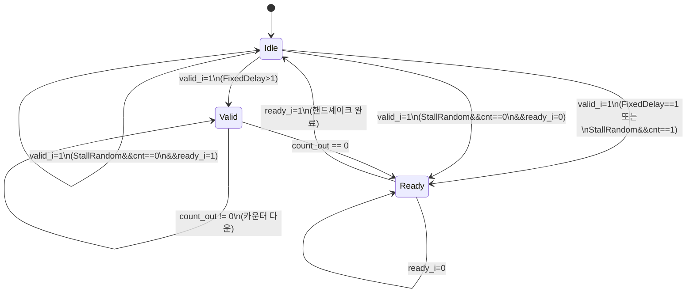

# stream_delay.sv

## 개요

`stream_delay`는 AXI 스타일 valid/ready 핸드셰이크 스트림에 고정 또는 랜덤 지연을 삽입하는 모듈입니다. 주로 시뮬레이션에서 백프레셔(backpressure) 시나리오나 지연 동작을 테스트하기 위해 사용됩니다. `FixedDelay = 0`이고 `StallRandom = 0`이면 완전한 패스스루로 동작합니다.

## 블록 다이어그램

## 포트/파라미터

### 파라미터

| 이름 | 타입 | 기본값 | 설명 |
|------|------|--------|------|
| `StallRandom` | `bit` | `0` | 1이면 LFSR 기반 랜덤 지연 사용 |
| `FixedDelay` | `int` | `1` | 고정 지연 사이클 수 (`StallRandom=0`일 때 사용) |
| `payload_t` | `type` | `logic` | 스트림 페이로드 데이터 타입 |
| `Seed` | `logic [15:0]` | `'0` | LFSR 초기 시드 (`StallRandom=1`일 때 사용) |

### 포트

| 이름 | 방향 | 타입 | 설명 |
|------|------|------|------|
| `clk_i` | input | `logic` | 클록 신호 |
| `rst_ni` | input | `logic` | 비동기 리셋 (active low) |
| `payload_i` | input | `payload_t` | 입력 페이로드 데이터 |
| `ready_o` | output | `logic` | 업스트림 수용 준비 신호 |
| `valid_i` | input | `logic` | 입력 유효 신호 |
| `payload_o` | output | `payload_t` | 출력 페이로드 데이터 (항상 payload_i와 동일) |
| `ready_i` | input | `logic` | 다운스트림 수용 준비 신호 |
| `valid_o` | output | `logic` | 출력 유효 신호 |

## 동작 설명

### 패스스루 모드 (`FixedDelay=0`, `StallRandom=0`)
입출력을 직접 연결합니다.

### 지연 모드 (그 외)
세 가지 상태로 동작하는 FSM을 사용합니다:

| 상태 | 동작 |
|------|------|
| `Idle` | 입력 대기. `valid_i`가 들어오면 카운터를 로드하고 다음 상태 결정 |
| `Valid` | 카운터를 매 사이클 감소. 0이 되면 `Ready` 상태로 전환 |
| `Ready` | `valid_o=1`, `ready_o=ready_i`. 다운스트림이 수용(`ready_i=1`)하면 `Idle`로 복귀 |

**고정 지연** (`StallRandom=0`): `counter_load = FixedDelay`로 고정. 페이로드는 `FixedDelay` 사이클 후 다운스트림에 제공됩니다.

**랜덤 지연** (`StallRandom=1`): `lfsr_16bit` 모듈로 생성한 랜덤 값을 카운터 초기값으로 사용. 매 트랜잭션마다 다른 지연이 발생합니다.

페이로드(`payload_o`)는 항상 `payload_i`와 동일하게 연결되며, 데이터는 버퍼링되지 않습니다.

## 의존성 및 관계

| 구분 | 내용 |
|------|------|
| 하위 인스턴스 | `lfsr_16bit` (StallRandom=1일 때), `counter` |
| 하위 인스턴스 조건 | `FixedDelay=0 && !StallRandom`이면 모든 서브모듈 없음 |
| 활용 예 | 시뮬레이션 전용 백프레셔 테스트, 네트워크 지연 모델링, 하드웨어 지연 에뮬레이션 |
