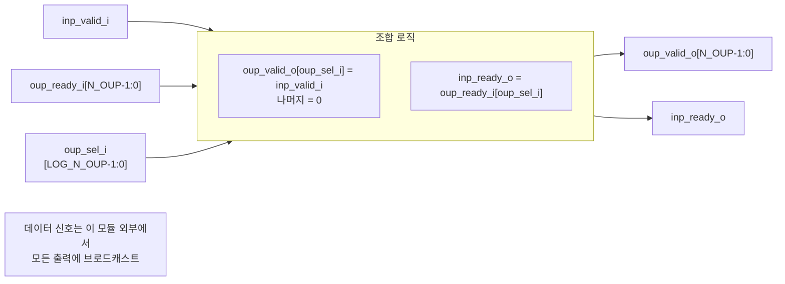

# stream_demux.sv

## 개요

`stream_demux`는 단일 입력 스트림의 valid/ready 핸드셰이크를 `N_OUP`개의 출력 스트림 핸드셰이크 중 선택된 하나에 연결하는 스트림 역다중화기(demultiplexer)입니다. 데이터 포트는 없으며, 실제 데이터는 모든 출력에 동일하게 연결되고 핸드셰이크 신호만 선택적으로 라우팅됩니다.

## 블록 다이어그램

## 포트/파라미터

### 파라미터

| 이름 | 타입 | 기본값 | 설명 |
|------|------|--------|------|
| `N_OUP` | `int unsigned` | `1` | 출력 스트림 수 |
| `LOG_N_OUP` | `int unsigned` (localparam) | `$clog2(N_OUP)` | 선택 신호 비트 너비 (자동 계산) |

### 포트

| 이름 | 방향 | 타입 | 설명 |
|------|------|------|------|
| `inp_valid_i` | input | `logic` | 입력 스트림 유효 신호 |
| `inp_ready_o` | output | `logic` | 입력 스트림 수용 준비 신호 |
| `oup_sel_i` | input | `logic [LOG_N_OUP-1:0]` | 출력 선택 인덱스 |
| `oup_valid_o` | output | `logic [N_OUP-1:0]` | 출력 스트림 유효 신호 배열 |
| `oup_ready_i` | input | `logic [N_OUP-1:0]` | 출력 스트림 수용 준비 신호 배열 |

## 동작 설명

조합 논리만으로 구현된 순수 조합(combinational) 모듈입니다.

- `oup_valid_o`: 초기값 0인 배열에서 `oup_sel_i`로 선택된 인덱스만 `inp_valid_i`로 설정됩니다.
- `inp_ready_o`: `oup_ready_i[oup_sel_i]`를 직접 연결합니다.

이 모듈은 데이터 포트를 의도적으로 생략했습니다. 이는 스트림 데이터를 역다중화할 필요가 없기 때문입니다. 스트림 데이터는 상위 모듈에서 모든 출력 스트림에 브로드캐스트하고, 핸드셰이크만 이 모듈로 선택적으로 라우팅합니다.

`oup_sel_i`는 입력 트랜잭션이 진행되는 동안(즉, `inp_valid_i` 어서트 중) 안정적으로 유지되어야 합니다.

## 의존성 및 관계

| 구분 | 내용 |
|------|------|
| 상위 의존 | 없음 (독립 조합 회로) |
| 하위 인스턴스 | 없음 |
| 관련 모듈 | `stream_arbiter` (역방향: N→1 합류) |
| 활용 예 | 라우팅 결정에 따른 스트림 분배, 크로스바 스위치의 출력 선택, 채널 선택기 |
