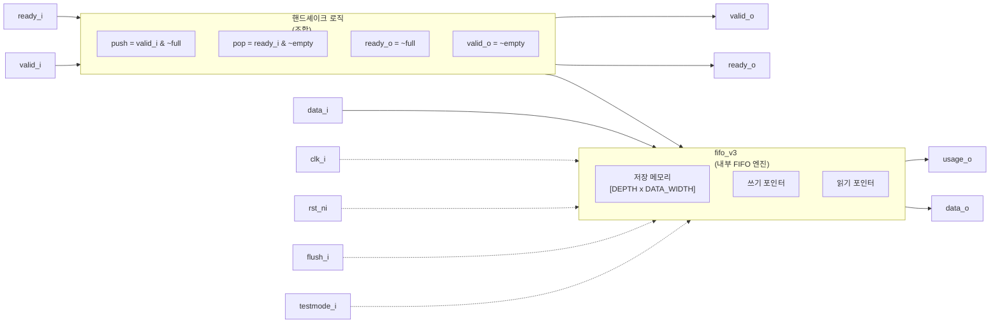

# stream_fifo.sv

## 개요

`stream_fifo`는 valid/ready 핸드셰이크 기반의 스트림 FIFO(First-In First-Out) 모듈입니다. 임의의 깊이와 데이터 타입을 지원하며, 폴스루(fall-through) 모드와 일반 등록(registered) 모드를 선택할 수 있습니다. 내부적으로 `fifo_v3`를 래핑하여 스트림 핸드셰이크 인터페이스를 제공합니다.

## 블록 다이어그램

## 포트/파라미터

### 파라미터

| 이름 | 타입 | 기본값 | 설명 |
|------|------|--------|------|
| `FALL_THROUGH` | `bit` | `1'b0` | 1이면 폴스루 모드 (입력이 즉시 출력에 나타남) |
| `DATA_WIDTH` | `int unsigned` | `32` | 기본 데이터 비트 너비 (T 미사용 시) |
| `DEPTH` | `int unsigned` | `8` | FIFO 깊이 (0 ~ 2^32) |
| `T` | `type` | `logic [DATA_WIDTH-1:0]` | 데이터 타입 (사용자 정의 타입 지원) |
| `ADDR_DEPTH` | `int unsigned` (localparam) | `$clog2(DEPTH)` | 주소/사용량 포인터 비트 너비 |

### 포트

| 이름 | 방향 | 타입 | 설명 |
|------|------|------|------|
| `clk_i` | input | `logic` | 클록 신호 |
| `rst_ni` | input | `logic` | 비동기 리셋 (active low) |
| `flush_i` | input | `logic` | FIFO 초기화 신호 |
| `testmode_i` | input | `logic` | 테스트 모드 (클록 게이팅 바이패스) |
| `usage_o` | output | `logic [ADDR_DEPTH-1:0]` | 현재 FIFO 사용량 (엔트리 수) |
| `data_i` | input | `T` | 입력 데이터 |
| `valid_i` | input | `logic` | 입력 유효 신호 |
| `ready_o` | output | `logic` | FIFO가 가득 차지 않음 (쓰기 수용 가능) |
| `data_o` | output | `T` | 출력 데이터 (FIFO 헤드) |
| `valid_o` | output | `logic` | FIFO가 비어 있지 않음 (읽기 가능) |
| `ready_i` | input | `logic` | 다운스트림 수용 준비 (팝 요청) |

## 동작 설명

### 핸드셰이크 변환
`fifo_v3`의 `push_i`/`pop_i` 인터페이스를 valid/ready 스트림 핸드셰이크로 변환합니다:

| 신호 | 수식 |
|------|------|
| `push` | `valid_i & ~full` |
| `pop` | `ready_i & ~empty` |
| `ready_o` | `~full` |
| `valid_o` | `~empty` |

### FALL_THROUGH 모드
- `1'b1`: FIFO가 비어 있을 때 입력 데이터가 바로 출력에 나타납니다 (조합 경로 존재).
- `1'b0`: 데이터는 항상 1사이클 이상 레지스터를 통해 출력됩니다.

### flush 동작
`flush_i`가 어서트되면 `fifo_v3` 내부의 포인터가 초기화되어 FIFO가 즉시 비워집니다.

## 의존성 및 관계

| 구분 | 내용 |
|------|------|
| 하위 인스턴스 | `fifo_v3` |
| 상위 사용처 | `stream_fifo_optimal_wrap` (Depth > 2일 때) |
| 관련 모듈 | `fifo_v3`, `stream_fifo_optimal_wrap`, `spill_register_flushable` |
| 활용 예 | 스트림 버퍼링, 클록 도메인 간 데이터 큐, 파이프라인 입력 버퍼 |
