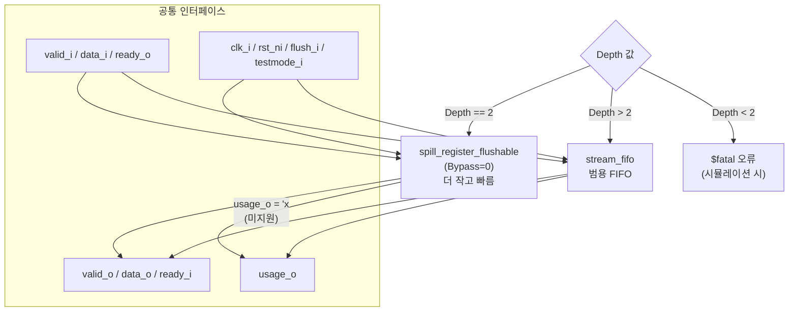

# stream_fifo_optimal_wrap.sv

## 개요

`stream_fifo_optimal_wrap`은 요청된 깊이에 따라 최적의 스트림 FIFO 구현을 자동으로 선택하는 래퍼(wrapper) 모듈입니다. 깊이가 2이면 더 작고 빠른 `spill_register_flushable`을, 깊이가 3 이상이면 `stream_fifo`를 인스턴스화합니다. 깊이 0과 1은 의미 없는 구성으로 오류를 발생시킵니다.

## 블록 다이어그램

## 포트/파라미터

### 파라미터

| 이름 | 타입 | 기본값 | 설명 |
|------|------|--------|------|
| `Depth` | `int unsigned` | `8` | FIFO 깊이 (2 이상이어야 함) |
| `type_t` | `type` | `logic` | 데이터 타입 |
| `PrintInfo` | `bit` | `1'b0` | 1이면 시뮬레이션 시작 시 선택된 구현 정보 출력 |
| `AddrDepth` | `int unsigned` (localparam) | `$clog2(Depth)` | 사용량 포인터 비트 너비 |

### 포트

| 이름 | 방향 | 타입 | 설명 |
|------|------|------|------|
| `clk_i` | input | `logic` | 클록 신호 |
| `rst_ni` | input | `logic` | 비동기 리셋 (active low) |
| `flush_i` | input | `logic` | FIFO 초기화 신호 |
| `testmode_i` | input | `logic` | 테스트 모드 (클록 게이팅 바이패스) |
| `usage_o` | output | `logic [AddrDepth-1:0]` | 현재 사용량 (Depth=2이면 'x로 출력) |
| `data_i` | input | `type_t` | 입력 데이터 |
| `valid_i` | input | `logic` | 입력 유효 신호 |
| `ready_o` | output | `logic` | 수용 준비 신호 |
| `data_o` | output | `type_t` | 출력 데이터 |
| `valid_o` | output | `logic` | 출력 유효 신호 |
| `ready_i` | input | `logic` | 다운스트림 수용 준비 신호 |

## 동작 설명

### 깊이에 따른 구현 선택

| Depth 값 | 선택된 구현 | 특징 |
|----------|-------------|------|
| 0 또는 1 | 오류 (`$fatal`) | 의미 없는 구성 |
| 2 | `spill_register_flushable` | 더 작은 면적, 더 빠른 경로, `usage_o`는 'x |
| 3 이상 | `stream_fifo` | 범용 FIFO, `usage_o` 정상 동작 |

`spill_register_flushable`은 깊이 2의 FIFO를 최소한의 하드웨어로 구현합니다. 포인터 로직이 없어 면적과 타이밍 모두 유리합니다.

`PrintInfo = 1`로 설정하면 시뮬레이션 시작 시 다음과 같은 메시지가 출력됩니다:
- Depth=2: `[<경로>] Instantiate spill register (of depth 2)`
- Depth>2: `[<경로>] Instantiate stream FIFO of depth <N>`

## 의존성 및 관계

| 구분 | 내용 |
|------|------|
| 하위 인스턴스 (Depth=2) | `spill_register_flushable` |
| 하위 인스턴스 (Depth>2) | `stream_fifo` |
| 간접 하위 인스턴스 | `fifo_v3` (stream_fifo 경유) |
| 활용 예 | 깊이가 다양하게 변경될 수 있는 스트림 버퍼의 최적 자동 선택, IP 재사용 라이브러리 |
