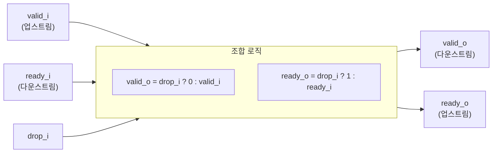

# stream_filter.sv

## 개요

`stream_filter`는 `drop_i` 신호에 따라 스트림 트랜잭션을 선택적으로 드롭(drop)하거나 통과(pass-through)시키는 스트림 필터 모듈입니다. `drop_i = 1`일 때는 업스트림에 즉시 ready를 반환하고 다운스트림에는 valid를 전달하지 않아 트랜잭션을 소비하면서 버립니다. 클록이나 상태가 없는 순수 조합 논리 모듈입니다.

## 블록 다이어그램



## 포트/파라미터

파라미터 없음.

### 포트

| 이름 | 방향 | 타입 | 설명 |
|------|------|------|------|
| `valid_i` | input | `logic` | 업스트림 스트림 유효 신호 |
| `ready_o` | output | `logic` | 업스트림 수용 준비 신호 |
| `drop_i` | input | `logic` | 드롭 제어 신호 (1이면 트랜잭션 드롭) |
| `valid_o` | output | `logic` | 다운스트림 스트림 유효 신호 |
| `ready_i` | input | `logic` | 다운스트림 수용 준비 신호 |

## 동작 설명

두 줄의 조합 논리로 구현됩니다:

```
assign valid_o = drop_i ? 1'b0 : valid_i;
assign ready_o = drop_i ? 1'b1 : ready_i;
```

### drop_i = 0 (통과 모드)
- `valid_o = valid_i`: 업스트림 유효 신호가 그대로 다운스트림에 전달됩니다.
- `ready_o = ready_i`: 다운스트림의 백프레셔가 그대로 업스트림에 전달됩니다.
- 정상적인 스트림 흐름이 유지됩니다.

### drop_i = 1 (드롭 모드)
- `valid_o = 0`: 다운스트림에는 유효 신호를 보내지 않아 트랜잭션이 전달되지 않습니다.
- `ready_o = 1`: 업스트림에 항상 ready를 반환하여 업스트림 트랜잭션을 소비(흡수)합니다.
- 업스트림 트랜잭션이 실행되지만 다운스트림에는 전달되지 않습니다.

데이터 포트가 없으므로, 실제 데이터 신호는 상위 모듈에서 별도로 연결해야 합니다. 이 모듈은 핸드셰이크 신호만 제어합니다.

## 의존성 및 관계

| 구분 | 내용 |
|------|------|
| 상위 의존 | 없음 (독립 조합 회로) |
| 하위 인스턴스 | 없음 |
| 관련 모듈 | `stream_demux` (선택적 라우팅), `stream_arbiter` (합류) |
| 활용 예 | 조건부 트랜잭션 드롭, 스트림 마스킹, 인터럽트 억제, 트랜잭션 필터링 로직 |
