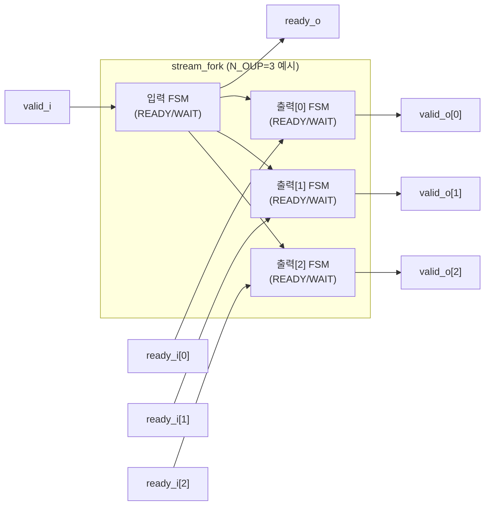
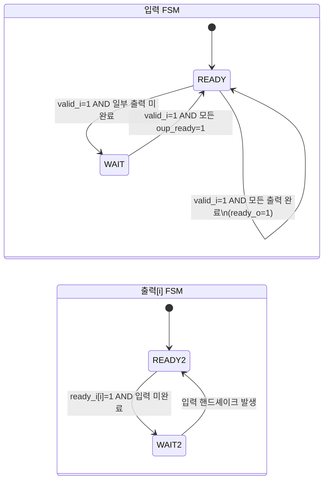

# stream_fork.sv

## 개요

`stream_fork`는 하나의 입력 스트림(ready-valid 핸드셰이크)을 `N_OUP`개의 출력 스트림 핸드셰이크 모두에 연결하는 모듈이다. 입력 스트림의 각 트랜잭션마다 모든 출력 스트림이 정확히 한 번씩 핸드셰이크를 수행한다. 출력 스트림들이 동시에 핸드셰이크할 필요는 없으며, 모든 출력이 핸드셰이크를 완료했을 때만 입력이 핸드셰이크된다.

데이터 포트를 별도로 가지지 않는다. 입력 데이터는 모든 출력 스트림에 공통으로 연결하면 되기 때문이다.

## 블록 다이어그램

## 포트/파라미터

### 파라미터

| 파라미터 | 타입 | 기본값 | 설명 |
|----------|------|--------|------|
| `N_OUP` | `int unsigned` | `0` | 출력 스트림 수 (최소 1 이상) |

### 포트

| 포트명 | 방향 | 폭 | 설명 |
|--------|------|----|------|
| `clk_i` | input | 1 | 클록 신호 |
| `rst_ni` | input | 1 | 비동기 리셋 (active low) |
| `valid_i` | input | 1 | 입력 스트림 valid |
| `ready_o` | output | 1 | 입력 스트림 ready (모든 출력 완료 시 asserted) |
| `valid_o` | output | N_OUP | 각 출력 스트림 valid |
| `ready_i` | input | N_OUP | 각 출력 스트림 ready |

## 동작 설명

### FSM 구조

모듈은 입력 FSM 1개와 출력 FSM N_OUP개로 구성된다. 모든 FSM은 `READY`와 `WAIT` 두 가지 상태를 가진다.

**입력 FSM (`inp_state`)**

- **READY 상태**: `valid_i`가 assert되면 모든 출력이 동시에 핸드셰이크 완료 여부를 확인한다.
  - 모든 출력이 완료(`valid_o == all_ones && ready_i == all_ones`): `ready_o = 1` (입력 핸드셰이크)
  - 일부 출력이 미완료: `ready_o = 0`, WAIT 상태로 전이
- **WAIT 상태**: 아직 핸드셰이크 미완료된 출력들을 기다린다.
  - `valid_i`가 유효하고 모든 출력의 `oup_ready`가 1이 되면: `ready_o = 1`, READY로 복귀

**출력 FSM (`oup_state[i]`)**

- **READY 상태**: `valid_i`가 assert되면 `valid_o[i] = 1`을 출력한다.
  - `ready_i[i]`가 assert되고(출력 핸드셰이크 완료) 입력이 아직 미완료이면: WAIT 상태로 전이
  - `ready_i[i]`가 assert되지 않으면: `oup_ready[i] = 0`으로 표시
- **WAIT 상태**: 입력 핸드셰이크(`valid_i && ready_o`)를 기다린다. 완료되면 READY로 복귀.

### 핵심 동작 원칙

- 입력 트랜잭션 하나당 각 출력이 정확히 한 번 핸드셰이크한다.
- 출력들은 서로 다른 사이클에 핸드셰이크해도 된다.
- 이미 핸드셰이크된 출력은 WAIT 상태로 전환되어 다음 입력 트랜잭션을 기다린다.

## 의존성 및 관계

| 항목 | 설명 |
|------|------|
| 헤더 | `common_cells/assertions.svh` |
| 사용하는 모듈 | 없음 (독립 모듈) |
| 사용되는 곳 | `stream_fork_dynamic.sv` (내부에서 인스턴스화) |
| 관련 모듈 | `stream_fork_dynamic` (동적 선택 마스크 지원 버전) |
