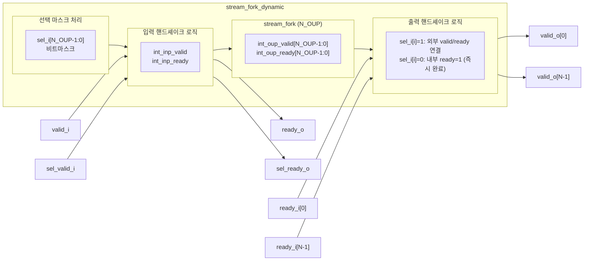

# stream_fork_dynamic.sv

## 개요

`stream_fork_dynamic`은 입력 스트림(ready-valid 핸드셰이크)을 동적으로 선택된 출력 스트림 조합에 연결하는 모듈이다. 기본 `stream_fork`와 달리, 별도의 선택 스트림(`sel_i`, `sel_valid_i`, `sel_ready_o`)을 통해 런타임에 어떤 출력 스트림들에 포크할지를 비트마스크로 지정할 수 있다.

데이터 포트를 별도로 가지지 않으며, 입력 데이터는 원하는 출력 스트림에 공통으로 연결하면 된다.

## 블록 다이어그램

## 포트/파라미터

### 파라미터

| 파라미터 | 타입 | 기본값 | 설명 |
|----------|------|--------|------|
| `N_OUP` | `int unsigned` | `0` | 출력 스트림 수 (최소 1 이상) |

### 포트

| 포트명 | 방향 | 폭 | 설명 |
|--------|------|----|------|
| `clk_i` | input | 1 | 클록 신호 |
| `rst_ni` | input | 1 | 비동기 리셋 (active low) |
| `valid_i` | input | 1 | 입력 스트림 valid |
| `ready_o` | output | 1 | 입력 스트림 ready |
| `sel_i` | input | N_OUP | 출력 선택 비트마스크 (비트 i=1이면 출력 i로 포크) |
| `sel_valid_i` | input | 1 | 선택 마스크의 valid |
| `sel_ready_o` | output | 1 | 선택 마스크의 ready |
| `valid_o` | output | N_OUP | 각 출력 스트림 valid |
| `ready_i` | input | N_OUP | 각 출력 스트림 ready |

## 동작 설명

### 선택 마스크 처리

`sel_valid_i`가 asserted된 경우에만 동작한다. `sel_i[i]`의 값에 따라 각 출력 채널의 처리 방식이 달라진다.

**`sel_i[i] = 1` (선택된 출력):**
- `valid_o[i] = int_oup_valid[i]` (내부 stream_fork의 출력을 외부로 전달)
- `int_oup_ready[i] = ready_i[i]` (외부 ready를 내부로 전달)

**`sel_i[i] = 0` (선택되지 않은 출력):**
- `valid_o[i] = 0` (외부로 valid를 assert하지 않음)
- `int_oup_ready[i] = 1` (내부 stream_fork 입장에서는 즉시 완료로 처리)

### 입력 핸드셰이크

`sel_valid_i`가 asserted된 경우에만 `valid_i`를 내부 stream_fork에 전달하고, 내부 ready가 발생하면 `ready_o`와 `sel_ready_o`를 동시에 assert한다. 입력 트랜잭션과 선택 마스크 트랜잭션이 동시에 완료된다.

### 내부 stream_fork와의 관계

`stream_fork` 인스턴스를 내부에서 사용하며, 선택되지 않은 출력 채널에 대해 `int_oup_ready = 1`을 인가함으로써 해당 출력은 즉시 완료된 것으로 처리한다. 결과적으로 `stream_fork`의 입력 핸드셰이크는 선택된 출력들이 모두 완료될 때 발생한다.

## 의존성 및 관계

| 항목 | 설명 |
|------|------|
| 헤더 | `common_cells/assertions.svh` |
| 사용하는 모듈 | `stream_fork` |
| 관련 모듈 | `stream_fork` (정적 버전), `stream_join_dynamic` (동적 조인) |
