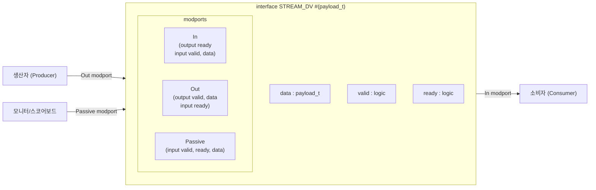
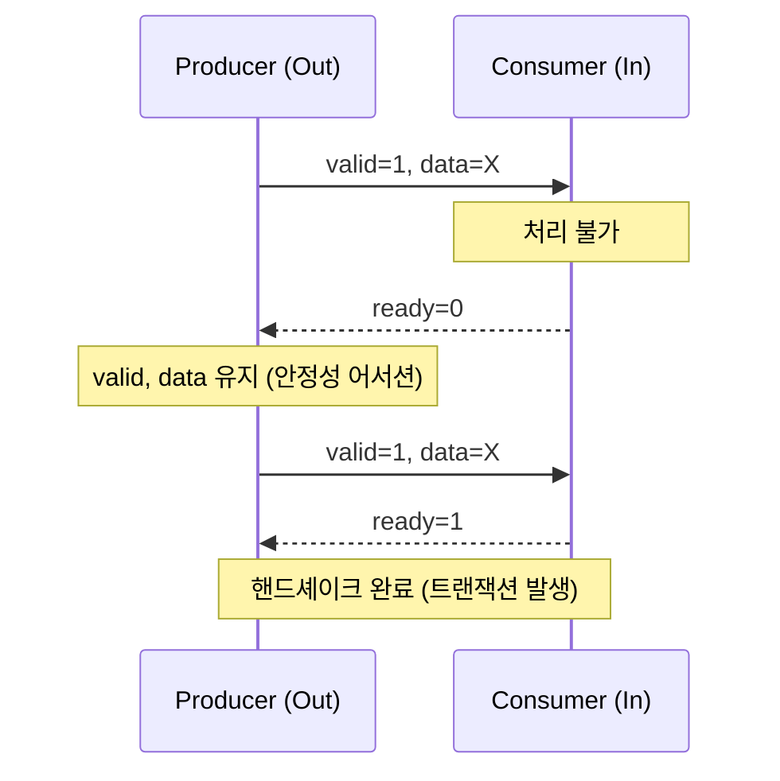

# stream_intf.sv

## 개요

`stream_intf.sv`는 AXI 표준의 핸드셰이크 규칙을 따르는 범용 스트림 인터페이스(`STREAM_DV`)를 정의한다. 커스텀 페이로드 타입(`payload_t`)을 파라미터로 받아 유연하게 재사용할 수 있으며, 시뮬레이션 시 데이터 안정성(data stability) 어서션을 내장하고 있다.

## 블록 다이어그램

## 포트/파라미터

### 파라미터

| 파라미터 | 타입 | 기본값 | 설명 |
|----------|------|--------|------|
| `payload_t` | type | `logic` | 스트림 페이로드의 데이터 타입 |

### 인터페이스 포트

| 포트명 | 방향 | 타입 | 설명 |
|--------|------|------|------|
| `clk_i` | input | `logic` | 인터페이스 클록 (어서션에 사용) |
| `data` | - | `payload_t` | 페이로드 데이터 |
| `valid` | - | `logic` | 데이터 유효 신호 |
| `ready` | - | `logic` | 소비자 준비 신호 |

### Modport 요약

| modport | 방향 | 설명 |
|---------|------|------|
| `In` | 소비자 측 | `ready` 출력, `valid`/`data` 입력 |
| `Out` | 생산자 측 | `valid`/`data` 출력, `ready` 입력 |
| `Passive` | 모니터 측 | 모든 신호 입력 (관찰 전용) |

## 동작 설명

### AXI 핸드셰이크 규칙

- 생산자는 `valid`를 assert하고 `data`를 제공한다.
- 소비자는 `ready`를 assert하여 수신 가능 상태를 표시한다.
- `valid && ready`가 동시에 asserted된 사이클에 트랜잭션이 발생한다.
- `valid`가 assert된 후 `ready`가 assert되기 전까지 `data`와 `valid`는 반드시 안정(stable)해야 한다.

### 내장 어서션

`COMMON_CELLS_ASSERTS_OFF`가 정의되지 않은 경우 다음 어서션이 활성화된다.

| 어서션 이름 | 조건 | 검증 내용 |
|-------------|------|-----------|
| `data_unstable` | `valid && !ready` | 다음 사이클에 `data`가 안정적으로 유지됨을 검증 |
| `valid_unstable` | `valid && !ready` | 다음 사이클에 `valid`가 유지됨을 검증 |

## 의존성 및 관계

| 항목 | 설명 |
|------|------|
| 헤더 | `common_cells/assertions.svh` |
| 사용하는 모듈 | 없음 (인터페이스 정의) |
| 관련 모듈 | AXI 핸드셰이크를 사용하는 모든 stream_* 모듈 |
| 주요 용도 | 테스트벤치, 검증 환경에서 스트림 인터페이스 표준화 |
