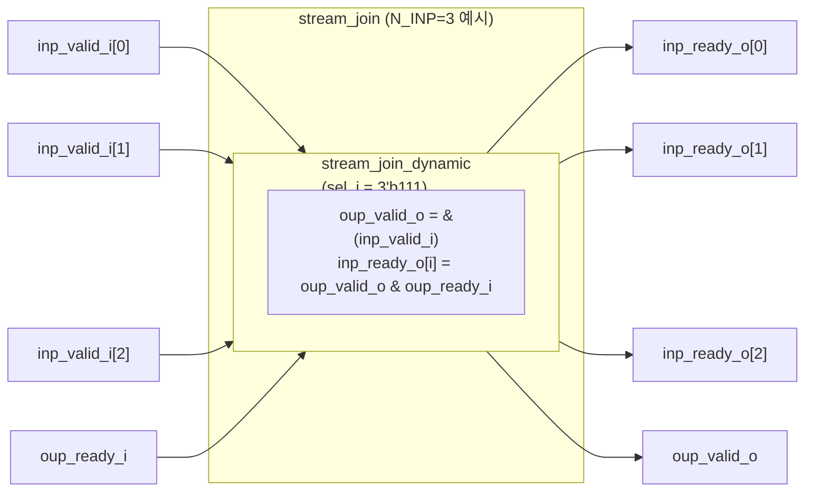
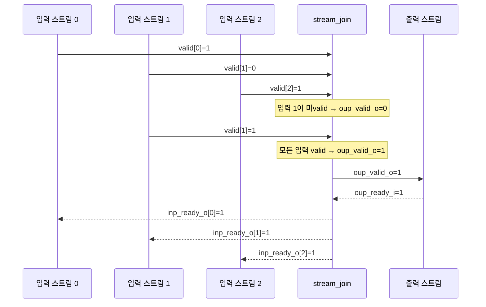

# stream_join.sv

## 개요

`stream_join`은 `N_INP`개의 입력 스트림(valid-ready 핸드셰이크, AXI4 의존성 규칙 적용)을 하나의 출력 스트림으로 합치는 모듈이다. 모든 입력 스트림이 valid를 assert해야만 출력 핸드셰이크가 발생한다. 데이터 채널은 모듈 외부에서 처리한다.

내부적으로 `stream_join_dynamic`을 `sel_i = '1` (전체 선택)로 인스턴스화하여 구현한다.

## 블록 다이어그램





## 포트/파라미터

### 파라미터

| 파라미터 | 타입 | 기본값 | 설명 |
|----------|------|--------|------|
| `N_INP` | `int unsigned` | `0` | 입력 스트림 수 (최소 1 이상) |

### 포트

| 포트명 | 방향 | 폭 | 설명 |
|--------|------|----|------|
| `inp_valid_i` | input | N_INP | 각 입력 스트림 valid |
| `inp_ready_o` | output | N_INP | 각 입력 스트림 ready |
| `oup_valid_o` | output | 1 | 출력 스트림 valid (모든 입력 valid일 때 assert) |
| `oup_ready_i` | input | 1 | 출력 스트림 ready |

## 동작 설명

### 출력 valid 생성

출력 valid는 모든 입력 valid의 AND 연산으로 결정된다.

```
oup_valid_o = inp_valid_i[0] & inp_valid_i[1] & ... & inp_valid_i[N_INP-1]
```

### 입력 ready 생성

각 입력의 ready는 출력 핸드셰이크가 발생할 때만 assert된다.

```
inp_ready_o[i] = oup_valid_o & oup_ready_i  (모든 i에 대해)
```

### 동작 특성

- 클록과 리셋이 없는 **순수 조합 논리** 모듈이다.
- 모든 입력이 valid를 assert한 후 출력 측에서 ready를 assert하면 모든 입력의 핸드셰이크가 동시에 완료된다.
- 데이터는 모듈 외부에서 연결해야 한다 (데이터 포트 없음).

## 의존성 및 관계

| 항목 | 설명 |
|------|------|
| 사용하는 모듈 | `stream_join_dynamic` |
| 관련 모듈 | `stream_join_dynamic` (동적 선택 마스크 지원 버전), `stream_fork` (반대 방향 연산) |
