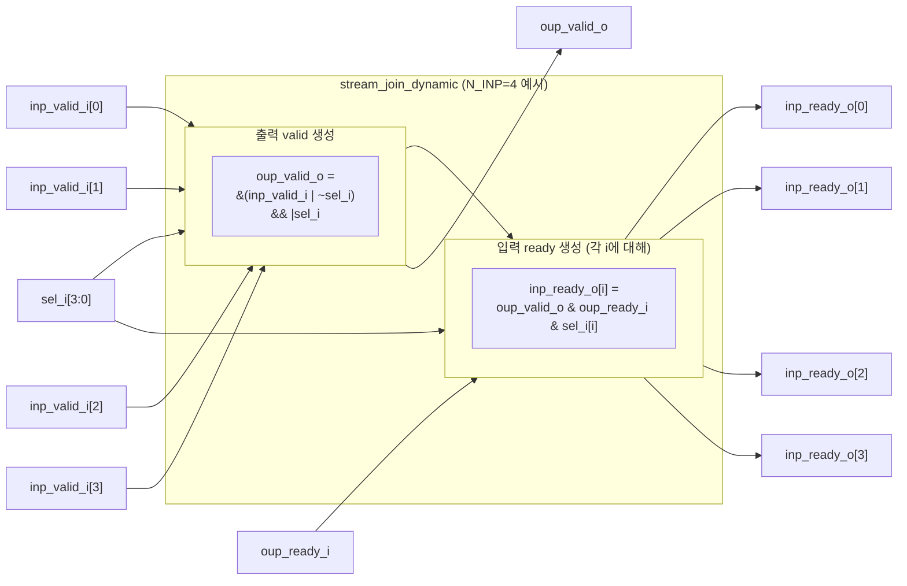

# stream_join_dynamic.sv

## 개요

`stream_join_dynamic`은 `N_INP`개의 입력 스트림을 하나의 출력 스트림으로 합치는 모듈이며, `sel_i` 비트마스크를 통해 어떤 입력 스트림들을 조인할지 런타임에 동적으로 지정할 수 있다. 선택된 입력 스트림들이 모두 valid를 assert해야만 출력 핸드셰이크가 발생한다.

데이터 채널은 모듈 외부에서 처리한다. `stream_join`의 하위 구현체로도 사용된다.

## 블록 다이어그램



## 포트/파라미터

### 파라미터

| 파라미터 | 타입 | 기본값 | 설명 |
|----------|------|--------|------|
| `N_INP` | `int unsigned` | `0` | 입력 스트림 수 (최소 1 이상) |

### 포트

| 포트명 | 방향 | 폭 | 설명 |
|--------|------|----|------|
| `inp_valid_i` | input | N_INP | 각 입력 스트림 valid |
| `inp_ready_o` | output | N_INP | 각 입력 스트림 ready |
| `sel_i` | input | N_INP | 입력 선택 비트마스크 (비트 i=1이면 입력 i를 조인에 포함) |
| `oup_valid_o` | output | 1 | 출력 스트림 valid |
| `oup_ready_i` | input | 1 | 출력 스트림 ready |

## 동작 설명

### 출력 valid 생성 로직

```
oup_valid_o = &(inp_valid_i | ~sel_i) && |sel_i
```

- `inp_valid_i | ~sel_i`: 선택되지 않은 비트는 1로 강제하여 AND 연산에서 제외
- `&(...)`: 선택된 모든 입력이 valid인지 AND로 확인
- `|sel_i`: sel_i가 모두 0인 코너 케이스에서 valid를 생성하지 않도록 방지

### 입력 ready 생성 로직

```
inp_ready_o[i] = oup_valid_o & oup_ready_i & sel_i[i]
```

- 선택된 입력(`sel_i[i] = 1`)에 한해서만 ready를 assert
- 선택되지 않은 입력(`sel_i[i] = 0`)은 ready를 받지 않으므로 독립적으로 동작 가능

### 코너 케이스

| `sel_i` | 동작 |
|---------|------|
| 전체 1 | 모든 입력이 valid일 때 출력 valid (stream_join과 동일) |
| 일부 1 | 선택된 입력만 valid이면 출력 valid |
| 전체 0 | `oup_valid_o = 0` (핸드셰이크 발생 안 함) |

### 순수 조합 논리

클록과 리셋이 없는 순수 조합 논리 모듈이다.

## 의존성 및 관계

| 항목 | 설명 |
|------|------|
| 헤더 | `common_cells/assertions.svh` |
| 사용하는 모듈 | 없음 (독립 조합 논리) |
| 사용되는 곳 | `stream_join` (sel_i='1로 고정하여 사용) |
| 관련 모듈 | `stream_join`, `stream_fork_dynamic` |
